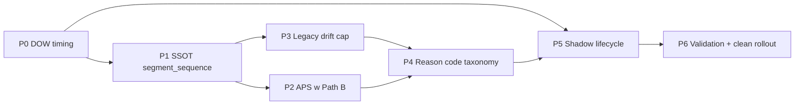

# Plan naprawczy Gatekeeper V2.5 + shadow-burnin

Pełny plan zapisany w: [PLANS/PLAN_NAPRAWCZY_GATEKEEPER_V25_SHADOW_BURNIN_20260507.md](PLANS/PLAN_NAPRAWCZY_GATEKEEPER_V25_SHADOW_BURNIN_20260507.md)

## Diagnoza warstwowa (audyt 2026-05-07)

Shadow-burnin nie jest wiarygodną symulacją scoringu pool/tokenów. 7 problemów warstwowych:

1. **V2.5 doczepione do `mode = "long"`** — nie jest pierwszoklasową ścieżką, znika gdy mode się zmieni ([gatekeeper.rs:3589](ghost-launcher/src/components/gatekeeper.rs))
2. **Okna DOW są tx-triggered** — Early/Normal nie odpalają się bez ruchu TX; Extended jest `unreachable!()` w `try_shadow_evaluate` ([gatekeeper.rs:3596-3617, 5606-5609](ghost-launcher/src/components/gatekeeper.rs))
3. **Path B (kanoniczny) nie widzi TAS/spike/ramping/flash** — `MaterializedFeatureSet` nie niesie `segment_sequence`; logi: `tas_unavailable_reason=materialized_features_missing_segment_sequence` ([gatekeeper_policy.rs:606-664](ghost-launcher/src/components/gatekeeper_policy.rs))
4. **APS jest telemetry-only** — `has_sufficient_history = false` hardcoded ⇒ regime zawsze `Normal`; APS w ogóle nie odpala w Path B ([gatekeeper_adaptive_prosperity.rs:97](ghost-launcher/src/components/gatekeeper_adaptive_prosperity.rs))
5. `**max_price_change_ratio = 9999.0`** — legacy drift cap wyłączony ([ghost_brain_config.toml:90](ghost-brain/ghost_brain_config.toml))
6. **TIMEOUT z `decision_reason = null`** — 2077/2614 rekordów latest scope; brak typed `reason_code` enum ([decision_logger.rs:196, 597-609](ghost-brain/src/oracle/decision_logger.rs))
7. **Shadow lifecycle nie domyka cyklu** — 0 BUY/0 entries w 2614 v25 decyzjach; `eventbus_lag_total = 5.5M`; `simulation_mismatch / ConstraintSeeds`

## Mapa priorytetów

## Hard guardrails (niezmiennicze)

- **N1-N16 SSOT contracts** zachowane — w szczególności N14 (no synthetic parity) i N16 (no `GatekeeperMode::V25`)
- **B1-B8 boundary decisions** z istniejącego [PLANS/GATEKEEPER_V25_REPAIR_PLAN.md](PLANS/GATEKEEPER_V25_REPAIR_PLAN.md) zachowane
- **Legacy live plane** niezmieniony; V2.5 plane wciąż shadow-first (`live_execution_enabled = false`)
- **HyperPrediction Oracle** poza zakresem
- **PnL nie jest DoD** — DoD to coverage, invariants, audytowalność

## Final acceptance

17 testów kontraktowych zielone + clean rollout `shadow-burnin-v25-repair-r2` przez 24h + walidator NO-GO → GO + 100% `reason_code` completeness + shadow lifecycle domknięty + zero invariant violations.