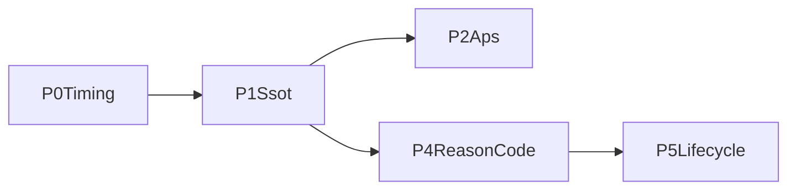

# Audyt realizacji planu naprawczego Gatekeeper V2.5 Shadow Burn-in

Data audytu: 2026-05-09
Audytor: GPT-5.4
Zakres: weryfikacja realizacji `PLANS/PLAN_NAPRAWCZY_GATEKEEPER_V25_SHADOW_BURNIN_20260507.md` dla priorytetow `P0`-`P5`

## Werdykt wykonawczy

Plan **nie zostal wdrozony kompletnie**. W kodzie widac duzy postep i kilka istotnych elementow zostalo naprawionych, ale tylko `P3` mozna uznac za wdrozone na poziomie samej zmiany kodowej. Nadal pozostaja materialne braki kontraktowe w `P0`, `P1`, `P2`, `P4` i `P5`.

Najwazniejsze wnioski:

- `P0` ma timer i osobna sciezke `Extended`, ale semantyka okien DOW w kodzie nie zgadza sie z planem.
- `P1` dostarczyl `tx_segment_sequence`, ale parytet Path A/Path B jest tylko czesciowy.
- `P2` uruchamia APS w Path B, ale nie respektuje kontraktu "Normal if sample < 30".
- `P3` zamyka blind spot `9999.0` w konfiguracji, ale faza nie jest formalnie zamknieta, bo backfill audit zostal odroczony.
- `P4` ma nowa taksonomie `reason_code`, ale mapowanie nie obejmuje wszystkich werdyktow.
- `P5` wdrozylo metryki i payer `ephemeral`, ale nie wdrozylo planowanego modelu `shadow_lifecycle` z terminalnymi statusami dispatchu.

## Metodologia

Audyt oparto na:

- inspekcji kodu z plikow wskazanych w planie,
- weryfikacji testow regresyjnych i pomocniczych,
- sprawdzeniu ADR-ow i plikow konfiguracyjnych,
- porownaniu implementacji z konkretnymi DoD zapisanymi w planie.

Ograniczenie audytu:

- pelna walidacja calego workspace nie byla wykonywana; uruchomiono jedynie testy celowane dla obszarow audytu.

### Walidacja wykonawcza

Po doinstalowaniu i aktywacji toolchaina Rust uruchomiono:

- `cargo test -p ghost-launcher --test gatekeeper_v25_regression -- --nocapture`
- `cargo test -p ghost-launcher --test post_buy_runtime_integration -- --nocapture`

Wynik:

- `gatekeeper_v25_regression`: `24 passed; 0 failed`
- `post_buy_runtime_integration`: `4 passed; 0 failed`

Istotna interpretacja audytowa:

- zielone testy **nie obalaja** ustalen audytu,
- czesc testow potwierdza aktualna implementacje, ale nie literalny kontrakt planu,
- w szczegolnosci dotyczy to `P0` (okna DOW), `P4` (brak pokrycia dla `REJECT_SYBIL_INTERFERENCE`) i `P5` (brak testow na planowany model dispatch lifecycle).

## Status zbiorczy

| Priorytet | Status | Ocena audytora |
|---|---|---|
| `P0` | niezamkniete | implementacja istnieje, ale zachowanie nie odpowiada kontraktowi planu |
| `P1` | czesciowo wdrozone | SSOT rozszerzono, ale parytet i taxonomia availability nie sa domkniete |
| `P2` | czesciowo wdrozone | APS dziala w Path B, ale nie spelnia w pelni kontraktu regime gating |
| `P3` | wdrozone w kodzie, niezamkniete operacyjnie | cap `1.50` i ADR sa, ale backfill audit pozostaje deferred |
| `P4` | czesciowo wdrozone | schema i enum sa, ale mapowanie `reason_code` nie jest kompletne |
| `P5` | czesciowo wdrozone | payer/metryki sa, ale lifecycle dispatch-status nie zostal zrealizowany zgodnie z planem |

---

## P0 - DOW timing reliability

### Co jest wdrozone

- istnieje nowy modul `ghost-launcher/src/components/gatekeeper_dow_timer.rs`,
- `oracle_runtime.rs` uruchamia per-pool `tokio::time::interval` i woła `maybe_fire_shadow_checkpoint()`,
- `gatekeeper.rs` ma `extended_shadow_fired`,
- `try_shadow_evaluate(ObservationStage::Extended)` nie jest juz `unreachable!()`,
- istnieje metryka `gatekeeper_dow_timer_fired_total`,
- istnieja testy regresyjne dla timer path.

### Co jest niezgodne z planem

1. Okna czasowe sa zaimplementowane inaczej niz w planie.

Plan:

- Early: `2-5s`
- Normal: `5-7s`
- Extended: `7-10s`

Kod w `gatekeeper.rs`:

- Early: `elapsed >= early_entry_min_ms && elapsed <= early_entry_max_ms`
- Normal: `elapsed >= normal_window_ms && elapsed < extended_window_ms`
- Extended: `elapsed >= extended_window_ms`

Przy aktualnym configu:

- `early_entry_max_ms = 5000`
- `normal_window_ms = 7000`
- `extended_window_ms = 10000`

To oznacza realnie:

- Early: `2-5s`
- Normal: `7-10s`
- Extended: `>=10s`

Czyli kontrakt z planu nie zostal dotrzymany. Co gorsza, komentarz w `oracle_runtime.rs` nadal twierdzi, ze timer odpala `Normal (5-7s), Extended (7-10s)`, ale kod tego nie robi.

2. `extended_require_pdd_clean` jest martwym konfigiem.

Pole istnieje w `ghost-brain/src/config/gatekeeper_v25_config.rs`, ale nie jest uzywane w logice decyzyjnej `Extended`. Kod twardo wymaga `pdd_clean` niezaleznie od wartosci tego pola. To znaczy, ze planowany kontrakt nie zostal domkniety na poziomie semantyki configu.

3. Timer path i deadline fallback licza confidence inaczej.

`try_shadow_evaluate()` liczy confidence z prostego modelu:

- ratio soft points,
- TAS modulation,
- PDD zeroing/modulation.

Deadline fallback w `check_long_deadline()` korzysta z:

- `assessment.cache_v25_confidence()`,
- `v25_confidence_breakdown()`.

To sa dwie rozne sciezki obliczeniowe dla tej samej decyzji `Extended`, wiec wynik moze zalezec od tego, czy checkpoint wyprodukowal timer czy fallback deadline. Plan wymagajacy jednego modelu decyzyjnego nie jest tu spelniony.

4. Testy utrwalaja zla semantyke okien.

`ghost-launcher/tests/gatekeeper_v25_regression.rs` oczekuje:

- `Early` przy ~`3s`,
- `Normal` przy ~`8s`,
- `Extended` przy ~`11s`.

To testuje aktualna implementacje, ale nie kontrakt planu `2-5 / 5-7 / 7-10`.

### Co jest poprawne

- single-owner per stage przez flagi `*_shadow_fired` wyglada poprawnie,
- `Extended` ma juz realna galaz logiczna,
- timer jest zintegrowany w tym samym tasku `tokio::select!`, co ogranicza ryzyko dubli z osobnego writera.

### Werdykt P0

`P0` jest **niezamkniete**. Implementacja infrastruktury istnieje, ale zachowanie biznesowe i testy nie odpowiadaja planowi.

---

## P1 - SSOT parity + segment_sequence

### Co jest wdrozone

- `ghost-core/src/checkpoint/types.rs` dodaje `tx_segment_sequence: Option<TxSegmentSequence>` z `#[serde(default)]`,
- `ghost-launcher/src/session/observation.rs` materializuje `tx_segment_sequence`,
- `ghost-launcher/src/components/gatekeeper_policy.rs` liczy TAS w Path B z sekwencji,
- dodano modul `ghost-launcher/src/components/gatekeeper_pdd_sequence.rs`,
- istnieja testy na:
  - pole SSOT,
  - Path B unavailable zamiast synthetic guess,
  - parity TAS Path A vs Path B.

### Co jest niekompletne lub rozjechane z planem

1. `tx_segment_sequence` jest zalezne od `tas.enabled`.

`current_segment_sequence_from_config()` woła `current_segment_sequence(&self.config.tas)`, a samo `current_segment_sequence()` zwraca `None`, gdy `tas.enabled == false`.

To jest problem, bo plan zakladal, ze `tx_segment_sequence` sluzy nie tylko TAS, ale tez PDD sequence (`spike`, `ramping`, `flash`). Przy obecnej implementacji wylaczenie TAS moze odciac sekwencje rowniez dla PDD.

2. `tas_unavailable_reason` nie jest wystarczajaco szczegolowe.

Plan wprost wymagalo reasonow typu:

- `insufficient_tx_per_segment`
- `insufficient_duration`

W aktualnym `tas_availability()` dla materialized path fallback jest ogolny:

- `materialized_features_missing_segment_sequence`

czyli informacja o realnym powodzie braku nie jest zawsze zachowana.

3. `v25_confidence_unavailable_reason` pozostaje zbyt ogolne.

Aktualny kod zwraca:

- `materialized_features_partial_v25_inputs`

zamiast nazwac konkretny brakujacy input, jak zakladal plan.

4. `flash_crash` nie ma pelnej parytetowej semantyki Path B.

Plan zakladal sekwencje z polem pokroju `max_price_impact_pct` / sygnalem sell-impact. Obecna implementacja zmienila model na proxy oparte o `max_single_tx_sol`, a komentarz wprost przyznaje, ze to nie jest prawdziwy detector flash crash oparty o impact ceny, tylko heurystyka "large transaction anomaly".

To jest uczciwe technicznie, ale oznacza, ze P1 nie dowiozlo pelnej parytetowej funkcjonalnosci deklarowanej w planie.

### Co oceniam pozytywnie

- rozszerzenie SSOT jest addytywne i zgodne z kontraktem serde,
- materializacja sequence w sesji jest realnie podlaczona,
- parity TAS Path A/Path B na poziomie sciezki trajectory zostalo wykonane sensownie.

### Werdykt P1

`P1` jest **czesciowo wdrozone**. Najwazniejszy fundament SSOT zostal dodany, ale parytet z planem pozostaje niepelny, zwlaszcza dla availability taxonomy i flash-crash semantics.

---

## P2 - APS w decision plane

### Co jest wdrozone

- `AdaptiveProsperityConfig` dostal:
  - `regime_local_heuristic_enabled`,
  - `cross_pool_outcome_tracker_available`,
- `build_assessment_from_features()` uruchamia APS w Path B,
- istnieje metryka `gatekeeper_aps_regime_distribution_total`,
- `ghost-brain/ghost_brain_config.toml` wlacza `regime_local_heuristic_enabled = true`,
- istnieja testy `p2_aps_runs_in_path_b_when_enabled` oraz `p2_aps_drift_override_only_in_shadow_plane`.

### Co jest niezgodne z planem

1. Brakuje realnego warunku "default to Normal if sample < 30".

Plan wymagalo:

- `Default to Normal regime if sample < 30`.

W `evaluate_aps()` warunek jest:

- `if has_sufficient_history && config.min_calibration_samples > 0`

czyli kod sprawdza jedynie, czy w configu liczba jest dodatnia, a nie czy aktualna probka rzeczywiscie spelnia minimum. W praktyce heurystyka moze sie uruchomic dla malej probki, wbrew planowi.

2. Shadow-only guard jest domkniety tylko czesciowo.

W Path B:

- `assessment.adaptive_thresholds_applied` jest dodatkowo gaszone przez `!config.v25.live_execution_enabled`.

W Path A / shadow evaluation:

- `assessment.adaptive_thresholds_applied = aps.adaptive_thresholds_applied`

czyli bez tego guardu. To oznacza, ze telemetryczne pole moze raportowac zastosowane progi adaptacyjne nawet wtedy, gdy live bylby wlaczony.

3. Rollout overlay `configs/rollout/shadow-burnin.toml` nie ustawia `regime_local_heuristic_enabled = true`.

Flaga jest wlaczona w glownym `ghost_brain_config.toml`, ale nie w overlay, mimo ze plan przewidywal to wprost dla rollout profile.

### Co oceniam pozytywnie

- APS jest faktycznie obecny w Path B, a nie tylko telemetry-only w shadow Path A,
- HighVolatility drift override w Path B istnieje,
- metryki i diagnostyka APS trafily do assessment/logow.

### Werdykt P2

`P2` jest **czesciowo wdrozone**. Najwieksza luka to brak rzeczywistego guardu `sample < 30 => Normal` oraz niespojne shadow-only semantics dla `adaptive_thresholds_applied`.

---

## P3 - Legacy drift cap

### Co jest wdrozone

- `ghost-brain/ghost_brain_config.toml` ustawia `max_price_change_ratio = 1.50`,
- dodatkowo zrownano `prosperity_overlay_max_price_change_ratio` i `prosperity_overlay_branch2_max_price_change_ratio` do `1.50`,
- istnieje ADR `docs/ADR/ADR-0125-p3-legacy-drift-cap-restore-20260508.md`,
- sa testy:
  - `p3_legacy_drift_cap_blocks_extreme_pump`,
  - `p3_config_has_legacy_drift_cap_1_50`.

### Co pozostaje otwarte

1. Formalne DoD nie jest domkniete, bo backfill audit zostal odroczony.

ADR wprost mowi, ze backfill audit jest `Deferred`. To oznacza, ze sama zmiana konfigu jest wdrozona, ale cala faza `P3` nie jest jeszcze wykonana do konca wedlug planu.

2. Domyslny `GatekeeperV2Config::default()` nadal ma `max_price_change_ratio = 4.0`.

To nie jest juz blind spot `9999.0`, ale jest to nadal rozjazd wzgledem wybranego capu `1.50`. Dla kodu uruchamianego bez TOML ta semantyka pozostaje inna.

### Werdykt P3

`P3` jest **wdrozone w kodzie, ale niezamkniete operacyjnie**. Sam fix blind spotu w runtime-config jest zrobiony poprawnie; planowe zamkniecie fazy czeka jeszcze na backfill audit.

---

## P4 - Reason code taxonomy + TIMEOUT semantics

### Co jest wdrozone

- istnieje nowy modul `ghost-brain/src/oracle/reason_code.rs`,
- `GatekeeperBuyLog` ma `reason_code` i `reason_code_version`,
- schema zostala podniesiona do `v19`,
- `to_buy_log()` emituje podtypy timeoutu:
  - `TIMEOUT_PHASE1_NO_DATA`,
  - `TIMEOUT_PHASE1_INSUFFICIENT`,
  - `TIMEOUT_DEADLINE_LOW_PHASES`,
- walidator `scripts/gatekeeper_v25_repair_validation.py` sprawdza `reason_code_completeness` i timeout taxonomy,
- sa testy dla reason code i timeoutow.

### Krytyczne luki

1. `derive_reason_code()` nie mapuje `REJECT_SYBIL_INTERFERENCE`.

To jest najpowazniejszy brak.

Fakty:

- `GatekeeperVerdictType` ma wariant `RejectSybilInterference`,
- jego tag to `REJECT_SYBIL_INTERFERENCE`,
- enum `GatekeeperReasonCode` ma wariant `RejectSybilInterference`,
- pomocniczy parser `derive_from_verdict_type_str()` w `reason_code.rs` zna ten tag,
- ale glowna sciezka runtime `GatekeeperAssessment::derive_reason_code()` w `gatekeeper.rs` nie ma tego mapowania.

Skutek:

- dla tej klasy werdyktu `reason_code` moze pozostac `None`,
- deklaracja "100% completeness" nie jest obroniona samym kodem.

2. Czesc taksonomii jest dodana, ale nieuzywana.

W enumie sa warianty typu:

- `TimeoutGenuineNoInterest`,
- `TimeoutIngestMiss`,
- `TimeoutFilterDrop`,
- `TimeoutStaleArrival`,
- `TimeoutWindowCloseTooEarly`,
- `InvariantPddBuyContradiction`,
- `InvariantZeroConfidenceBuy`,
- `ShadowEvalSkipped`.

W repo nie znalazlem sciezek, ktore faktycznie je emituja przy produkcji `GatekeeperBuyLog`. To oznacza, ze taksonomia jest szersza niz realna implementacja.

3. Test surface nie pokrywa wykrytej luki.

Testy `P4` sprawdzaja hard-fail oraz timeouty, ale nie wymuszaja mapowania dla `REJECT_SYBIL_INTERFERENCE`. To zostawia realna dziure regresyjna.

### Co oceniam pozytywnie

- timeouty przestaly byc generyczne,
- schema logow i pole `reason_code_version` sa wdrozone poprawnie,
- centralizacja mapowania upraszcza dalszy refactoring.

### Werdykt P4

`P4` jest **czesciowo wdrozone**. Głowny kierunek naprawy jest poprawny, ale mapowanie nie jest kompletne, wiec nie mozna uznac fazy za domknieta.

---

## P5 - Shadow execution lifecycle

### Co jest wdrozone

- `shadow_only` moze dzialac z `payer_strategy = "ephemeral"`,
- walidacja configu w `ghost-launcher/src/config.rs` rzeczywiscie nie wymaga `keypair_path`, jesli `shadow_only` uzywa `ephemeral`,
- `TriggerComponent` tworzy `cached_shadow_ephemeral_payer`,
- istnieje `make_shadow_idempotency_key()`,
- `ShadowBuySimulationRecord` dostal pole `idempotency_key`,
- eventbus lag emituje `tracing::warn!` powyzej stalego progu `100`,
- metryka `gatekeeper_shadow_lifecycle_status_total` rozdziela:
  - `no_dispatch_eligible`,
  - `no_dispatch_rejected`,
  - `dispatched`,
  - `failed_reconciliation`.

### Najwazniejsze braki wzgledem planu

1. Idempotency key nie jest podlaczony zgodnie z kontraktem planu.

Plan wymagalo:

- `blake3(pool_id || join_key || rollout_profile)`.

Produkcja w `oracle_runtime.rs` i `trigger/component.rs` robi:

- `make_shadow_idempotency_key(pool_id, base_mint, "")`

czyli:

- zamiast `join_key` uzywa `base_mint`,
- zamiast `rollout_profile` przekazuje pusty string.

To nie jest ten sam kontrakt. Test sprawdza funkcje pomocnicza, ale production call sites nie podaja planowanych argumentow.

2. Nie powstal planowany model lifecycle status dla dispatchu.

Plan wymagalo nowego modelu w rodzaju:

- `Pending`,
- `Submitted`,
- `Confirmed`,
- `Failed`,
- `Abandoned`.

Obecny `shadow_lifecycle.jsonl` w `ghost-brain/src/guardian/post_buy/engine.rs` rejestruje tylko:

- `exit_filled`,
- `exit_blocked`,
- `position_closed`.

To sa rekordy post-buy / exit-proof, nie dispatch lifecycle status.

3. Brakuje `Abandoned` sweep i timeout enforcement.

Nie znalazlem implementacji:

- timeoutowego sweepa dla pending dispatch,
- zapisu statusu `Abandoned`,
- klasyfikacji dispatch timeout jako osobnego stanu lifecycle.

4. `shadow_lifecycle.jsonl` nie jest zwiazane z idempotency key.

`ShadowLifecycleRecord` nie ma:

- `idempotency_key`,
- `dispatch_id`,
- `dispatch_status`.

To oznacza, ze planowane "single reconciliation path" nie zostalo formalnie domkniete na poziomie logu lifecycle.

5. Testy P5 sa zbyt slabe wzgledem planu.

Istniejace testy `P5` potwierdzaja jedynie:

- istnienie enumu,
- deterministycznosc helpera,
- obecność pola `idempotency_key`.

Nie ma testow odpowiadajacych planowemu DoD:

- `shadow_only_runs_end_to_end_without_live_payer`,
- `no_dispatch_is_not_reported_as_lifecycle_failure`.

Zamiast tego czesc "walidacji" opiera sie na licznikach i istniejacej strukturze reportow, a nie na nowym modelu statusow dispatchu.

### Co oceniam pozytywnie

- rozdzielenie `no_dispatch` vs `failed_reconciliation` w metrykach jest sensowne i wartosciowe,
- `ephemeral payer` wydaje sie realnie podlaczony do runtime, a nie tylko dopisany w enumie,
- eventbus warning zostal wprowadzony.

### Werdykt P5

`P5` jest **czesciowo wdrozone**. Wdrozone zostaly elementy pomocnicze i telemetryczne, ale glowny kontrakt planu dotyczacy `shadow_lifecycle` jako statusowego evidence chain dla dispatchu nie zostal zrealizowany.

---

## Wnioski koncowe

### Priorytety, ktore nalezy formalnie otworzyc ponownie

- `P0`
- `P1`
- `P2`
- `P4`
- `P5`

### Priorytet najblizej domkniecia

- `P3` - po wykonaniu odroczonego backfill audit.

### Najwazniejsze luki do poprawy przed uznaniem planu za wykonany

1. Dostosowac semantyke DOW do kontraktu planu (`2-5`, `5-7`, `7-10`) i ujednolicic confidence dla timer/deadline.
2. Oderwac `tx_segment_sequence` od samego `tas.enabled` i doprecyzowac availability taxonomy.
3. W APS dodac realny guard `sample < 30 => Normal`.
4. Domknac mapowanie `reason_code` dla wszystkich `GatekeeperVerdictType`, w tym `REJECT_SYBIL_INTERFERENCE`.
5. Zaimplementowac prawdziwy dispatch lifecycle dla shadow execution: statusy, timeout sweep, powiazanie z `idempotency_key`, oraz testy end-to-end.

## Ostateczny werdykt audytora

Na dzien audytu kod **nie potwierdza kompletnej realizacji planu naprawczego** `PLAN_NAPRAWCZY_GATEKEEPER_V25_SHADOW_BURNIN_20260507.md` dla `P0`-`P5`.

Uruchomione testy celowane sa zielone, ale nie zmienia to werdyktu, poniewaz wykryte braki maja charakter:

- semantyczny (implementacja rozni sie od kontraktu planu),
- kontraktowy (martwe lub niezuzyte pola config/enum),
- pokryciowy (testy nie obejmuja wszystkich krytycznych galezi).

Najuczciwsza klasyfikacja:

- `P3`: wdrozone w kodzie, jeszcze niezamkniete operacyjnie,
- `P0`, `P1`, `P2`, `P4`, `P5`: wdrozone tylko czesciowo.

---

## Plan poprawek

Ponizej przepisany zostaje w calosci plan napraw kontraktowych wynikajacy z tego audytu.

### Cel

Zamknac luki wykryte w audycie tak, aby zielone testy odzwierciedlaly rzeczywisty kontrakt planu `PLANS/PLAN_NAPRAWCZY_GATEKEEPER_V25_SHADOW_BURNIN_20260507.md`, a nie tylko aktualna implementacje.

### Zaleznosci

### Workstream 1 - P0 DOW timing contract

- W [ghost-launcher/src/components/gatekeeper.rs](/home/ghost/Gho/ghost-launcher/src/components/gatekeeper.rs) zmienic `maybe_fire_shadow_checkpoint()` tak, aby modelowal jawne okna `2-5s / 5-7s / 7-10s`, a nie obecne `2-5 / 7-10 / >=10`.
- W [ghost-launcher/src/oracle_runtime.rs](/home/ghost/Gho/ghost-launcher/src/oracle_runtime.rs) i configu wymusic invariant `extended_window_ms <= max_wait_time_ms`; przy naruszeniu fail-fast zamiast cichego deadline fallback.
- Ujednolicic logike `Extended` w timer path i deadline fallback, tak aby oba uzywaly tego samego modelu confidence oraz honorowaly `extended_require_pdd_clean`.
- Przepisac testy w [ghost-launcher/tests/gatekeeper_v25_regression.rs](/home/ghost/Gho/ghost-launcher/tests/gatekeeper_v25_regression.rs), bo obecnie utrwalaja czasy `3s/8s/11s`, czyli zachowanie rozne od planu.

### Workstream 2 - P1 SSOT parity i availability discipline

- W [ghost-launcher/src/components/gatekeeper.rs](/home/ghost/Gho/ghost-launcher/src/components/gatekeeper.rs) i [ghost-launcher/src/session/observation.rs](/home/ghost/Gho/ghost-launcher/src/session/observation.rs) oddzielic materializacje `tx_segment_sequence` od samego `tas.enabled`, albo jawnie zawezic kontrakt configiem; PDD sequence nie moze znikac tylko dlatego, ze TAS jest off.
- W [ghost-launcher/src/components/gatekeeper.rs](/home/ghost/Gho/ghost-launcher/src/components/gatekeeper.rs) rozbic `tas_unavailable_reason`, `pdd_sequence_signals_unavailable_reason` i `v25_confidence_unavailable_reason` na konkretne przypadki (`missing_sequence`, `insufficient_duration`, `insufficient_tx_per_segment`, `partial_inputs`).
- W [ghost-launcher/src/components/gatekeeper_pdd_sequence.rs](/home/ghost/Gho/ghost-launcher/src/components/gatekeeper_pdd_sequence.rs) usunac pozorna parytetowosc flash-crash: jezeli Path B nie ma sell-impact/price-impact, powinien zwracac `unavailable`, a nie proxy pod tym samym progiem co Path A.
- Zachowac addytywny SSOT w [ghost-core/src/checkpoint/types.rs](/home/ghost/Gho/ghost-core/src/checkpoint/types.rs), ale doprowadzic parity semantics w [ghost-launcher/src/components/gatekeeper_policy.rs](/home/ghost/Gho/ghost-launcher/src/components/gatekeeper_policy.rs).

### Workstream 3 - P2 APS semantics

- W [ghost-launcher/src/components/gatekeeper_adaptive_prosperity.rs](/home/ghost/Gho/ghost-launcher/src/components/gatekeeper_adaptive_prosperity.rs) dodac realny guard `sample < min_calibration_samples => Normal`; dzis sprawdzana jest tylko dodatnia wartosc configu, nie rzeczywista probka.
- Ujednolicic semantyke `adaptive_thresholds_applied` miedzy Path A i Path B: guard `!live_execution_enabled` nie moze byc doklejony tylko w jednej sciezce.
- W [ghost-launcher/src/components/gatekeeper_policy.rs](/home/ghost/Gho/ghost-launcher/src/components/gatekeeper_policy.rs) zdecydowac kontrakt: APS albo realnie steruje prosperity w shadow plane, albo pozostaje telemetry-only i pola/nazwy trzeba odtelemetyzowac.
- Jezeli shadow-burnin ma byc samowystarczalny, dopiac rollout-local flagi w [configs/rollout/shadow-burnin.toml](/home/ghost/Gho/configs/rollout/shadow-burnin.toml), a nie polegac tylko na [ghost-brain/ghost_brain_config.toml](/home/ghost/Gho/ghost-brain/ghost_brain_config.toml).

### Workstream 4 - P4 reason_code i TIMEOUT taxonomy

- W [ghost-launcher/src/components/gatekeeper_policy.rs](/home/ghost/Gho/ghost-launcher/src/components/gatekeeper_policy.rs) zmienic `build_timeout_decision_from_assessment()` tak, aby timeout po `phase1_passed` emitowal `TIMEOUT_DEADLINE_LOW_PHASES`, a nie `RejectCoreFail`.
- W [ghost-launcher/src/components/gatekeeper.rs](/home/ghost/Gho/ghost-launcher/src/components/gatekeeper.rs) domknac `derive_reason_code()` dla wszystkich `GatekeeperVerdictType`, zaczynajac od brakujacego `REJECT_SYBIL_INTERFERENCE`.
- W [ghost-brain/src/oracle/reason_code.rs](/home/ghost/Gho/ghost-brain/src/oracle/reason_code.rs) zdecydowac, czy root-cause timeout variants sa aktywnym kontraktem runtime; jesli nie, nie wolno ich traktowac jako zrealizowanego DoD.
- W [scripts/gatekeeper_v25_repair_validation.py](/home/ghost/Gho/scripts/gatekeeper_v25_repair_validation.py) podniesc gate z syntaktycznego do semantycznego: `reason_code` i `verdict_type` musza byc spojne dla timeoutow i rejectow w Path A/B.

### Workstream 5 - P5 shadow lifecycle evidence chain

- W [ghost-launcher/src/components/trigger/component.rs](/home/ghost/Gho/ghost-launcher/src/components/trigger/component.rs) i [ghost-launcher/src/oracle_runtime.rs](/home/ghost/Gho/ghost-launcher/src/oracle_runtime.rs) liczyc `idempotency_key` z `pool_id + join_key + rollout_profile`, nie z `base_mint` i pustego rollout profile.
- Rozszerzyc [ghost-brain/src/guardian/post_buy/engine.rs](/home/ghost/Gho/ghost-brain/src/guardian/post_buy/engine.rs) albo dodac osobny typ lifecycle tak, aby `shadow_lifecycle.jsonl` obejmowal dispatch-status (`submitted/failed/abandoned/closed`), a nie tylko post-buy exit proof (`exit_blocked/exit_filled/position_closed`).
- W [scripts/gatekeeper_v25_repair_validation.py](/home/ghost/Gho/scripts/gatekeeper_v25_repair_validation.py) i [scripts/shadow_run_report.py](/home/ghost/Gho/scripts/shadow_run_report.py) rozdzielic dwa pytania: `czy byl dispatch` vs `czy dispatchowany kandydat domknal lifecycle`; `no_dispatch_*` nie moze psuc gate'u lifecycle.
- Dopiac testy end-to-end dla `shadow_only` bez live payera, failed dispatch z terminalnym lifecycle record oraz propagacji `idempotency_key` przez trigger -> runtime -> lifecycle log.

### Minimalny acceptance gate

- `P0`: okna stage zgodne z `2-5 / 5-7 / 7-10`, bez luk i overlapow, `extended_window_ms <= max_wait_time_ms`.
- `P1`: Path B nie zgaduje; kazdy brak sequence ma jednoznaczny `unavailable_reason`; flash-crash bez impact data jest `unavailable`, nie proxy.
- `P2`: `sample < 30` wymusza `Normal`; `adaptive_thresholds_applied` ma ta sama semantyke w Path A i B.
- `P4`: 100% `reason_code` completeness oraz spojnosc `verdict_type <-> reason_code`, w tym dla Path B timeoutow i `REJECT_SYBIL_INTERFERENCE`.
- `P5`: dispatched candidates zawsze koncza terminalnym recordem lifecycle; `no_dispatch_*` jest raportowane osobno i nie falszuje gate'u lifecycle.

### Kluczowe pliki

- [ghost-launcher/src/components/gatekeeper.rs](/home/ghost/Gho/ghost-launcher/src/components/gatekeeper.rs)
- [ghost-launcher/src/oracle_runtime.rs](/home/ghost/Gho/ghost-launcher/src/oracle_runtime.rs)
- [ghost-launcher/src/components/gatekeeper_policy.rs](/home/ghost/Gho/ghost-launcher/src/components/gatekeeper_policy.rs)
- [ghost-launcher/src/components/gatekeeper_adaptive_prosperity.rs](/home/ghost/Gho/ghost-launcher/src/components/gatekeeper_adaptive_prosperity.rs)
- [ghost-launcher/src/components/gatekeeper_pdd_sequence.rs](/home/ghost/Gho/ghost-launcher/src/components/gatekeeper_pdd_sequence.rs)
- [ghost-brain/src/oracle/reason_code.rs](/home/ghost/Gho/ghost-brain/src/oracle/reason_code.rs)
- [ghost-launcher/src/components/trigger/component.rs](/home/ghost/Gho/ghost-launcher/src/components/trigger/component.rs)
- [ghost-brain/src/guardian/post_buy/engine.rs](/home/ghost/Gho/ghost-brain/src/guardian/post_buy/engine.rs)
- [scripts/gatekeeper_v25_repair_validation.py](/home/ghost/Gho/scripts/gatekeeper_v25_repair_validation.py)
- [scripts/shadow_run_report.py](/home/ghost/Gho/scripts/shadow_run_report.py)
