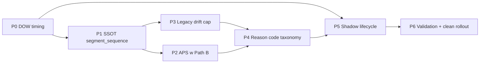
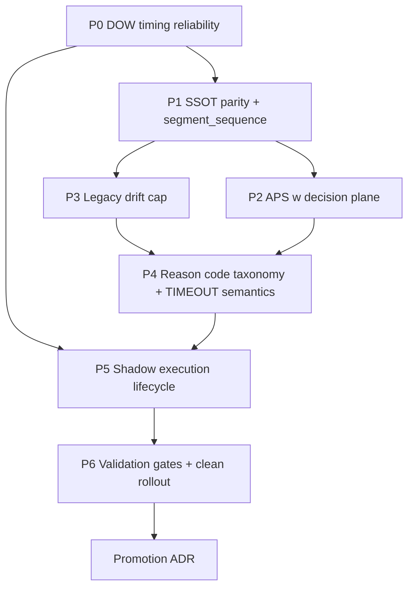

# PLAN NAPRAWCZY — GATEKEEPER V2.5 + SHADOW-BURNIN

> **Data:** 2026-05-07
> **Status:** plan wykonawczy (proposal), wymaga ACK przed implementacją
> **Baseline:** [PLANS/GATEKEEPER_V25_REPAIR_PLAN.md](PLANS/GATEKEEPER_V25_REPAIR_PLAN.md), [PLANS/GATEKEEPER_V25_SSOT_CONTRACTS.md](PLANS/GATEKEEPER_V25_SSOT_CONTRACTS.md)
> **Branch implementacyjny:** `refactor/gatekeeper-v25` (kontynuacja)
> **Skills aktywowane:** `ghost-execution`, `trading-systems`, `solana-pumpfun-architect`, `rust-master`, `abstract-reasoning`


---
# WSTĘP I STRESZCZENIE OGÓLNE

## Diagnoza warstwowa (audyt 2026-05-07)

Shadow-burnin nie jest wiarygodną symulacją scoringu pool/tokenów. 7 problemów warstwowych:

1. **V2.5 doczepione do `mode = "long"`** — nie jest pierwszoklasową ścieżką, znika gdy mode się zmieni ([gatekeeper.rs:3589](ghost-launcher/src/components/gatekeeper.rs))
2. **Okna DOW są tx-triggered** — Early/Normal nie odpalają się bez ruchu TX; Extended jest `unreachable!()` w `try_shadow_evaluate` ([gatekeeper.rs:3596-3617, 5606-5609](ghost-launcher/src/components/gatekeeper.rs))
3. **Path B (kanoniczny) nie widzi TAS/spike/ramping/flash** — `MaterializedFeatureSet` nie niesie `segment_sequence`; logi: `tas_unavailable_reason=materialized_features_missing_segment_sequence` ([gatekeeper_policy.rs:606-664](ghost-launcher/src/components/gatekeeper_policy.rs))
4. **APS jest telemetry-only** — `has_sufficient_history = false` hardcoded ⇒ regime zawsze `Normal`; APS w ogóle nie odpala w Path B ([gatekeeper_adaptive_prosperity.rs:97](ghost-launcher/src/components/gatekeeper_adaptive_prosperity.rs))
5. `**max_price_change_ratio = 9999.0`** — legacy drift cap wyłączony ([ghost_brain_config.toml:90](ghost-brain/ghost_brain_config.toml))
6. **TIMEOUT z `decision_reason = null`** — 2077/2614 rekordów latest scope; brak typed `reason_code` enum ([decision_logger.rs:196, 597-609](ghost-brain/src/oracle/decision_logger.rs))
7. **Shadow lifecycle nie domyka cyklu** — 0 BUY/0 entries w 2614 v25 decyzjach; `eventbus_lag_total = 5.5M`; `simulation_mismatch / ConstraintSeeds`

## Mapa priorytetów




## Hard guardrails (niezmiennicze)

- **N1-N16 SSOT contracts** zachowane — w szczególności N14 (no synthetic parity) i N16 (no `GatekeeperMode::V25`)
- **B1-B8 boundary decisions** z istniejącego [PLANS/GATEKEEPER_V25_REPAIR_PLAN.md](PLANS/GATEKEEPER_V25_REPAIR_PLAN.md) zachowane
- **Legacy live plane** niezmieniony; V2.5 plane wciąż shadow-first (`live_execution_enabled = false`)
- **HyperPrediction Oracle** poza zakresem
- **PnL nie jest DoD** — DoD to coverage, invariants, audytowalność
- **Single owner per pool** dla checkpoint firing i shadow reconciliation — żadnych równoległych writerów tej samej decyzji/lifecycle bez jawnej serializacji

## Final acceptance

19 testów kontraktowych zielone + clean rollout `shadow-burnin-v25-repair-r2` przez 24h + walidator NO-GO → GO + 100% `reason_code` completeness + shadow lifecycle domknięty + rozróżnienie `no_dispatch` vs `failed_reconciliation` + zero invariant violations.


---

## 0. Streszczenie wykonawcze

System Gatekeeper V2.5 jest częściowo zaimplementowany, ale **shadow-burnin nie jest wiarygodną symulacją scoringu pool/tokenów**. Diagnoza warstwowa (obraz operatora 2026-05-07 + kanoniczny scope `shadow-burnin-v25-repair`):

- **Problem 1 — semantyka V2.5 doczepiona do `mode = "long"`** zamiast jawnej decision-plane separacji. Jeśli ktoś przełączy `mode = "standard"`, V2.5 cicho znika.
- **Problem 2 — okna DOW są tx-triggered, nie czasowo gwarantowane.** Cisza w buforze = brak Early/Normal checkpointu nawet jeśli minęło 4s, 6s. Extended jest deadline-collapse, nie checkpointem.
- **Problem 3 — Path B (feature-driven, kanoniczny) ma niepełny scoring.** `tas_unavailable_reason = materialized_features_missing_segment_sequence`, `v25_confidence_unavailable_reason = materialized_features_partial_v25_inputs`. Finalny verdict na deadlineie nie widzi pełnego obrazu poola.
- **Problem 4 — APS jest telemetry-only.** `has_sufficient_history = false` jest hardcoded; APS regime zawsze `Normal`; APS nie sterował confidence ani na shadow Path A, ani na Path B (deadline). „Regime-aware scoring" z dokumentu nie istnieje operacyjnie.
- **Problem 5 — legacy drift cap wyłączony.** `max_price_change_ratio = 9999.0` — Path A hard-fail nie tnie driftu, a PDD entry-drift cap (`5.0%`) działa tylko w shadow.
- **Problem 6 — audytowalność TIMEOUT-ów łamie kontrakt.** `decision_reason = null` w 2077/2614 rekordach v25 latest scope; brak `reason_code` jako typed enum; `verdict_type` na timeoutach jest częściowy.
- **Problem 7 — runtime shadow nie domyka cyklu.** 0 BUY, 0 shadow entries w 2614 v25 decyzjach. `eventbus_lag_total = 5_591_219` skipped events. `shadow_lifecycle_complete = failed`. `simulation_mismatch` / `ConstraintSeeds` / `shadow_simulation_error` widoczne jako klasy, ale reconciliation niedomknięta.

Plan utrzymuje **wszystkie boundary decisions** z istniejącego [PLANS/GATEKEEPER_V25_REPAIR_PLAN.md](PLANS/GATEKEEPER_V25_REPAIR_PLAN.md) (B1-B8) oraz **niezmienniki SSOT** (N1-N16). Nie wprowadza `GatekeeperMode::V25`. Naprawia 7 problemów w jasnej kolejności priorytetów P0-P6, z explicit DoD i invariant tests.

---

## 1. Niezmienniki, których plan nie narusza

Lista jest skrócona; pełna postać w [PLANS/GATEKEEPER_V25_SSOT_CONTRACTS.md](PLANS/GATEKEEPER_V25_SSOT_CONTRACTS.md).

- N1 — `MaterializedFeatureSet` SSOT, nowe pola optional `#[serde(default)]`.
- N2 — `GatekeeperDecision` rozszerzane, nie modyfikowane.
- N3 — JSONL schema changes są additive i rebasowane na **aktualny baseline loggera** (na dzień 2026-05-07: `v18`).
- N5 — `shadow_enabled = true`, `live_execution_enabled = false` defaultem.
- N7 — Yellowstone gRPC jedynym źródłem on-chain state.
- N9 — `compute_decision()` (Path A, buffer) i `evaluate_policy_from_assessment()` (Path B, materialized) to dwie ścieżki, ten sam typ.
- N10 — kolejność: HardFails → PDD → CoreFail → SybilCombo → SybilSoft → LegacySoft → Alpha → Prosperity.
- N13 — legacy live plane i V2.5 shadow plane są rozdzielone w loggerze.
- N14 — parity Path A/B jest availability-aware; **żadnego synthetic backfill**.
- N16 — repair stream **nie wprowadza** `GatekeeperMode::V25`.

Boundary decisions z [GATEKEEPER_V25_REPAIR_PLAN.md](PLANS/GATEKEEPER_V25_REPAIR_PLAN.md): B1 legacy live niezmieniony, B2 V2.5 first-class shadow, B3 PDD absolutne veto wewnątrz V2.5, B4 brak zgadywania feature'ów, B5 najpierw coverage potem tuning, B6 shadow_only nie zależy od live payer, B7 HyperPrediction Oracle poza zakresem, B8 PnL nie jest DoD.

---

## 2. Mapa problemów → priorytety → workstreamy



Krytyczna ścieżka: P0 → P1 → P4 → P5 → P6.

---

## 3. P0 — DOW timing reliability (gwarantowane okna)

### 3.1 Problem (mapowanie)

Z obrazu: „Okna DOW są tx-triggered, nie czasowo gwarantowane 2-5 / 5-7 / 7-10s; Extended nie działa jako normalny checkpoint."

Z kodu:

- [ghost-launcher/src/components/gatekeeper.rs:3589-3617](ghost-launcher/src/components/gatekeeper.rs) — checkpoint Early/Normal odpala się tylko wewnątrz `ingest_long_transaction_tracking_only()` i tylko gdy nowy TX wpadnie w okno czasowe. Cisza po t=2s = brak Early.
- [ghost-launcher/src/components/gatekeeper.rs:5318-5636](ghost-launcher/src/components/gatekeeper.rs) — `try_shadow_evaluate(Extended)` jest oznaczone jako `unreachable!()` (linia 5606-5609). Extended jest obsługiwane w `check_long_deadline()` (linia 6045-6179), czyli pojedynczy event przy deadline.
- Konsekwencja: **golden window coverage 3-7s jest zniekształcony**, telemetry pokazuje skewed liczbę BUY w stage Early/Normal/Extended.

### 3.2 Decyzja architektoniczna

DOW pozostaje **shadow-first**, ale checkpointy muszą być **niezależne od ruchu TX**. Uzasadnienie z trading-systems: „Stale data, duplicate delivery, partial failure are normal conditions." Brak ruchu TX nie zwalnia decyzji w ujęciu czasowym.

Wybór: **dedykowany tokio interval timer per pool**, równolegle do tx-driven path. Timer odpala `try_shadow_evaluate(stage)` na deadlineie czasowym, niezależnie od ostatniego TX.

Krytyczny invariant wykonawczy: **single serialized owner per pool**. Timer, ingest path i deadline fallback nie mogą niezależnie emitować tego samego checkpointu. Jeden obiekt stanu poola jest jedynym właścicielem flag `*_shadow_fired`, a wszystkie wejścia (`TX`, tick, deadline) przechodzą przez ten sam serializowany mutator.

### 3.3 Implementacja

#### 3.3.1 Per-pool DOW timer

Nowy moduł: `ghost-launcher/src/components/gatekeeper_dow_timer.rs`.

Kontrakt:

- spawn `tokio::time::interval` z tick co `dow.tick_interval_ms` (default 250ms).
- przy każdym ticku wywołać `gatekeeper_buffer.maybe_fire_shadow_checkpoint(now_wall_ms)`.
- kończy się gdy `state == Approved/Rejected` albo deadline minął.

`maybe_fire_shadow_checkpoint`:

- jeśli `early_window_open && !early_shadow_fired` → `try_shadow_evaluate(Early)`.
- jeśli `normal_window_open && !normal_shadow_fired` → `try_shadow_evaluate(Normal)`.
- jeśli `extended_window_open && !extended_shadow_fired` → `try_shadow_evaluate(Extended)`.
- jeśli checkpoint już odpalony lub pool w stanie terminalnym → no-op, bez duplikatu i bez drugiego writera.

#### 3.3.2 Extended jako pełnoprawny checkpoint

Usunąć `unreachable!()` w [ghost-launcher/src/components/gatekeeper.rs:5608](ghost-launcher/src/components/gatekeeper.rs).
`try_shadow_evaluate(Extended)` ma własną gałąź:

- guard: `total_tx_count >= min_tx_count`,
- `extended_require_pdd_clean = true` (już jest w configu),
- min confidence: `dow.extended_window_min_confidence` (już jest, 0.55),
- decyzja: `NormalBuyCandidate` jeśli `verdict_buy && conf >= min && pdd_clean`.

`check_long_deadline()` zachowuje obecną semantykę dla legacy live verdict, ale **nie powiela** Extended shadow decision — Extended z timera ustawia `extended_shadow_fired = true` i deadline path tylko sprawdza, czy flaga ustawiona; jeśli nie, fires fallback z reason `EXTENDED_SHADOW_DEADLINE_FALLBACK`.

#### 3.3.3 Insufficient-data tagging

Każdy timer-fired checkpoint, który nie ma minimalnej liczby TX, loguje `ShadowDecisionKind::InsufficientData` z explicit reason `TIMER_FIRED_INSUFFICIENT_DATA: tx={}/{} elapsed_ms={}`. Bez ciszy.

### 3.4 Pliki

- `ghost-launcher/src/components/gatekeeper.rs` — usunięcie `unreachable!`, dodanie `maybe_fire_shadow_checkpoint`, dodanie `extended_shadow_fired` flag.
- `ghost-launcher/src/components/gatekeeper_dow_timer.rs` — nowy moduł.
- `ghost-launcher/src/components/mod.rs` — `pub mod gatekeeper_dow_timer`.
- `ghost-launcher/src/oracle_runtime.rs` — spawn timer task per pool w `pool_observation_task`.
- `ghost-brain/ghost_brain_config.toml` — sekcja `[gatekeeper_v2.dow]` rozszerzona o `tick_interval_ms = 250` (z `#[serde(default)]`).
- `ghost-brain/src/config/gatekeeper_v25_config.rs` — pole `tick_interval_ms: u64`.

### 3.5 DoD P0

- [ ] Early/Normal/Extended fire na timerze, niezależnie od ruchu TX.
- [ ] Extended ma własną gałąź w `try_shadow_evaluate`, bez `unreachable!`.
- [ ] Timer kończy się przy `Approved`/`Rejected`/`deadline`.
- [ ] Single-owner invariant: timer, ingest i deadline fallback nie generują zdublowanych checkpointów dla tego samego poola/stage.
- [ ] Telemetry: nowy metric `gatekeeper_dow_timer_fired_total{stage="Early|Normal|Extended"}`.
- [ ] Test integracyjny: pool z 1 TX o t=0s, brak TX → Early/Normal/Extended każdy odpala raz z `InsufficientData` reason.
- [ ] Test integracyjny: pool z TX co 2s → Early o t∈[2,5], Normal o t∈[5,7], Extended o t∈[7,10], każdy z poprawnym verdict.
- [ ] Test race-safety: tick + nowy TX + deadline fallback w tej samej okolicy czasu nadal kończą z jednym checkpointem per stage.

---

## 4. P1 — SSOT parity + segment_sequence (Path B widzi pełny obraz)

### 4.1 Problem (mapowanie)

Z obrazu: „Finalny path feature-driven nie ma pełnego PDD; TAS/V25 confidence bywają niedostępne" + logi: `tas_unavailable_reason=materialized_features_missing_segment_sequence`, `v25_confidence_unavailable_reason=materialized_features_partial_v25_inputs`.

Z kodu:

- [ghost-launcher/src/components/gatekeeper_policy.rs:606-664](ghost-launcher/src/components/gatekeeper_policy.rs) — `materialize_pdd_diagnostics_from_features` ma tylko 3/6 sygnałów (drift, whale, reserve). Brak: spike (sequence), ramping (sequence), flash crash (sequence).
- [ghost-launcher/src/components/gatekeeper.rs:1419-1466](ghost-launcher/src/components/gatekeeper.rs) — `tas_availability` zwraca `materialized_features_missing_segment_sequence` jeśli Path B nie zna segmentów. To jest **honest** (zgodne z N14), ale skutek operacyjny: TAS/V25 confidence są `None` w 100% Path B → decision gate na deadlineie nie waży trajektorii.

### 4.2 Decyzja architektoniczna

Zgodnie z N14, **nie** rekonstruujemy syntetycznie. Zamiast tego:

1. **Wzbogacamy `MaterializedFeatureSet` o segment_sequence** — to jest legalne rozszerzenie SSOT (N1: nowe pola optional). `PoolObservationSession::materialize_features()` (już istnieje w [ghost-launcher/src/session/observation.rs:368](ghost-launcher/src/session/observation.rs)) dostaje dodatkowy step: zbudowanie `TrajectorySegmentSequence` z `gatekeeper_buffer.buffered_txs` i zapis do nowego pola w `CheckpointDerivedFeatures` lub osobnego pola `tx_segment_sequence` w `MaterializedFeatureSet`.
2. **Path B liczy TAS** z tego pola, jeśli sufficient.
3. **Path B liczy spike/ramping/flash** z `tx_segment_sequence`. Jeśli w sequence brak sufficient TX per segment → `unavailable_reason` z konkretnym powodem.

Path B nadal nie liczy sygnałów, których SSOT realnie nie niesie (np. dane fingerprint sub-3s, jeśli session nie zebrała). Kontrakt N14 zachowany.

### 4.3 Implementacja

#### 4.3.1 Nowe pole SSOT: `tx_segment_sequence`

Lokalizacja: `ghost-core/src/checkpoint/types.rs`.

```rust
#[derive(Debug, Clone, Default, Serialize, Deserialize)]
pub struct TxSegmentSequence {
    pub t0_segment: TrajectorySegmentSnapshot,
    pub t1_segment: TrajectorySegmentSnapshot,
    pub t2_segment: TrajectorySegmentSnapshot,
    pub total_duration_ms: u64,
    pub min_tx_per_segment_satisfied: bool,
}

#[derive(Debug, Clone, Default, Serialize, Deserialize)]
pub struct TrajectorySegmentSnapshot {
    pub tx_count: u64,
    pub buy_ratio: f64,
    pub avg_interval_ms: f64,
    pub total_volume_sol: f64,
    pub hhi: f64,
    pub max_price_impact_pct: f64,
    pub same_size_streak: u32,
}
```

Dodane jako `Option<TxSegmentSequence>` na końcu `MaterializedFeatureSet` z `#[serde(default)]`. N1 zachowany.

#### 4.3.2 Materializacja sequence w sesji

[ghost-launcher/src/session/observation.rs:368-505](ghost-launcher/src/session/observation.rs) — `materialize_features()` woła nową metodę `gatekeeper_buffer.current_segment_sequence(&self.config.tas)`. Buffer ma już logikę w `materialize_trajectory()` ([ghost-launcher/src/components/gatekeeper.rs:5644-5697](ghost-launcher/src/components/gatekeeper.rs)) — refaktoryzujemy tak, żeby zwracała surowe segmenty zamiast od razu `TrajectoryAssessment`.

#### 4.3.3 Path B liczy TAS

[ghost-launcher/src/components/gatekeeper_policy.rs](ghost-launcher/src/components/gatekeeper_policy.rs) — `build_assessment_from_features()` woła nowy helper `materialize_trajectory_from_features(features, &config.tas)` który zwraca `Option<TrajectoryAssessment>` z segmentów.

`tas_unavailable_reason` zostaje wypełnione tylko gdy sequence faktycznie brak (`min_tx_per_segment_satisfied = false`), z konkretnym powodem zamiast generic.

#### 4.3.4 Path B liczy spike/ramping/flash

Nowy moduł: `ghost-launcher/src/components/gatekeeper_pdd_sequence.rs` (split z `gatekeeper_pdd.rs` dla SRP):

- `detect_spike_from_segments(seq)` — porównanie t2 vs (t0+t1)/2 wolumenu.
- `detect_ramping_from_segments(seq)` — `same_size_streak` w t1 lub t2.
- `detect_flash_crash_from_segments(seq)` — max sell impact w t2 vs t0/t1.

Jeśli sequence brak — `pdd_sequence_signals_available = Some(false)` z explicit reason.

#### 4.3.5 v25_confidence policy

Zgodnie z B4: confidence jest liczony tylko gdy **wszystkie** wejścia dostępne. Dodatkowy bool helper:

```rust
fn v25_confidence_inputs_available(features, config) -> Result<(), &'static str> {
    if config.tas.enabled && !tas_available { return Err("tas_missing"); }
    if config.pdd.enabled && !pdd_sequence_signals_available && config.pdd.spike_detection_enabled {
        return Err("pdd_sequence_missing");
    }
    // ...
    Ok(())
}
```

### 4.4 Pliki

- `ghost-core/src/checkpoint/types.rs` — `TxSegmentSequence`, `TrajectorySegmentSnapshot`, dodanie do `MaterializedFeatureSet`.
- `ghost-core/src/checkpoint/feature_builder.rs` — przekazanie `Option<TxSegmentSequence>` w `materialize()`.
- `ghost-launcher/src/components/gatekeeper.rs` — `current_segment_sequence()` na `GatekeeperBuffer`, refaktor `materialize_trajectory()`.
- `ghost-launcher/src/session/observation.rs` — materializacja sequence w `materialize_features()`.
- `ghost-launcher/src/components/gatekeeper_policy.rs` — `materialize_trajectory_from_features()`, użycie sequence w PDD diagnostics, refaktor `tas_unavailable_reason` / `v25_confidence_unavailable_reason`.
- `ghost-launcher/src/components/gatekeeper_pdd_sequence.rs` — nowy moduł.
- `ghost-launcher/src/components/mod.rs`.

### 4.5 DoD P1

- [ ] `MaterializedFeatureSet` ma `Option<TxSegmentSequence>` z `#[serde(default)]` (N1 zachowany).
- [ ] Path B liczy TAS gdy sequence dostępna; w przeciwnym razie `tas_unavailable_reason` z konkretnym powodem (`insufficient_tx_per_segment`, `insufficient_duration`).
- [ ] Path B liczy spike/ramping/flash z sequence; jawny `unavailable_reason` gdy brak.
- [ ] `v25_confidence` jest liczony tylko gdy wszystkie wejścia dostępne; `unavailable_reason` zawsze typed.
- [ ] Test contract: `path_b_marks_unavailable_instead_of_guessing_sequence_features` (już zdefiniowany w repair planie 7.2).
- [ ] Test parity: `path_a_and_path_b_compute_same_tas_when_sequence_present`.

---

## 5. P2 — APS w decision plane (regime-aware bez pełnej kalibracji)

### 5.1 Problem (mapowanie)

Z obrazu: „APS jest praktycznie telemetry-only, nie steruje realnie prosperity/scoringiem". Logi pokazują APS regime = Normal w 100% rekordów.

Z kodu:

- [ghost-launcher/src/components/gatekeeper_adaptive_prosperity.rs:97](ghost-launcher/src/components/gatekeeper_adaptive_prosperity.rs) — `let has_sufficient_history = false;` hardcoded. Niezależnie od configu, regime detection nigdy nie odpala — zawsze Normal.
- [ghost-launcher/src/components/gatekeeper_adaptive_prosperity.rs:134](ghost-launcher/src/components/gatekeeper_adaptive_prosperity.rs) — `adaptive_thresholds_applied: false` zawsze.
- APS jest wywoływane tylko w `try_shadow_evaluate` ([ghost-launcher/src/components/gatekeeper.rs:5389](ghost-launcher/src/components/gatekeeper.rs)). W `evaluate_policy_from_assessment` (Path B / kanonicznej deadline path) — APS nigdy się nie liczy.

### 5.2 Decyzja architektoniczna

Pełna kalibracja regime z cross-pool outcome trackerem to większy projekt (post-V2.5 zgodnie z `ghost-execution`). **Nie wpinamy** outcome trackera w tym repair streamie. Zamiast tego dwustopniowe podejście:

1. **APS pool-local heuristic** — `detect_regime` jest już zaimplementowany ([ghost-launcher/src/components/gatekeeper_adaptive_prosperity.rs:160-200](ghost-launcher/src/components/gatekeeper_adaptive_prosperity.rs)) i działa bez cross-pool history. Jego wyniki są **provisional** (B5 + uncertainty policy z trading-systems). Włączamy je przez nową flagę `regime_local_heuristic_enabled` (default `false` poza `shadow-burnin` rolloutem).
2. **APS w Path B** — wywołać `evaluate_aps()` w `evaluate_policy_from_assessment()`. APS daje:
   - shadow contrafactual `shadow_prosperity_would_pass` (telemetry dla kalibracji).
   - regime label do JSONL (audytowalność).
   - drift override w HighVolatility regime (3% zamiast 5%) **tylko jeśli `aps.adaptive_enabled = true` i `live_execution_enabled = false`** — zachowuje shadow-first, ale daje regime-aware shadow rozstrzygnięcie.

`adaptive_thresholds_applied` przestaje być stale-`false`; staje się funkcją `(adaptive_enabled && regime != Normal && live_execution_enabled == false)`. To daje plane V2.5 shadow zdolność reagowania na regime, **bez** ruszania legacy live verdict (B1 zachowany).

### 5.3 Implementacja

#### 5.3.1 APS w Path B

[ghost-launcher/src/components/gatekeeper_policy.rs](ghost-launcher/src/components/gatekeeper_policy.rs) — `build_assessment_from_features()`:

```rust
let pdd_spike_detected = assessment
    .pdd_assessment
    .as_ref()
    .map_or(false, |p| p.spike_detected);
assessment.aps_diagnostics = Some(
    crate::components::gatekeeper_adaptive_prosperity::evaluate_aps(
        &assessment,
        &config.aps,
        pdd_spike_detected,
    ),
);
```

#### 5.3.2 Lokalna heurystyka regime jako provisional

[ghost-launcher/src/components/gatekeeper_adaptive_prosperity.rs:97-102](ghost-launcher/src/components/gatekeeper_adaptive_prosperity.rs):

```rust
let has_sufficient_history = config.regime_local_heuristic_enabled
    || config.cross_pool_outcome_tracker_available;
let regime = if has_sufficient_history {
    detect_regime(assessment, config, pdd_spike_detected)
} else {
    MarketRegime::Normal
};
```

Nowy bool w `AdaptiveProsperityConfig`:

```rust
#[serde(default)]
pub regime_local_heuristic_enabled: bool,  // default false; włączyć w shadow-burnin
#[serde(default)]
pub cross_pool_outcome_tracker_available: bool,  // future flag
```

#### 5.3.3 HighVolatility drift override w Path B

`build_assessment_from_features`, po wywołaniu `evaluate_aps`:

```rust
if let Some(aps) = &assessment.aps_diagnostics {
    if aps.regime == MarketRegime::HighVolatility
        && config.aps.adaptive_enabled
        && !config.v25.live_execution_enabled
    {
        if let Some(drift) = assessment.entry_drift_pct {
            let hv_max = config.aps.regime_high_vol_entry_drift_max_pct;
            if drift > hv_max {
                if let Some(pdd) = assessment.pdd_assessment.as_mut() {
                    pdd.hard_fail = Some(PddHardFail::EntryDrift);
                    pdd.pdd_score = 0.0;
                }
            }
        }
    }
}
```

Identyczna logika jak w shadow Path A ([ghost-launcher/src/components/gatekeeper.rs:5409-5430](ghost-launcher/src/components/gatekeeper.rs)).

### 5.4 Pliki

- `ghost-launcher/src/components/gatekeeper_adaptive_prosperity.rs` — usunięcie hardcoded `false`, dodanie regime_local_heuristic flag.
- `ghost-launcher/src/components/gatekeeper_policy.rs` — wywołanie APS + drift override.
- `ghost-brain/src/config/gatekeeper_v25_config.rs` — `regime_local_heuristic_enabled`, `cross_pool_outcome_tracker_available`.
- `ghost-brain/ghost_brain_config.toml` — `[gatekeeper_v2.aps]` rozszerzone (z `#[serde(default)]`).
- `configs/rollout/shadow-burnin.toml` — overlay włączający `regime_local_heuristic_enabled = true`.

### 5.5 DoD P2

- [ ] APS odpala w `evaluate_policy_from_assessment` (Path B).
- [ ] `aps_diagnostics` jest w 100% rekordów Path B (nie tylko shadow Path A).
- [ ] `regime_local_heuristic_enabled = true` w shadow-burnin rolloucie; provisional regime label widoczny w JSONL.
- [ ] HighVolatility drift override działa w Path B gdy `adaptive_enabled = true && live_execution_enabled = false`.
- [ ] Test invariant: `aps_drift_override_only_in_shadow_plane` — gdy `live_execution_enabled = true`, override nie odpala.
- [ ] Telemetry: metric `gatekeeper_aps_regime_distribution{regime="Normal|HighVol|LowVol"}` — udokumentowane jako provisional do post-V2.5 outcome trackera.

---

## 6. P3 — Legacy drift cap (świadome zamknięcie blind spot)

### 6.1 Problem (mapowanie)

Z obrazu: „`max_price_change_ratio = 9999.0` nadal aktywne" + audyt: legacy hard fail HF-4 sprawdza `price_change_ratio > max_price_change_ratio` ([ghost-launcher/src/components/gatekeeper_policy.rs](ghost-launcher/src/components/gatekeeper_policy.rs), evaluate_hard_filters_from_assessment).

Konsekwencja: Path A (legacy) nie blokuje driftu. PDD entry-drift (5%) działa tylko w shadow path. Live legacy może puścić BUY z driftem +500%.

### 6.2 Decyzja architektoniczna

Konflikt z B1 (legacy live niezmieniony): nie wolno cicho zaostrzyć legacy progu. Ale `9999.0` to nie jest „wartość zaostrzona" — to **wyłączenie**, faktycznie naruszenie założenia z `ghost-execution` SKILL ("Entry drift jest hard configured limit, nie 9999.0").

Świadome działanie: zamknąć blind spot w legacy live plane przez **przywrócenie sensownego cap**, ale bez udawania pełnej parytetowej zgodności z PDD. PDD ma `entry_drift_max_pct = 5.0%` ⇒ pełne wyrównanie dawałoby `max_price_change_ratio = 1.05` (price_change_ratio = current/initial ⇒ +5% drift = 1.05). **Ten plan nie robi jeszcze alignmentu do 1.05.** Ten plan wprowadza **tymczasowy legacy safety cap = 1.50** jako pierwszy krok de-riskingu, żeby zamknąć blind spot `9999.0`, ale nie przestroić od razu legacy plane do semantyki PDD shadow.

Alternatywa świadoma: jeśli operator chce zachować 9999.0 jako emergency-disable, dodać `legacy_drift_cap_enabled = true` z `#[serde(default = "default_true")]` i wartość 1.05, a wyłączenie wymaga jawnego przełącznika. Plan rekomenduje **tymczasowe 1.50** w `ghost-brain/ghost_brain_config.toml` z ADR, a ewentualne dojście do `1.20` / `1.10` / `1.05` dopiero po validation.

### 6.3 Implementacja

[ghost-brain/ghost_brain_config.toml:90](ghost-brain/ghost_brain_config.toml):

```toml
# Przed:
max_price_change_ratio = 9999.0

# Po:
# Tymczasowy legacy safety cap. To NIE jest pełny alignment do PDD 5%,
# tylko pierwszy krok zamykający blind spot 9999.0 bez gwałtownego
# przestrojenia legacy live plane.
max_price_change_ratio = 1.50
```

Nie 1.05 w pierwszym kroku — **stopniowe zaostrzanie** w jednym shadow-burnin scope:

1. **Krok 1 (ten plan):** `1.50` (+50%) — tnie tylko skrajne pumpy, nie ruszać A-pool capture.
2. **Krok 2 (osobny ADR po validation):** ewentualne zaostrzenie do `1.20` lub `1.10`.
3. **Krok 3 (osobny ADR, tylko jeśli dane to uzasadnią):** rozważyć pełny alignment do `1.05`.

ADR: `docs/ADR/ADR-0XXX-legacy-drift-cap-restore-20260507.md`.

### 6.4 Pliki

- `ghost-brain/ghost_brain_config.toml` — `max_price_change_ratio = 1.50`.
- `docs/ADR/ADR-0XXX-legacy-drift-cap-restore-20260507.md` — decision context, alternatywy (`1.05`, `1.20`, `1.50`, gated bool), wybór `1.50`, consequences (mniej A-pool false negatives przy pierwszej iteracji, dane do dalszego zaostrzenia).

### 6.5 DoD P3

- [ ] `max_price_change_ratio = 1.50` w toml.
- [ ] ADR w `docs/ADR/`.
- [ ] Backfill audit: ile pooli z latest scope miało `price_change_ratio > 1.50` w Path A (te byłyby teraz odrzucone). Dla weryfikacji, że `1.50` nie jest nadgorliwy.
- [ ] ADR explicite nazywa `1.50` jako **tymczasowy legacy safety cap**, nie „PDD alignment”.
- [ ] Test parse/config przechodzi (toml deserializacja).

---

## 7. P4 — Reason code taxonomy + TIMEOUT semantics

### 7.1 Problem (mapowanie)

Z obrazu: „V25 loguje `decision_reason`, ale nie wypełnia osobnego `reason_code`; TIMEOUT-y mają `decision_reason=null`" + 2077/2614 rekordów v25 latest scope ma pusty decision_reason.

Z kodu:

- [ghost-launcher/src/components/gatekeeper.rs:6022-6042](ghost-launcher/src/components/gatekeeper.rs) — `Timeout` verdict zawiera `assessment` z `build_minimal_assessment()`, ale `assessment.decision = None`. `to_buy_log()` mapuje pola tylko gdy `decision.is_some()`.
- [ghost-brain/src/oracle/decision_logger.rs:194-198](ghost-brain/src/oracle/decision_logger.rs) — `reason_code` jest `Option<String>`, wersjonowany (`reason_code_version: u32`), ale używany tylko dla NoEmit ścieżki. Reject/Buy/Timeout używają `decision_reason` (free-form `String`).
- Skutek: nie da się jednoznacznie kategoryzować Timeout-ów (genuine-no-interest vs ingest-miss vs window-close-too-early), bo TIMEOUT nawet nie ma reason w JSONL.

### 7.2 Decyzja architektoniczna

Wprowadzić **typed reason_code dla wszystkich verdict types**, nie tylko NoEmit. To jest schema bump, ale plan jest **rebasowany na aktualny baseline loggera**. Na dzień 2026-05-07 kod ma już `GATEKEEPER_BUY_LOG_SCHEMA_VERSION = 18`, więc ten workstream oznacza bump **z aktualnego baseline do kolejnej additive wersji** (jeśli nic innego nie wyląduje równolegle, będzie to `v19`).

Taxonomy reason code (zgodnie z 7.6.2 repair planu — timeout taxonomy):

```rust
#[derive(Debug, Clone, Copy, Serialize, Deserialize)]
#[serde(rename_all = "SCREAMING_SNAKE_CASE")]
pub enum GatekeeperReasonCode {
    // ── BUY ──
    BuyNormal,
    BuyEarly,
    BuyExtended,
    // ── HARD FAIL ──
    HardFailDevSold,
    HardFailMarketCap,
    HardFailExtremeHhi,
    HardFailExtremeBundling,
    HardFailExtremeTop3,
    HardFailExtremeBotTiming,
    HardFailFailedTxRatio,
    HardFailSlowPool,
    HardFailSellImpact,
    HardFailTxPriceImpact,
    HardFailPriceChange,  // legacy drift cap
    // ── PDD ──
    RejectPddEntryDrift,
    RejectPddSpike,
    RejectPddRamping,
    RejectPddWhale,
    RejectPddReserve,
    RejectPddFlashCrash,
    // ── CORE / SYBIL / ALPHA / PROSPERITY ──
    RejectCoreFail,
    RejectSybilCombo,
    RejectSybilSoftExcess,
    RejectLegacySoftExcess,
    RejectLowAlpha,
    RejectLowProsperity,
    // ── TAS / TIMING ──
    RejectLowTrajectory,
    RejectInsufficientConfidence,
    // ── TIMEOUT ──
    TimeoutPhase1NoData,           // Phase 1 nigdy nie spełnione, brak TX
    TimeoutPhase1Insufficient,     // TX są, ale za mało dla Phase 1
    TimeoutDeadlineLowPhases,      // Phase 1 OK, ale phases_passed < min
    TimeoutNoVerdict,              // verdict nie zwrócony (invariant break)
    // ── INVARIANT / SHADOW ──
    InvariantPddBuyContradiction,  // V25-I1 violation
    InvariantZeroConfidenceBuy,    // V25-I2 violation
    ShadowInsufficientData,
    ShadowEvalSkipped,
}

impl GatekeeperReasonCode {
    pub fn version() -> u32 { 2 }  // bump z 1 (NoEmit-only)
}
```

Lokalizacja: nowy modul `ghost-brain/src/oracle/reason_code.rs` (ma być testowalny i zewnętrznie czytelny).

`GatekeeperBuyLog` ma:

- `decision_reason: Option<String>` — free-form (zachowany wstecznie).
- `reason_code: Option<String>` — typed (zawsze wypełniany).
- `reason_code_version: u32` — `2`.

### 7.3 Implementacja

#### 7.3.1 Reason code per verdict

Każda gałąź w `compute_decision`, `evaluate_policy_from_assessment`, `check_long_deadline`, `try_shadow_evaluate`, `evaluate_phases` ustawia `reason_code` z odpowiednim wariantem.

#### 7.3.2 TIMEOUT z reason

[ghost-launcher/src/components/gatekeeper.rs:6022-6042](ghost-launcher/src/components/gatekeeper.rs) — `build_minimal_assessment()` rozszerzony o `reason_code` field. `Timeout { assessment, reason_code }` z trzy gałęzie: `TimeoutPhase1NoData` (zero TX), `TimeoutPhase1Insufficient` (TX są ale za mało), `TimeoutDeadlineLowPhases` (Phase 1 OK ale `phases_passed < min_phases_to_pass`).

`to_buy_log()` mapuje TIMEOUT → JSONL z wypełnionym `reason_code`, `decision_reason` (formatted breakdown), `verdict_type` (`TIMEOUT_PHASE1_NO_DATA` / `TIMEOUT_PHASE1_INSUFFICIENT` / `TIMEOUT_DEADLINE_LOW_PHASES`).

#### 7.3.3 Schema bump z aktualnego baseline

`GATEKEEPER_BUY_LOG_SCHEMA_VERSION` jest bumpowane z **aktualnego baseline v18** do następnej additive wersji (planistycznie: `v19`, jeśli nie zajdzie równoległy bump). Zmiany w schema dokumentowane w `PLANS/GATEKEEPER_V25_SSOT_CONTRACTS.md` sekcja 12 + `docs/ADR/ADR-0XXX-decision-logger-schema-next-20260507.md`.

### 7.4 Pliki

- `ghost-brain/src/oracle/reason_code.rs` — nowy moduł.
- `ghost-brain/src/oracle/decision_logger.rs` — schema bump, integracja `GatekeeperReasonCode`.
- `ghost-launcher/src/components/gatekeeper.rs` — TIMEOUT z reason_code, propagacja w build_minimal_assessment.
- `ghost-launcher/src/components/gatekeeper_policy.rs` — reason_code w każdej gałęzi.
- `ghost-launcher/src/components/gatekeeper_pdd.rs`, `gatekeeper_trajectory.rs` — reason_code per fail mode.
- `docs/ADR/ADR-0XXX-decision-logger-schema-next-20260507.md`.

### 7.5 DoD P4

- [ ] `GatekeeperReasonCode` enum + `reason_code_version = 2`.
- [ ] 100% rekordów JSONL ma `reason_code` wypełniony.
- [ ] TIMEOUT ma 3 podtypy: `TimeoutPhase1NoData`, `TimeoutPhase1Insufficient`, `TimeoutDeadlineLowPhases`.
- [ ] Schema bump z aktualnego baseline (`v18` na dzień planu) do następnej additive wersji, z ADR.
- [ ] Test contract: `every_verdict_emits_typed_reason_code`.
- [ ] Test contract: `timeout_decision_reason_is_never_null`.
- [ ] `scripts/gatekeeper_v25_repair_validation.py` rozszerzony o `reason_code completeness check`.

---

## 8. P5 — Shadow execution lifecycle (zamknięcie evidence chain)

### 8.1 Problem (mapowanie)

Z obrazu: „07.05 latest scope: 2614 decyzji v25, **0 BUY, 0 shadow entries**; walidator: NO-GO; brak `shadow_lifecycle`; `eventbus_lag_total = 5_591_219`; `simulation_mismatch / ConstraintSeeds / shadow_simulation_error`".

Z kodu:

- [ghost-launcher/src/components/trigger/shadow_run.rs:582-608](ghost-launcher/src/components/trigger/shadow_run.rs) — `simulation_mismatch` mapowane na `shadow_simulation_error`, klasyfikacja błędów istnieje.
- [ghost-launcher/src/oracle_runtime.rs:5004, 6635-6653](ghost-launcher/src/oracle_runtime.rs) — `shadow_lifecycle_log_path` i mapowanie failure classes.
- [ghost-launcher/src/main.rs:309-336](ghost-launcher/src/main.rs) — `derive_shadow_lifecycle_log_path` derive z entry log.
- [ghost-launcher/src/events.rs:858-861](ghost-launcher/src/events.rs) — `record_event_bus_lag` istnieje.
- 0 BUY → 0 entries w `shadow_entries.jsonl` → 0 lifecycle entries.

### 8.2 Decyzja architektoniczna

Zgodnie z B6 (shadow_only nie zależy od live payer) i workstreamem 6 repair planu:

1. **`payer_strategy = ephemeral`** dla `shadow_only` w shadow-burnin rolloucie. Już istnieje `payer_strategy = "configured"` w [configs/rollout/shadow-burnin.toml:69](configs/rollout/shadow-burnin.toml). Dodanie wariantu `ephemeral` jako lokalna ścieżka shadow path (nie shared payer loader).
2. **Reconciliation enforcement** — shadow simulation result MUSI zostać dowieziony do `shadow_lifecycle.jsonl` z klasyfikacją (data/auth/timing/fee/network/sim_mismatch/invariant). Jeśli simulation się nie domknie — log z `simulation_outcome = "abandoned"`, nie cisza.
3. **Eventbus backpressure** — 5.5M skipped events to nie jest problem skalowania, tylko brak konsumenta dla niektórych typów. Plan nakłada limit dropów przed alarmem (`eventbus_drop_threshold_per_min = 100`), powyżej — `tracing::warn!` z konkretnymi consumer/event-type.
4. **Idempotency key** — każdy shadow dispatch dostaje `idempotency_key = blake3(pool_id || join_key || rollout_profile)`, single reconciliation path.

Krytyczne rozróżnienie operacyjne: **`no_dispatch` != `failed_reconciliation`**. Jeśli scoring nie wygenerował żadnego BUY-candidate, plan nie traktuje tego jako bug lifecycle. Lifecycle jest oceniany tylko dla przypadków, w których dispatch został faktycznie utworzony. Walidator i telemetry muszą raportować oba stany osobno.

### 8.3 Implementacja

#### 8.3.1 Ephemeral payer w shadow_only

[ghost-launcher/src/components/trigger/shadow_run.rs](ghost-launcher/src/components/trigger/shadow_run.rs) — nowy wariant `payer_strategy`:

```rust
#[derive(Debug, Clone, Copy)]
pub enum ShadowPayerStrategy {
    Configured,    // dotychczasowy
    Ephemeral,     // launcher-local keypair, poza shared loader
}
```

`load_shadow_payer()` w trigger jest osobny od `load_configured_payer()` używanego przez live submit. Brak shared fallback (B6).

#### 8.3.2 Shadow lifecycle enforcement

[ghost-launcher/src/components/post_buy_runtime.rs](ghost-launcher/src/components/post_buy_runtime.rs):

- każdy shadow dispatch produkuje `ShadowLifecycleEntry { dispatch_id, idempotency_key, status: Pending|Submitted|Confirmed|Failed|Abandoned, classification: ... }`.
- timer-driven sweep: jeśli `Pending > shadow_timeout_ms`, status = `Abandoned` z `classification = TimingProblem`.
- osobny outcome dla pooli bez dispatchu: `dispatch_status = NoDispatchEligible | NoDispatchRejected | Dispatched`. Brak dispatchu ma własny raport i **nie** jest mieszany z reconciliation failure.

#### 8.3.3 Eventbus backpressure

[ghost-launcher/src/events.rs](ghost-launcher/src/events.rs):

```rust
pub fn record_event_bus_lag(consumer: &str, skipped: u64) {
    crate::oracle_metrics::record_eventbus_lag(consumer, skipped);
    if skipped > config.eventbus_drop_warn_threshold {
        tracing::warn!(consumer, skipped, "eventbus_lag_threshold_exceeded");
    }
}
```

Per-consumer limity, alarm gdy `skipped/min > 100` przez 60s.

#### 8.3.4 Idempotency

[ghost-launcher/src/components/trigger/shadow_run.rs](ghost-launcher/src/components/trigger/shadow_run.rs):

```rust
let idempotency_key = blake3::hash(format!(
    "{}:{}:{}",
    pool_id, join_key, rollout_profile
).as_bytes());
```

Klucz w `ShadowBuySimulationRecord` + dedup w `shadow_entries.jsonl` writer.

### 8.4 Pliki

- `ghost-launcher/src/components/trigger/shadow_run.rs` — `ShadowPayerStrategy::Ephemeral`, idempotency_key.
- `ghost-launcher/src/components/post_buy_runtime.rs` — lifecycle enforcement, sweep timer.
- `ghost-launcher/src/events.rs` — eventbus backpressure alert.
- `ghost-launcher/src/oracle_metrics.rs` — `gatekeeper_shadow_lifecycle_status_total{status}`.
- `configs/rollout/shadow-burnin.toml` — `payer_strategy = "ephemeral"`.
- `docs/ADR/ADR-0XXX-shadow-only-ephemeral-payer-20260507.md`.

### 8.5 DoD P5

- [ ] `shadow_only` z `payer_strategy = ephemeral` startuje bez `GHOST_TRIGGER_KEYPAIR_PATH`.
- [ ] Każdy shadow dispatch ma `idempotency_key` i zamyka się w `shadow_lifecycle.jsonl` ze statusem.
- [ ] Walidator i telemetry rozróżniają `no_dispatch` od `failed_reconciliation`.
- [ ] `eventbus_lag_total` per-min monitorowany; alarm > 100/min.
- [ ] Walidator `shadow_lifecycle_complete = ok` w czystym rerun.
- [ ] `simulation_mismatch` / `ConstraintSeeds` mają explicit reconciliation.
- [ ] Test integracyjny: `shadow_only_runs_end_to_end_without_live_payer`.
- [ ] Test integracyjny: `no_dispatch_is_not_reported_as_lifecycle_failure`.

---

## 9. P6 — Validation gates + clean rollout

### 9.1 Cel

Udowodnić, że naprawiony V2.5 jest:

- audytowalny (P4 zamyka),
- spójny SSOT (P1 zamyka),
- coverage-sound (workstream 5 z repair planu — zacieśniony tu),
- promotowalny (gates z workstreamu 7 repair planu).

### 9.2 Testy obowiązkowe

Sumują testy z repair planu 7.2 + nowe specyficzne dla P0-P5:

1. `v25_shadow_buy_cannot_coexist_with_pdd_hard_fail` (V25-I1, repair).
2. `v25_shadow_buy_cannot_coexist_with_zero_confidence` (V25-I2, repair).
3. `legacy_live_and_v25_shadow_planes_are_logged_separately` (repair).
4. `path_b_marks_unavailable_instead_of_guessing_sequence_features` (repair).
5. `shadow_only_does_not_depend_on_live_payer_contract` (repair / P5).
6. `shadow_result_reaches_reconciliation` (repair / P5).
7. `config_hash_changes_when_gatekeeper_behavior_changes` (repair).
8. **`dow_timer_fires_all_three_stages_without_tx_pressure` (P0).**
9. **`extended_stage_has_typed_verdict_not_unreachable` (P0).**
10. **`path_a_and_path_b_compute_same_tas_when_segment_sequence_present` (P1).**
11. **`materialized_feature_set_carries_optional_segment_sequence` (P1, N1).**
12. **`aps_runs_in_path_b_when_enabled` (P2).**
13. **`aps_drift_override_only_in_shadow_plane` (P2, N13).**
14. **`legacy_drift_cap_blocks_extreme_pump` (P3).**
15. **`every_verdict_emits_typed_reason_code` (P4).**
16. **`timeout_decision_reason_is_never_null` (P4).**
17. **`shadow_lifecycle_writer_persists_terminal_status` (P5).**
18. **`dow_checkpoint_owner_is_serialized_per_pool` (P0).**
19. **`no_dispatch_is_not_counted_as_reconciliation_failure` (P5).**

### 9.3 Clean rollout

Nowy clean scope: `shadow-burnin-v25-repair-r2/` (r2 = repair round 2). Stare logi `shadow-burnin-v25-repair/` pozostają immutable jako artefakt.

### 9.4 Coverage acceptance

Walidator `scripts/gatekeeper_v25_repair_validation.py` musi pokazać:

- `mixed_plane_violations = 0`,
- `decision_reason_null_count = 0`,
- `reason_code_completeness = 100%`,
- `timeout_taxonomy_classified = 100%`,
- `dispatch_outcome_classified = 100%` (`no_dispatch` vs `dispatched`),
- `shadow_lifecycle_complete = ok`,
- `eventbus_lag_alert = none`,
- `path_b_v25_confidence_available_pct >= 70%` (po wzbogaceniu o segment_sequence — może nie być 100% jeśli niektóre poole mają < 9 TX).

### 9.5 DoD P6

- [ ] Wszystkie 19 testów kontraktowych zielone.
- [ ] Clean rollout `shadow-burnin-v25-repair-r2` przez >= 24h.
- [ ] Walidator NO-GO → GO.
- [ ] Raport JSON z liczeniami: BUY/REJECT/TIMEOUT per plane, per regime, per stage.
- [ ] Zero invariant violations w 100% rekordów.

---

## 10. Promotion ADR

Po P0-P6 zamknięciu, osobny ADR `docs/ADR/ADR-0XXX-v25-shadow-promotion-readiness-20260601.md` ma rozstrzygnąć:

- czy `live_execution_enabled = true` jest promotowalne (osobne kryteria, **nie objęte tym planem**).
- czy `mode = "v25"` jako dedykowany alias jest potrzebny (N16 może być re-evaluated po sukcesach P0-P5).

Nie obiecujemy `live_execution_enabled = true` w tym streamie. B5 + B8: PnL nie jest DoD; coverage i invariants są.

---

## 11. Mapa plików — zmiany pochodne

| Plik | P0 | P1 | P2 | P3 | P4 | P5 | P6 |
|------|----|----|----|----|----|----|----|
| `ghost-brain/ghost_brain_config.toml` | ext | ext | ext | edit | - | - | - |
| `ghost-brain/src/config/gatekeeper_v25_config.rs` | ext | - | ext | - | - | - | - |
| `ghost-brain/src/config/ghost_brain_config.rs` | - | - | - | - | - | - | - |
| `ghost-brain/src/oracle/decision_logger.rs` | - | ext | ext | - | major | ext | - |
| `ghost-brain/src/oracle/reason_code.rs` | - | - | - | - | NEW | - | - |
| `ghost-core/src/checkpoint/types.rs` | - | NEW field | - | - | - | - | - |
| `ghost-core/src/checkpoint/feature_builder.rs` | - | edit | - | - | - | - | - |
| `ghost-launcher/src/components/gatekeeper.rs` | edit | edit | - | - | major | - | - |
| `ghost-launcher/src/components/gatekeeper_policy.rs` | - | major | edit | - | edit | - | - |
| `ghost-launcher/src/components/gatekeeper_pdd.rs` | - | edit | - | - | edit | - | - |
| `ghost-launcher/src/components/gatekeeper_pdd_sequence.rs` | - | NEW | - | - | edit | - | - |
| `ghost-launcher/src/components/gatekeeper_trajectory.rs` | - | edit | - | - | edit | - | - |
| `ghost-launcher/src/components/gatekeeper_adaptive_prosperity.rs` | - | - | major | - | - | - | - |
| `ghost-launcher/src/components/gatekeeper_dow_timer.rs` | NEW | - | - | - | - | - | - |
| `ghost-launcher/src/components/mod.rs` | edit | edit | - | - | - | - | - |
| `ghost-launcher/src/components/trigger/shadow_run.rs` | - | - | - | - | - | major | - |
| `ghost-launcher/src/components/post_buy_runtime.rs` | - | - | - | - | - | edit | - |
| `ghost-launcher/src/events.rs` | - | - | - | - | - | edit | - |
| `ghost-launcher/src/oracle_metrics.rs` | edit | - | edit | - | - | edit | - |
| `ghost-launcher/src/oracle_runtime.rs` | edit | - | - | - | - | - | - |
| `ghost-launcher/src/session/observation.rs` | - | edit | - | - | - | - | - |
| `configs/rollout/shadow-burnin.toml` | - | - | edit | - | - | edit | - |
| `docs/ADR/ADR-0XXX-legacy-drift-cap-restore-20260507.md` | - | - | - | NEW | - | - | - |
| `docs/ADR/ADR-0XXX-decision-logger-schema-next-20260507.md` | - | - | - | - | NEW | - | - |
| `docs/ADR/ADR-0XXX-shadow-only-ephemeral-payer-20260507.md` | - | - | - | - | - | NEW | - |
| `docs/ADR/ADR-0XXX-v25-shadow-promotion-readiness-20260601.md` | - | - | - | - | - | - | NEW |
| `scripts/gatekeeper_v25_repair_validation.py` | - | - | - | - | edit | edit | edit |
| Testy: `ghost-launcher/tests/gatekeeper_v25_*.rs` | NEW/edit | NEW/edit | NEW/edit | edit | NEW/edit | NEW | edit |

Legenda: `NEW` = nowy plik, `major` = znacząca zmiana, `edit` = punktowa edycja, `ext` = nowe pola opcjonalne (`#[serde(default)]`), `-` = bez zmian w danej fazie.

---

## 12. Failure modes wykryte w trakcie audytu (kontrola jakości)

Zgodnie z `trading-systems` i `ghost-execution`, plan deklaruje aktywne failure modes:

- **stale signal execution** — Path B liczy verdict z deadline-old MaterializedFeatureSet bez świeżego sequence (P1 zamyka).
- **race between decision and execution** — eventbus lag 5.5M (P5 zamyka).
- **execution drift from intent** — V2.5 BUY z PDD hard fail (P4 invariant test).
- **uncalibrated confidence** — `v25_confidence` z partial inputs (P1 + P4 zamyka).
- **liquidity assumption** — `9999.0` drift cap (P3 zamyka).
- **post-fill state mismatch** — brak shadow lifecycle (P5 zamyka).
- **synthetic parity** — nie wprowadzamy (zachowane przez B4).
- **GatekeeperMode V25 creep** — nie wprowadzamy (zachowane przez N16).

---

## 13. Uncertainty disclosure

Plan **nie obiecuje**:

- 65% win rate (B8).
- BUY-yield > 0% w czystym rerun bez kalibracji thresholdów (B5).
- pełnej regime detection bez cross-pool outcome trackera (uznajemy lokalną heurystykę za provisional).
- braku regresji performance (latencji) bez profilowania timer-task overhead (mitigacja: `tick_interval_ms = 250` sensible default).

Plan **obiecuje**:

- DOW jest czasowo gwarantowane (P0).
- Path B widzi sequence (P1).
- APS odpala w decision plane (P2).
- legacy drift cap przestaje być blind spotem (P3).
- 100% verdict ma typed reason_code (P4).
- shadow lifecycle domyka cykl, a `no_dispatch` nie jest mylone z reconciliation failure (P5).
- 19 invariant tests zielone, walidator GO (P6).

---

## 14. Definition of Done — całość

- [ ] P0: DOW timer per pool, Extended pełnoprawne, telemetry.
- [ ] P1: `TxSegmentSequence` w SSOT, Path B liczy TAS/PDD-sequence z honest `unavailable_reason`.
- [ ] P2: APS w Path B, regime label provisional, drift override w shadow plane.
- [ ] P3: `max_price_change_ratio = 1.50`, ADR.
- [ ] P4: `GatekeeperReasonCode` enum, schema bump z aktualnego baseline loggera, 100% reason_code completeness.
- [ ] P5: ephemeral payer w shadow_only, idempotency, lifecycle enforcement, eventbus backpressure.
- [ ] P6: 19 testów kontraktowych zielone, clean rollout 24h, walidator GO.
- [ ] Wszystkie SSOT N1-N16 zachowane.
- [ ] Wszystkie boundary B1-B8 zachowane.
- [ ] Żaden test istniejący nie regresuje.
- [ ] ADR-y per faza.

---

*Koniec planu. Ten plan jest kontynuacją [PLANS/GATEKEEPER_V25_REPAIR_PLAN.md](PLANS/GATEKEEPER_V25_REPAIR_PLAN.md), nie zastępstwem. Otwiera 7 priorytetów konkretnych dla problemów audytu 2026-05-07; nie zmienia boundary decisions ustalonych 2026-05-05.*
