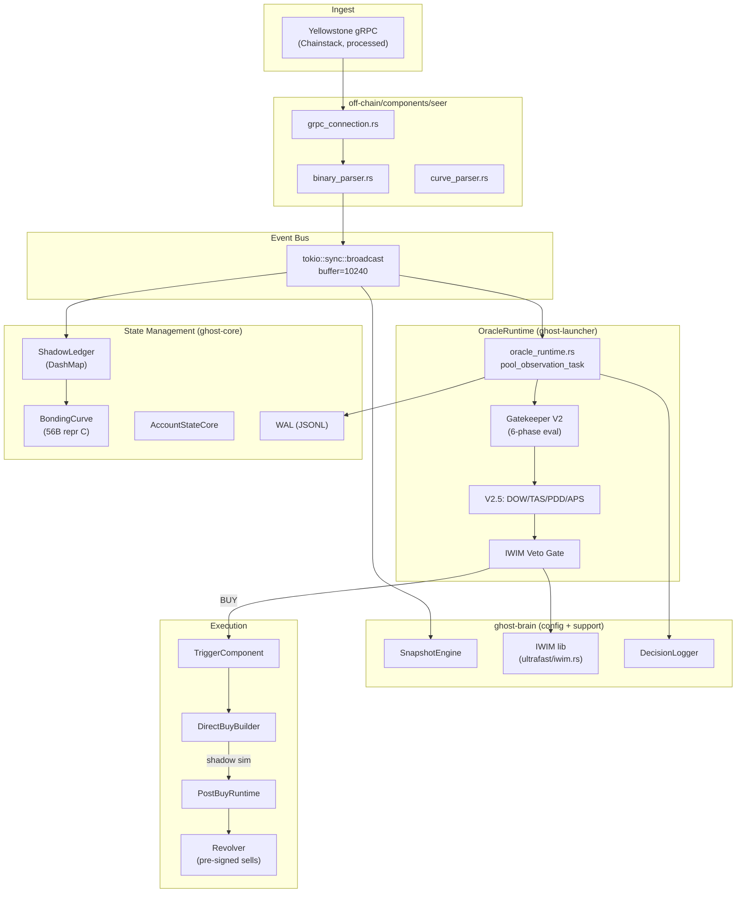

# Ghost — Selective Pump.fun Trading System

Techniczna dokumentacja aktualnego pipeline runtime systemu Ghost. Opisuje wyłącznie aktywny kod produkcyjny i ścieżkę shadow burn-in (stan na 2026-05-12). Legacy, deprecated, wyłączone feature flags i dead code są oznaczone jawnie — nie są częścią głównego opisu.

---

## Spis treści

1. [Cel systemu](#cel-systemu)
2. [High-Level Architecture](#high-level-architecture)
3. [Schema wdrożeniowa](#schema-wdrożeniowa)
4. [Pipeline End-to-End](#pipeline-end-to-end)
   - [4.1 Ingest danych — Seer (Yellowstone gRPC)](#41-ingest-danych--seer-yellowstone-grpc)
   - [4.2 Event Bus](#42-event-bus)
   - [4.3 OracleRuntime — główna pętla decyzyjna](#43-oracleruntime--główna-pętla-decyzyjna)
   - [4.4 Per-Pool Observation Task](#44-per-pool-observation-task)
   - [4.5 Gatekeeper V2 — 6-fazowa ewaluacja](#45-gatekeeper-v2--6-fazowa-ewaluacja)
   - [4.6 Gatekeeper V2.5 — moduły PRECISION STRIKE](#46-gatekeeper-v25--moduły-precision-strike)
   - [4.7 IWIM Veto Gate](#47-iwim-veto-gate)
   - [4.8 Wykonanie — TriggerComponent](#48-wykonanie--triggercomponent)
   - [4.9 Post-Buy Runtime — monitoring pozycji](#49-post-buy-runtime--monitoring-pozycji)
   - [4.10 Sprzedaż — Revolver](#410-sprzedaż--revolver)
   - [4.11 Decision Logging](#411-decision-logging)
5. [State Management](#state-management)
   - [5.1 ShadowLedger](#51-shadowledger)
   - [5.2 AccountStateCore](#52-accountstatecore)
   - [5.3 SnapshotEngine](#53-snapshotengine)
   - [5.4 PoolIdentityRegistry](#54-poolidentityregistry)
6. [Single Sources of Truth](#single-sources-of-truth)
7. [Konfiguracja](#konfiguracja)
   - [7.1 Tryby wykonania (ExecutionMode)](#71-tryby-wykonania-executionmode)
   - [7.2 Pliki konfiguracyjne](#72-pliki-konfiguracyjne)
   - [7.3 Aktywna konfiguracja](#73-aktywna-konfiguracja)
8. [Model współbieżności](#model-współbieżności)
9. [Błędy, retry i failover](#błędy-retry-i-failover)
10. [Integracje zewnętrzne](#integracje-zewnętrzne)
11. [Telemetria i monitoring](#telemetria-i-monitoring)
12. [Legacy, deprecated i dead code](#legacy-deprecated-i-dead-code)
13. [Ograniczenia i zależności](#ograniczenia-i-zależności)

---

## Cel systemu

Ghost to selektywny, zautomatyzowany system tradingowy dla tokenów Pump.fun na Solanie. Wykrywa nowo utworzone poole w czasie rzeczywistym, ocenia ich potencjał wzrostu w oknie obserwacyjnym ~10s, i podejmuje decyzję o wejściu w pozycję — obecnie w trybie **shadow-only** (symulacja bez realnych transakcji). System jest zaprojektowany do pracy w trybie produkcyjnym z maksymalnie jedną pozycją na raz i kapitałem rzędu 0.004 SOL na pozycję.

**Aktywny tryb:** `production` + `execution_mode = "shadow"` (shadow burn-in Gatekeeper V2.5).

---

## High-Level Architecture



---

## Schema wdrożeniowa

### Workspace (Cargo.toml)

| Crate | Typ | Rola |
|-------|------|------|
| `ghost-launcher` | **bin** | Główny proces — łączy wszystkie komponenty w jednym procesie |
| `ghost-core` | lib | Współdzielone typy: BondingCurve, ShadowLedger, WAL, PoolIdentity, EventSemantics |
| `ghost-brain` | lib + bin | Konfiguracja Gatekeeper V2/V2.5, IWIM (jedyny moduł ultrafast używany przez launcher), SnapshotEngine, DecisionLogger, tuning, guardian (LIGMA/WHF/PANIC) |
| `seer` (off-chain) | lib + bin | Detekcja pooli i transakcji z Yellowstone gRPC / WebSocket / PumpPortal |
| `trigger` (off-chain) | lib + bin | Budowanie i wysyłanie transakcji, Jito bundle, Revolver, safety guards |
| `off-chain/collector` | lib | Dataset recorder — zbieranie danych treningowych |
| `gui-backend` | bin | REST API + WebSocket dla GUI (opcjonalny, wyłączany przez `GHOST_GUI_BACKEND_DISABLED`) |

### Feature flags

- `ghost-launcher`: brak aktywnych feature flags (`default = []`), jedyna zdefiniowana to `manual-debug-examples`
- `ghost-core`: brak feature flags

### Zależności między crate'ami

```
ghost-launcher
  ├── ghost-core (ShadowLedger, BondingCurve, WAL, PoolIdentity)
  ├── ghost-brain (GatekeeperV2Config, GatekeeperV25Config, IWIM, SnapshotEngine, DecisionLogger, Tuning)
  ├── seer (grpc_connection, binary_parser, types)
  └── trigger (DirectBuyBuilder, DirectSellBuilder, Revolver)

ghost-brain
  └── ghost-core

seer (off-chain)
  └── ghost-core

trigger (off-chain)
  └── ghost-core
  └── seer (dev-dependency only, dla testów)
```

---

## Pipeline End-to-End

### 4.1 Ingest danych — Seer (Yellowstone gRPC)

**Pliki:** `off-chain/components/seer/src/grpc_connection.rs`, `lib.rs`, `binary_parser.rs`, `curve_parser.rs`

**Opis:** Seer łączy się z Yellowstone gRPC (Chainstack, `processed` commitment) i subskrybuje:
- **Transakcje** dla programu `6EF8rrecthR5Dkzon8Nwu78hRvfCKubJ14M5uBEwF6P` (Pump.fun) oraz `pAMMBay6oceH9fJKBRHGP5D4bD4sWpmSwMn52FMfXEA` (PumpSwap AMM)
- **AccountUpdate** dla kont bonding curve (filtr memcmp po discriminatorze `0x17b7f83760d8ac60`) i kont AMM pool (discriminator `0xf19a6d281c37e455`)

**Tryb streamowania:** `single_global` — wszystkie eventy na jednym strumieniu gRPC.

**Funding lane:** `full_chain` — pełne pokrycie FSC (Funding Source Coverage).

**Konfiguracja (aktywna):**
```
source_mode = "grpc"
commitment = "processed"
enable_pumpfun = true
enable_bonkfun = false
funding_lane_mode = "full_chain"
tx_filter_strategy = "per_pool"
```

**Typy zdarzeń produkowane przez Seer:**
- `InitializePool` → parsowane przez `binary_parser.rs` → emitowane jako `GhostEvent::NewPoolDetected`
- `TradeEvent` → parsowane z instrukcji buy/sell → emitowane jako `GhostEvent::PoolTransaction`
- `FundingTransferObserved` → z funding lane → `GhostEvent::FundingTransferObserved`
- `AccountUpdate` → surowe dane konta → `GhostEvent::AccountUpdate`

**Kanały gRPC (grpc_connection.rs:120-180):**
- `grpc_global_stream` — główny kanał transakcji (capacity: 32768)
- `grpc_funding_lane_full_chain` — pełny łańcuch fundingowy (capacity: 65536)

**Stałe krytyczne:**
- `DEV_BUY_SOL_SANITY_LIMIT = 5000.0` — sanity check dla dev buy
- `GENESIS_BOOTSTRAP_LAMPORTS = 10_000_000` (~0.01 SOL) — bootstrap dla nowego poolu

### 4.2 Event Bus

**Plik:** `ghost-launcher/src/events.rs`

**Opis:** Jednolity, asynchroniczny bus zdarzeń oparty na `tokio::sync::broadcast`. Wszystkie komponenty komunikują się przez ten sam kanał.

**Specyfikacja:**
- Bufor: 10,240 zdarzeń (const `EVENT_BUS_BUFFER_SIZE`)
- Typ: `broadcast::Sender<GhostEvent>` / `broadcast::Receiver<GhostEvent>`
- Semantyka: multi-producer, multi-consumer
- Błąd nadpisywania: `RecvError::Lagged` gdy konsument nie nadąża — bufor 10240 zapewnia ~5-10s przy peak load

**Typy zdarzeń (`GhostEvent`) — aktywnie przetwarzane w głównej pętli OracleRuntime:**

Główna pętla decyzyjna w `oracle_runtime.rs:9288-9590` matchuje **dokładnie 5** wariantów `GhostEvent` (pozostałe wpadają w `_ => continue`):

- `NewPoolDetected(DetectedPool)` — nowy pool, spawn `pool_observation_task`
- `PoolTransaction(PoolTransaction)` — transakcja, routing do per-pool taska
- `FundingTransferObserved(FundingTransferObserved)` — transfer fundingowy, refresh FSC gate
- `GatekeeperCommitted { pool_amm_id, base_mint, .. }` — commit Gatekeeper, `mark_pool_committed()`
- `AccountUpdate(AccountUpdateEvent)` — update konta (warunkowo, gdy `canonical_account_update_relay_enabled`)

**Pozostałe warianty `GhostEvent`** istniejące w enum ale NIE konsumowane przez OracleRuntime:
- `PoolScored` — **LEGACY**, nigdy nie emitowany w produkcji (tylko w `#[cfg(test)]`). Jedyny konsument (TriggerComponent) jawnie blokuje wszystkie side effects. Klasyfikowany jako `RuntimePlane::LegacyObservation`.
- `TradeResult`, `PostBuySubmitted`, `PositionClosed`, `ShadowBuySimulated` — konsumowane przez PostBuyRuntime i TriggerComponent, nie przez OracleRuntime

**Producenci:** Seer (główny: NewPoolDetected, PoolTransaction, FundingTransferObserved, AccountUpdate), GatekeeperCommitLoop (GatekeeperCommitted), TriggerComponent, PostBuyRuntime
**Konsumenci:** OracleRuntime (główny — 5 wariantów), SnapshotListener (PoolTransaction, GatekeeperCommitted), ShadowLedger (NewPoolDetected, PoolTransaction), PostBuyRuntime, TriggerComponent (legacy PoolScored — no-op)

### 4.3 OracleRuntime — główna pętla decyzyjna

**Plik:** `ghost-launcher/src/oracle_runtime.rs` (~23000 linii)

**Struktura:** `OracleRuntime` (linia 1501) przechowuje:
- `session_manager: Arc<SessionManager>` — zarządzanie sesjami obserwacji (aktywne)
- `commit_coordinator: Arc<LauncherCommitCoordinator>` — koordynacja commitów (aktywne, `stage_history()` z `execute_gatekeeper_buy_path`, `add_approved_tx()` z `pool_observation_task`, `process_ready_commits()` z `GatekeeperCommitLoop`)
- `pool_identities: Arc<PoolIdentityRegistry>` — tożsamość pooli (aktywne)
- `account_state_core: Arc<AccountStateReducer>` — kanoniczny stan kont (aktywne)
- `approved_pools: Arc<ApprovedPools>` — zatwierdzone poole (aktywne)
- `reconciliation_runtime` — korekta rozbieżności ShadowLedger vs on-chain (aktywne)
- `wal: Option<Arc<Wal>>` — Write-Ahead Log (aktywne)
- `orphans` — transakcje bez jeszcze zarejestrowanego poolu (aktywne)
- `hyper_oracle: Arc<HyperPredictionOracle>` — **LEGACY**, nieużywane w ścieżce produkcyjnej; jedyny caller to deprecated `score_pool()` (test-only helper, linia 3388, `#[deprecated]`)
- `chaos_engine: Arc<ChaosEngine>` — **LEGACY**, nieużywane w ścieżce produkcyjnej; jedyny caller to deprecated `score_pool()`

**Główna pętla** (`start_oracle_runtime_task_with_funding_availability`, linia 8967, event dispatch od linii 9288):

```rust
loop {
    tokio::select! {
        // FSC funding stream availability change
        availability_changed => update_funding_availability(),

        // Tick co 1s — refresh FSC gate status
        fsc_coverage_window_tick => refresh_fsc_gate(),

        // Event z event bus (match na 5 wariantów, reszta _ => continue)
        event_rx.recv() => match event {         // linia 9288
            NewPoolDetected(pool)                 // linia 9289
                => register_pool() + spawn pool_observation_task(),
            PoolTransaction(tx)                   // linia 9393
                => route_to_pool_task() or buffer_as_orphan(),
            FundingTransferObserved(transfer)     // linia 9513
                => observe_funding_transfer() + refresh_fsc_gate(),
            GatekeeperCommitted { .. }            // linia 9529
                => mark_pool_committed(pool_id),
            AccountUpdate(event)                  // linia 9556
                => dispatch_to_worker() (warunkowo),
            _ => continue,                        // linia 9590 — PoolScored i reszta pomijane
        },

        // Wynik obserwacji poola
        result_rx.recv() => cleanup_pool_task(),
    }
}
```

**Kolejność startowa:** OracleRuntime subskrybuje event bus **przed** startem Seera — zapobiega to utracie zdarzeń podczas inicjalizacji. Synchronizacja przez `oneshot::channel`: Oracle wysyła `oracle_ready_tx.send(())` po inicjalizacji, main czeka z timeout 30s przed uruchomieniem Seera.

### 4.4 Per-Pool Observation Task

**Plik:** `ghost-launcher/src/oracle_runtime.rs:7826` — funkcja `pool_observation_task()`

**Opis:** Każdy nowo wykryty pool dostaje własną, niezależną instancję tasku. Task żyje przez całe okno obserwacji (~10s) lub do momentu podjęcia terminalnej decyzji.

**Przepływ wewnątrz tasku:**

1. **Inicjalizacja sesji** — `SessionManager::open_session()`, tworzy `PoolObservationSession` z:
   - `session_id`, `pool_amm_id`, `base_mint`, `bonding_curve`, `dev_wallet`
   - `candidate_snapshot: EnhancedCandidate` — snapshot kandydata z Seera
   - `gatekeeper_buffer: GatekeeperBuffer` — bufor transakcji Gatekeeper V2
   - `tx_intelligence: TxIntelligenceEngine` — analiza TX (CPV, FSC, sybil metrics)
   - `checkpoint_engine: CheckpointEngine` — snapshoty stanu

2. **Okno obserwacji** — `deadline_wall_ms` = czas rejestracji + `max_wait_time_ms` (10000ms w trybie `long`)

3. **Główna pętla** (dla każdego poola):
   ```
   loop {
       tokio::select! {
           rx.recv() => match event {
               PoolTransaction => {
                   normalize_timestamp()
                   enrich_tx()
                   feed_fingerprint_aggregator()
                   session.ingest_transaction()
                   resolve_feature_trigger_outcome()
               }
               NewPoolDetected => update_metadata() // późno przybyłe metadane
           }
           
           dow_tick.tick() => maybe_fire_shadow_checkpoint() // DOW checkpoint (V2.5)
           
           deadline => evaluate_feature_driven_terminal_verdict(force_deadline=true)
       }
   }
   ```

4. **Po decyzji terminalnej (BUY/REJECT/TIMEOUT):**
   - Zamknięcie coverage window
   - Finalizacja fingerprint aggregatora
   - Zapis JSONL (DecisionLogger)
   - Emisja eventu do EventEmitter
   - Spawn coverage audytu
   - Zwolnienie zasobów sesji

### 4.5 Gatekeeper V2 — 6-fazowa ewaluacja (pure feature-based, bez HyperPredictionOracle)

**Pliki:**
- `ghost-launcher/src/components/gatekeeper.rs` — typy (GatekeeperBuffer, GatekeeperVerdict, itd.)
- `ghost-launcher/src/components/gatekeeper_policy.rs` — logika decyzyjna
- `ghost-brain/ghost_brain_config.toml:[gatekeeper_v2]` — konfiguracja

**Mechanizm decyzyjny:** Gatekeeper V2 jest **czysto feature-based** — podejmuje decyzje wyłącznie na podstawie 6-fazowej ewaluacji cech policzonych z bufora transakcji. **Nie wywołuje HyperPredictionOracle.score_candidate()**. Ścieżka decyzyjna:

```
pool_observation_task (line 7826)
  └─ session.ingest_transaction(tx)                           [line 8078]
  └─ resolve_feature_trigger_outcome(session, ingress, config) [line 8082]
       └─ evaluate_feature_driven_terminal_verdict(session, config, force) [line 4749]
            └─ materialize_terminal_features(session, config, force)  [line 4778]
            └─ buffer.evaluate_from_features(features, config)         [line 4807]
                 └─ build_assessment_from_features(features, config)  [gatekeeper_policy.rs]
                 └─ evaluate_policy_from_assessment(assessment, ...)  [gatekeeper_policy.rs]
                 └─ evaluate_curve_gate( ... )                        [gatekeeper_policy.rs]
```

`materialize_terminal_features()` agreguje: tx_count, unique_signers, buy_count, HHI, volume_gini, top3_volume_pct, same_ms_tx_ratio, avg_interval_ms, interval_cv, buy_ratio, total_volume_sol, dev_buy_sol, dev_volume_ratio, market_cap_sol, bonding_progress_pct, price_change_ratio — **wszystkie bezpośrednio z bufora transakcji**, bez udziału zewnętrznego scoringu.

**Tryb:** `mode = "long"` — akumulacyjny, czeka pełne `max_wait_time_ms = 10000ms`, brak wczesnych decyzji.

**Struktura decyzji:** Three-Layer Decision (`use_three_layer_decision = true`, `min_phases_to_pass = 3`):

#### Phase 1: Quantity (Ilość)
| Parametr | Próg |
|----------|------|
| `min_tx_count` | >= 12 |
| `min_unique_signers` | >= 8 |
| `min_buy_count` | >= 6 |

#### Phase 2: Velocity (Prędkość)
| Parametr | Próg |
|----------|------|
| `max_avg_interval_ms` | <= 450 |
| `max_interval_cv` | <= 2.3 |
| `min_interval_cv` | >= 0.0 |

#### Phase 3: Diversity (Różnorodność)
| Parametr | Próg |
|----------|------|
| `max_hhi` | <= 0.155 (hard_fail_hhi = 0.10) |
| `min_volume_gini` | >= 0.53 |
| `max_top3_volume_pct` | <= 0.70 (hard_fail_top3_volume_pct = 0.70) |
| `max_same_ms_tx_ratio` | <= 0.99 (hard_fail_same_ms_tx_ratio = 0.60) |

#### Phase 4: Volume (Wolumen)
| Parametr | Próg |
|----------|------|
| `min_buy_ratio` | >= 0.80 |
| `max_sol_buy_ratio` | <= 0.96 |
| `min_avg_tx_sol` | >= 0.01 |
| `min_total_volume_sol` | >= 1.0 |
| `min_consecutive_buys` | >= 3 |

#### Phase 5: Dev (Deweloper)
| Parametr | Próg |
|----------|------|
| `max_dev_buy_sol` | <= 2.0 |
| `max_dev_volume_ratio` | <= 0.23 |
| `reject_on_dev_sell` | false |

#### Phase 6: Bonding (Krzywa)
| Parametr | Próg |
|----------|------|
| `min_market_cap_sol` | >= 60 |
| `min_bonding_progress_pct` | >= 40 |
| `max_bonding_progress_pct` | <= 99 |
| `min_price_change_ratio` | >= 0.01 |
| `max_price_change_ratio` | <= 1.50 |

**Alpha Gate** (aktywny):
- `min_momentum >= 0.55`
- `min_demand >= 0.55`
- `min_alpha_joint >= 0.35`
- `min_alpha_sample >= 15`

**Prosperity Filter** (aktywny, overlay wyłączony):
- `prosperity_min_market_cap_sol >= 45.0`
- Trzy branche: (1) block0_sniped >= 28% + sell_buy_ratio <= 0.16, (2) market_cap >= 55 + early_slot_buy_dominance >= 0.90, (3) max_hhi <= 0.0416 + min_ftdi >= 0.0909

**Hard Fail** (natychmiastowe odrzucenie):
- `hard_fail_hhi = 0.10`
- `hard_fail_same_ms_tx_ratio = 0.60`
- `hard_fail_top3_volume_pct = 0.70`

**Sybil Interference** (WYŁĄCZONY): `enable_sybil_interference_layer = false`, wszystkie soft penalties = 0. Zbiera tylko telemetrię.

**Werdykty** (`GatekeeperVerdictType`, 19 wariantów):
- `Buy` — przechodzi wszystkie fazy
- `EarlyBuy` — DOW early entry (V2.5)
- `RejectHardFail` — twardy fail
- `RejectCoreFail` — nie przeszedł faz 1-6
- `RejectSybilInterference` — sybil veto
- `RejectIwimVeto` — IWIM veto
- `RejectPumpAndDump` — PDD veto (V2.5)
- `RejectAlphaGate` — alpha gate nie przeszedł
- `Timeout` — deadline okna
- `PendingCurve` — krzywa jeszcze niedostępna
- itd.

### 4.6 Gatekeeper V2.5 — moduły PRECISION STRIKE

**Pliki:**
- `ghost-launcher/src/components/gatekeeper_dow_timer.rs` — Dynamic Observation Window
- `ghost-launcher/src/components/gatekeeper_trajectory.rs` — Trajectory-Aware Scoring
- `ghost-launcher/src/components/gatekeeper_pdd.rs` + `gatekeeper_pdd_sequence.rs` — Pump & Dump Detector
- `ghost-launcher/src/components/gatekeeper_adaptive_prosperity.rs` — Adaptive Prosperity Scoring
- `ghost-brain/src/config/gatekeeper_v25_config.rs` — konfiguracja

Wszystkie 4 moduły V2.5 są **aktywne** w konfiguracji (`ghost_brain_config.toml`):

#### DOW (Dynamic Observation Window)
- `enabled = true`, `early_entry_enabled = true`
- **Early window:** 2-5s, min confidence 0.85
- **Normal window:** 5-7s, min confidence 0.65
- **Extended window:** 7-10s, min confidence 0.55, `require_pdd_clean = true`

#### TAS (Trajectory-Aware Scoring)
- `enabled = true`
- Hard reject przy trajectory_score <= 0.30
- Modulator [0.75, 1.25] na podstawie trajektorii momentum/HHI

#### PDD (Pump & Dump Detector)
- `enabled = true`
- `entry_drift_max_pct = 5.0%`
- `spike_hard_veto = true` — natychmiastowe odrzucenie przy spike'u
- `ramping_hard_veto = true` — natychmiastowe odrzucenie przy rampingu
- `flash_crash_max_price_impact = 15%`

#### APS (Adaptive Prosperity Scoring)
- `enabled = true`
- `adaptive_enabled = false` — adaptacyjne progi wyłączone
- `shadow_suggestions_enabled = true` — sugestie w shadow mode
- `regime_local_heuristic_enabled = true`

### 4.7 IWIM Veto Gate

**Pliki:** `ghost-launcher/src/components/iwim_veto.rs`, `ghost-brain/src/oracle/ultrafast/iwim.rs`

**Opis:** Niezależna brama weta uruchamiana **po** decyzji BUY przez Gatekeeper V2. Analizuje historię portfela dewelopera przed dopuszczeniem do wykonania.

**Przepływ:**
1. Fetch historii portfela dewelopera z RPC (primary → fallback)
2. Buduje `IwimInput`, wywołuje `iwim_analyze()` (analiza Lightning CTP, CMM, CDIS)
3. Aplikuje policy matrix:
   - `GatekeeperStrength::Strong` + IWIM HIGH quality veto → **REJECT**
   - `GatekeeperStrength::Borderline` + timeout/unknown → **REJECT**
   - `GatekeeperStrength::Strong` + timeout/unknown → przepuszcza (BUY)

**Konfiguracja:** `mode = "pp"` (PumpPortal, N=30), `min_confidence = 0.75`, `rug_threat_threshold = 0.75`, `sybil_threshold = 0.75`, `max_wait_ms = 500`

### 4.8 Wykonanie — TriggerComponent

**Pliki:**
- `ghost-launcher/src/components/trigger/component.rs`
- `off-chain/components/trigger/src/direct_buy_builder.rs`
- `off-chain/components/trigger/src/direct_sell_builder.rs`
- `ghost-launcher/src/components/live_tx_sender.rs`

**Aktywny tryb:** `entry_mode = "shadow_only"` — transakcje są symulowane przez RPC `simulateTransaction`, nie są wysyłane on-chain.

**DirectBuyBuilder** (`direct_buy_builder.rs`):
- Buduje instrukcję `buy_exact_sol_in` (routed wariant, **nie** legacy `global:buy`)
- 65+ kont w instrukcji (bonding curve, fee config, token program, ATA, itd.)
- PDA derivacje: `derive_bonding_curve_v2()`, `derive_fee_config()`
- 15 autoryzowanych adresów fee recipient + 8 buyback fee recipients
- `DEFAULT_SLIPPAGE_TOLERANCE = 0.20` (20%)

**Shadow symulacja** (`trigger/shadow_run.rs`):
- `RpcShadowSimulator` — symuluje przez `RpcSimulateTransactionConfig`
- `ShadowPayerStrategy::Ephemeral` — klucz tymczasowy, nie wymaga realnego fundowania
- `commitment = "processed"`, `sig_verify = false`
- `timeout_ms = 1600`, `max_retries = 1`, `max_concurrent = 8`
- Wynik emitowany jako `GhostEvent::ShadowBuySimulated`

**Live Sender** (nieaktywny w shadow-only, gotowy dla live):
- `LiveTxSender` łączy Helius Sender API + Yellowstone gRPC confirmation
- `HELIUS_SENDER_MIN_TIP_LAMPORTS = 200_000`
- `HELIUS_SENDER_BUY_BASELINE_TIP_LAMPORTS = 1_000_000`
- Timeout confirm: 12s, submit: 1.5s, priority fee: 1.2s

### 4.9 Post-Buy Runtime — monitoring pozycji

**Plik:** `ghost-launcher/src/components/post_buy_runtime.rs`

**Opis:** Po otrzymaniu `PostBuySubmitted` przez kanał `DirectPostBuyHandoff`:

**Live lane** (gdy `live_sell_handle` skonfigurowany):
- Monitoruje cenę przez `AccountStateCore` (primary) lub RPC (fallback)
- Exit przy `live_exit_take_profit_pct = 0.58` (58%) lub `live_exit_stop_loss_pct = 0.46` (46%)
- Wysyła SELL przez Helius Sender

**Shadow lane** (aktywny tryb):
- Rejestruje pozycję w `MonitoringEngine` / `ShadowPositionBook`
- Zapisuje shadow lifecycle proof do `shadow_lifecycle.jsonl`
- Monitoring per-tick przez guardiana (MonitoringEngine::tick): LIGMA, WHF, PANIC

**Paper lane** (legacy, kompatybilność):
- Deleguje do `PaperPositionLifecycle` z ghost-brain

### 4.10 Sprzedaż — Revolver

**Pliki:** `off-chain/components/trigger/src/revolver.rs` + pliki towarzyszące

**Opis:** System zarządzania pre-podpisanymi transakcjami SELL (bullet). Każdy bullet reprezentuje frakcję pozycji do sprzedania przy określonej cenie.

**Strategia wyjścia (Ladder TP):**
| Poziom | Take Profit | Frakcja pozycji |
|--------|-------------|-----------------|
| TP1 | +12% | 20% |
| TP2 | +20% | 25% |
| TP3 | +35% | 30% |
| TP4 | +50% | 25% |

**Stop Loss:** -12%, max 30 min hold time.

**Bullet lifecycle:**
- `needs_refresh()` — co 60s
- `is_time_expired()` — time stop
- `requeue_count` — max 3 próby (DEFAULT_MAX_REQUEUE_ATTEMPTS)
- Requeue zwiększa slippage o 150 BPS za każdą próbą (max 600 BPS)

**Komponenty Revolver:**
- `TokenRevolver` — zarządza bulletami dla konkretnego token mint
- `Revolver` — top-level manager (HashMap<Pubkey, TokenRevolver>)
- `RevolverWorker` — background worker sprawdzający ceny i wykonujący sprzedaż
- `SellTxBuilder` — buduje instrukcje sell dla Pump.fun (24 bajty: discriminator + amount + min_sol_output, 12 kont)

### 4.11 Decision Logging

**Plik:** `ghost-brain/src/oracle/decision_logger.rs`

**Opis:** Każda terminalna decyzja Gatekeeper jest zapisywana jako JSONL.

**Wersja schematu:** `GATEKEEPER_BUY_LOG_SCHEMA_VERSION = 19`
**Wersja Gatekeeper:** `GATEKEEPER_VERSION = "v2.5"`

**Pola rekordu (`GatekeeperBuyLog`):**
- `gatekeeper_version`, `schema_version`
- `pool_amm_id`, `base_mint`, `bonding_curve`, `creator`
- `verdict`, `verdict_type` (19 wariantów)
- `reason_code` — kod powodu decyzji
- `assessment` — pełna ocena GatekeeperAssessment (sygnatariusze, fazy, alpha gate, prosperity, V2.5)
- `iwim_veto_reason` — powód veta IWIM (jeśli dotyczy)
- `timestamps` — wall clock, chain time, window duration
- `decision_latency_ms` — czas od rejestracji do decyzji

---

## State Management

### 5.1 ShadowLedger

**Pliki:** `ghost-core/src/shadow_ledger/ledger.rs`, `types.rs`, `live_pipeline.rs`

**Opis:** Wtórna, in-memory replika stanu bonding curve. **Nie jest kanonicznym SSOT dla runtime queries od PR 7** — `get_curve()` jest `#[deprecated]` (ledger.rs:1252-1264: *"use AccountStateCore for canonical runtime state; ShadowLedger lookups are bootstrap/simulation/forensics only"*). Aktywne zastosowania ShadowLedger:

**BondingCurve** (`ghost-core/src/market_state.rs`):
- `#[repr(C)]`, 56 bajtów, implementuje `bytemuck::Pod` i `Zeroable`
- Pola: discriminator (8B), virtual_token_reserves (8B), virtual_sol_reserves (8B), real_token_reserves (8B), real_sol_reserves (8B), token_total_supply (8B), complete (1B), _padding (7B)
- Metody: `simulate_buy()`, `simulate_sell()`, `current_price()`, `get_market_cap_sol()`, `get_bonding_progress()`, `get_price_impact()`, `is_near_migration()`
- Wzór: Constant Product AMM (x * y = k), 1% fee

**ShadowBondingCurve** rozszerza BondingCurve o:
- `last_updated_slot`, `curve_data_known`, `last_update_ts_ms`
- `curve_finality` (CurveFinality), `write_source` (ShadowLedgerWriteSource)
- `write_strength` (ShadowLedgerWriteStrength), `state_confidence` (ShadowLedgerStateConfidence)

**Write Strength (rangi):**
```rust
BootstrapSeed < ConfirmedBootstrap < Repair < CanonicalCommit < LiveAppend
```

**Operacje:**
- `insert()` — inicjalizacja krzywej dla mint
- `get()` — odczyt krzywej
- `simulate_buy(sol_in)` → `BuySimulationResult` — symulacja kupna
- `simulate_sell(tokens_in)` → `SellSimulationResult` — symulacja sprzedaży
- `push_snapshot()` — dodanie snapshotu rynku
- `commit_history()` — commit historii transakcji
- `append_live_with_source()` — live append po Gatekeeper commit
- `evict_stale_snapshots()` — czyszczenie starych snapshotów
- `snapshot_to_disk()` / `restore_from_disk()` — persistencja

**LivePipeline** (`live_pipeline.rs`):
- Post-commit snapshot appending po przejściu Gatekeepera
- Deduplikacja przez `TxKey` + pending buffer
- Deterministic ordering: timestamp_ms + tx_index + signature + fallback_counter
- VWAP (Volume-Weighted Average Price) kalkulacja
- `LivePipelineConfig`: flush_delay_ms (50ms), max_buffer_size (20), seen_keys_limit (10000)

**Reconciliation** (`reconciliation.rs`, `reconciliation_runtime.rs`):
- Diagnostic-only porównanie ShadowLedger vs on-chain truth
- **Nigdy nie nadpisuje** stanu ShadowLedger
- Progi driftu: NOISE (0.001 SOL), MEANINGFUL (0.05 SOL), SEVERE (0.5 SOL)
- `ReconciliationRuntime` — bounded registry (max 1000 pooli), round-robin cycles

**Storage** (`storage.rs`):
- `DashMapCurveStorage` — podstawowy storage
- `ShardedCurveStorage` — 16 shardów dla horyzontalnego skalowania
- `DashMapSnapshotStorage` — storage snapshotów
- `DirtyCurveMarker` / `DirtyCurveRegistry` — foundation pod disk-backed eviction (obecnie nieaktywne)

**Eviction** (`eviction.rs`):
- Age-based: max 5 min dla snapshotów
- Aggressive: bonding_progress > 90%, max_slot_age = 10
- LRU: max 5000 krzywych
- `EvictionMetrics` — atomic counters dla Prometheus

**Genesis** (`genesis.rs`, `bootstrap.rs`):
- `protocol_genesis_curve()` — initial state: 30 SOL reserves
- `bootstrap_snapshots()` — generuje 3 syntetyczne snapshoty (G0=genesis, G1=minimal trade impact, G2=2nd-order derivatives)

### 5.2 AccountStateCore

**Pliki:** `ghost-core/src/account_state_core/reducer.rs`, `types.rs`, `monotonic_guard.rs`

**Opis:** Redukuje AccountUpdate z gRPC do kanonicznego stanu runtime. Thread-safe, monotonic slot ordering.

**Kluczowe typy:**
- `AccountStateReducer` — główny reducer
- `AccountStateUpdate` — pojedynczy update konta
- `CanonicalPoolState` — kanoniczny stan poolu
- `BootstrapHints` — wskazówki bootstrapowe

### 5.3 SnapshotEngine

**Plik:** `ghost-brain/src/oracle/snapshot_engine.rs`

**Opis:** Centralny, thread-safe system zarządzania snapshotami rynku. Agreguje dane rynkowe (ceny, rezerwy, bonding progress) w ring bufferze per-pool. Używany przez Gatekeeper V2 do materializacji cech (bonding curve gate) oraz przez Post-Buy Guardian do monitoringu pozycji.

**Parametry:**
- Ring buffer capacity: 128 snapshotów na pool
- Snapshot interval: 200ms
- Inactive buffer TTL: konfigurowalny

**Funkcje:**
- `derive_price_canonical()` — kanoniczne wyprowadzanie ceny z rezerw
- Sygnalizuje `SoftTruth` / `SnapshotEngine` data source dla odróżnienia od ShadowLedger

### 5.4 PoolIdentityRegistry

**Plik:** `ghost-core/src/pool_identity.rs`

**Opis:** Rejestracja i translacja między tożsamościami pooli. Wrappery newtype na Pubkey (przez macro `pubkey_wrapper!`):
- `PoolId` — adres AMM pool
- `BaseMint` — mint tokena
- `BondingCurveKey` — adres bonding curve

**Struktura:** `PoolIdentity { pool_id, base_mint, bonding_curve }`
**Storage:** `DashMap`-based, thread-safe, współdzielony przez wszystkie komponenty.

---

## Single Sources of Truth

| Kategoria danych | SSOT | Plik |
|-----------------|------|------|
| **Cena tokena** (pre-buy, post-buy, monitoring) | `AccountStateReducer` — `CanonicalPoolState.price_sol` lub `derive_price_canonical(virtual_sol_reserves, virtual_token_reserves)` | `ghost-core/src/account_state_core/reducer.rs:18`, `types.rs:111` |
| **Parametry bonding curve** (virtual/real reserves — kanoniczne) | `AccountStateReducer.states: DashMap<Pubkey, CanonicalPoolState>` — aktualizowane z on-chain `AccountUpdate` | `ghost-core/src/account_state_core/reducer.rs:18` |
| **Parametry bonding curve** (symulacje buy/sell, WAL replay, bootstrap) | `ShadowLedger.curves: DashMap<Pubkey, ShadowBondingCurve>` — wtórny, `#[deprecated]` dla runtime queries od PR 7 | `ghost-core/src/shadow_ledger/ledger.rs:401,1252-1264` |
| Stan konta on-chain | `AccountStateReducer` (tożsamy z powyższym — to ten sam obiekt) | `ghost-core/src/account_state_core/reducer.rs` |
| Tożsamość pooli | `PoolIdentityRegistry` | `ghost-core/src/pool_identity.rs` |
| Konfiguracja runtime | `LauncherConfig` (deserializowane z `config.toml`) | `ghost-launcher/src/config.rs` |
| Konfiguracja Gatekeeper V2 | `GatekeeperV2Config` (deserializowane z `ghost_brain_config.toml:[gatekeeper_v2]`) | `ghost-brain/src/config/ghost_brain_config.rs` |
| Konfiguracja V2.5 | `GatekeeperV25RolloutConfig` | `ghost-brain/src/config/gatekeeper_v25_config.rs` |
| Stan pozycji (live) | `LivePositionRegistry` (JSONL) | `ghost-launcher/src/components/live_position_registry.rs` |
| Stan pozycji (shadow) | `ShadowPositionBook` | `ghost-brain/src/guardian/post_buy/integration.rs` |
| Historia transakcji (per-pool) | `SnapshotEngine` ring buffer — downstream consumer, nie źródło ceny | `ghost-brain/src/oracle/snapshot_engine.rs` |
| Decyzje (mechanizm) | `GatekeeperBuffer::evaluate_from_features()` | `ghost-launcher/src/components/gatekeeper.rs` |
| Decyzje (log) | `DecisionLogger` → `oracle_decisions.jsonl` | `ghost-brain/src/oracle/decision_logger.rs` |
| WAL (odtwarzanie) | Pliki JSONL na dysku | `ghost-core/src/wal.rs` |
| Event bus (transport) | `tokio::sync::broadcast` (buffer=10240) | `ghost-launcher/src/events.rs` |
| Health runtime | `RuntimeHealth` (AtomicBool + AtomicU64) | `ghost-core/src/health.rs` |

---

## Konfiguracja

### 7.1 Tryby wykonania (ExecutionMode)

| Tryb | Opis | Aktywny? |
|------|------|----------|
| `Live` | Realne transakcje on-chain, wymaga `entry_mode = "live"` | Nie |
| `Paper` | Papierowa symulacja, `entry_mode = "shadow_only"` | Nie |
| `Shadow` | Shadow symulacja, `entry_mode = "shadow_only"` | **Tak — bieżący tryb** |
| `Dual` | Live + Shadow równolegle, `entry_mode = "live_and_shadow"` | Nie (kompatybilność) |

**Kontrakt walidacyjny — poprawne pary (execution_mode, entry_mode):**
- `Live` → `live`
- `Paper` → `shadow_only`
- `Shadow` → `shadow_only`
- `Dual` → `live_and_shadow`

Nieprawidłowe kombinacje powodują błąd walidacji i odmowę startu.

### 7.2 Pliki konfiguracyjne

| Plik | Rola |
|------|------|
| `config.toml` (root) | Główna konfiguracja launchera: mode, seer, trigger, execution, oracle, shadow_ledger, metrics, durability |
| `ghost-brain/ghost_brain_config.toml` | Konfiguracja Gatekeeper V2, V2.5, IWIM Veto Gate, post-buy guardian, PANIC |
| `.env` | 6 zmiennych środowiskowych dla Chainstack (endpointy, tokeny) |
| `configs/rollout/shadow-burnin.toml` | Profil shadow burn-in (alternatywny, z `max_concurrent_positions=5`) |

### 7.3 Aktywna konfiguracja (kluczowe wartości)

```
[app]
mode = "production"

[execution]
execution_mode = "shadow"

[trigger]
enabled = true
entry_mode = "shadow_only"
max_concurrent_positions = 1
max_position_size_sol = 0.004
emergency_floor_sol = 0.0001
position_size_buffer_sol = 0.0001
slippage_tolerance = 0.25

[trigger.shadow_run]
enabled = true
payer_strategy = "ephemeral"
commitment = "processed"
max_retries = 1
max_concurrent = 8

[seer]
source_mode = "grpc"
commitment = "processed"
stream_mode = "single_global"
enable_pumpfun = true
enable_bonkfun = false
funding_lane_mode = "full_chain"

[gatekeeper_v2]  (w ghost_brain_config.toml)
mode = "long"
max_wait_time_ms = 10000
use_three_layer_decision = true
min_phases_to_pass = 3
```

---

## Model współbieżności

### Taski tokio (spawn w main.rs)

| # | Nazwa | Odpowiedzialność |
|---|------|-----------------|
| 1 | `TuningService` | Bandit weight optimization, aktualizacje co 180s |
| 2 | `ShadowLedger listener` | Nasłuchuje NewPoolDetected i PoolTransaction z event bus |
| 3 | `PostBuyRuntime` | Monitoruje pozycje post-buy |
| 4 | `OracleRuntime` | Główny aktor decyzyjny — subskrybuje event bus |
| 5 | `Seer` | Detekcja pooli + AccountUpdate z gRPC |
| 6 | `TriggerComponent` (event bus consumer) | Nasłuchuje GatekeeperCommitted (no-op, ignorowane), PoolScored (legacy, blokowane) — nie jest główną ścieżką decyzyjną |
| 7 | `GUI Backend` | REST API + WebSocket (opcjonalny) |
| 8 | `SnapshotListener` | Przekierowuje TX → SnapshotEngine |
| 9 | `GatekeeperCommitLoop` | Commit buforów co ~100ms |
| 10 | `LivePipelineFlushLoop` | Flush pipeline do ShadowLedger |
| 11 | `Watchdog` | Health check co 60s + stall detection |

### Per-pool taski dynamiczne

Każdy nowy pool spawnuje `pool_observation_task` — osobny tokio task żyjący do zakończenia okna obserwacji (~10s). Maksymalna liczba jednoczesnych tasków kontrolowana przez `SessionConfig.max_sessions` (domyślnie 10000).

### Kanały komunikacji

| Kanał | Typ | Rola |
|-------|------|------|
| Event Bus | `broadcast` (10240) | Główny transport zdarzeń między komponentami |
| Post-Buy Channel | `mpsc::unbounded` | Handoff BUY → PostBuyRuntime (DirectPostBuyHandoff) |
| Oracle Ready | `oneshot` | Synchronizacja startu Oracle przed Seer |
| Shutdown | `broadcast` (1) | Sygnał zamknięcia dla wszystkich komponentów |
| Tuning | `mpsc` | Komunikacja z TuningService |

### Synchronizacja danych

- **ShadowLedger**: `Arc<DashMap<Pubkey, ShadowBondingCurve>>` — lock-free na poziomie shardu, concurrent reads/writes
- **AccountStateCore**: `Arc<RwLock<...>>` — blokada tylko przy zapisie, bezblokadowe odczyty
- **SnapshotEngine**: ring bufory per-pool, atomic counters
- **PoolIdentityRegistry**: `DashMap` — lock-free
- **ApprovedPools**: `DashMap` — lock-free

---

## Błędy, retry i failover

### Watchdog (stall detection)

**Plik:** `ghost-launcher/src/components/watchdog.rs`

| Warunek | Akcja |
|---------|-------|
| `age_grpc_ms > 60_000` | ERROR log (ostrzeżenie) |
| `age_grpc_ms > 300_000` + brak progresu gRPC | `exit(2)` |
| `age_grpc_ms > 600_000` (zombie) | `exit(2)` |
| gRPC świeży + `age_decisions_ms > 300_000` | `exit(3)` |
| gRPC świeży + `age_events_ms > 300_000` | `exit(4)` |

### gRPC Connection Resilience

**Plik:** `seer/src/grpc_connection.rs`

- Multi-provider fan-in: N endpointów na jeden kanał
- Circuit breaker: `grpc_max_stalls_before_open = 3`, cooldown 15s
- Slot-gap detection
- Ping/pong + stall watchdog
- Bounded channel z overflow: PRIMARY_CHANNEL_CAP = 32768, OVERFLOW_CHANNEL_CAP = 65536

### Retry — Trigger

- Max 3 próby wysłania transakcji
- Inkrementacja priority fee i tipów przy każdej próbie
- Shadow simulation: `timeout_ms = 1600`, `max_retries = 1`

### Revolver Requeue

- Max 3 próby requeue bulleta (`DEFAULT_MAX_REQUEUE_ATTEMPTS`)
- Zwiększenie slippage o 150 BPS za każdą próbą (max 600 BPS)
- Odświeżanie bulletów co 60s (`needs_refresh()`)

### WAL Recovery

**Plik:** `ghost-launcher/src/wal_recovery.rs`

4 tryby odtwarzania po restarcie:
1. `snapshot_plus_wal` — pełne odtworzenie (snapshot + WAL)
2. `wal_only` — tylko WAL
3. `snapshot_only` — tylko snapshot
4. `cold_start` — start od zera

---

## Integracje zewnętrzne

| Serwis | Rola | Endpoint |
|--------|------|----------|
| **Yellowstone gRPC** (Chainstack) | Podstawowe źródło eventów (transakcje, AccountUpdate) | `grpc_endpoint` w config.toml (Chainstack) |
| **Helius RPC** | Priority fee API + fallback RPC dla live Sender | `helius_endpoint` w config.toml |
| **Helius Sender API** | Wysyłanie transakcji w trybie live | Konfigurowane w `LiveTxSenderConfig` |
| **Jito** | Bundle submission dla MEV protekcji (w trybie live) | `jito_client.rs` w trigger crate |
| **PumpPortal WebSocket** | Alternatywne źródło eventów (backup) | `pumpportal_connection.rs` |
| **Helius WebSocket** | Alternatywne źródło eventów (backup) | `helius_websocket_adapter.rs` |
| **Prometheus** | Ekspozycja metryk na `/metrics` | Serwer HTTP w main.rs |

---

## Telemetria i monitoring

### Prometheus Metrics

**Plik:** `ghost-launcher/src/oracle_metrics.rs`

- `POOL_IDENTITY_PROMOTION_TOTAL` — liczba promocji pool identity
- `POOL_IDENTITY_EXHAUSTED_TOTAL` — liczba wyczerpanych tożsamości
- `fsc_authoritative_buy_gate_open` — status FSC gate
- `fsc_coverage_window_ready` — gotowość coverage window
- `shadow_ledger_health` — health ShadowLedger
- `runtime_durability_mode` — tryb durability
- `eviction_count`, `aggressive_eviction_count`, `lru_eviction_count` — statystyki eviction

### Serwer HTTP

- `/metrics` — Prometheus metrics
- `/healthz` — health check (zwraca 200 gdy `RuntimeHealth` OK)

### Logi

- **Systemowy:** `logs/ghost.log` — logi aplikacji (tracing)
- **Oracle:** `logs/oracle_decisions.jsonl` — decyzje Gatekeeper (DecisionLogger)
- **Shadow entries:** `logs/shadow_run/shadow_entries.jsonl` — wpisy shadow
- **Shadow lifecycle:** `logs/shadow_run/shadow_lifecycle.jsonl` — lifecycle shadow
- **Shadow buys:** `logs/shadow_run/buys.jsonl` — symulowane buy

---

## Legacy, deprecated i dead code

### Deprecated (oznaczone `#[deprecated]`, zachowane dla kompatybilności testów)

| Element | Plik | Powód | Zastąpione przez |
|---------|------|-------|-----------------|
| `OracleDecision` | `ghost-brain/src/oracle/hyper_prediction/verdict.rs` | Stary typ decyzji | `GatekeeperVerdictType` |
| `RiskLevel` | `ghost-brain/src/oracle/hyper_prediction/verdict.rs` | Stary poziom ryzyka | `GatekeeperVerdict` |
| `FinalVerdict` | `ghost-brain/src/oracle/hyper_prediction/verdict.rs` | Stary werdykt końcowy | `GatekeeperVerdict` |
| `RiskThresholds` | `ghost-brain/src/oracle/hyper_prediction/verdict.rs` | Stare progi ryzyka | `GatekeeperV2Config` |
| `LegacyBuy` wariant `PumpfunBuyVariant` | `off-chain/components/trigger/src/direct_buy_builder.rs` | Stary wariant buy | `RoutedExactSolIn` |

### Wyłączone w konfiguracji (kod istnieje, ale nieaktywny w runtime)

| Element | Plik | Powód wyłączenia |
|---------|------|-----------------|
| Sybil Interference Layer | `gatekeeper_policy.rs` | `enable_sybil_interference_layer = false` — wszystkie soft penalties = 0 |
| Prosperity Overlay | gatekeeper V2 config | `enable_prosperity_overlay = false` |
| TCF (Trend Cohesion Field) | `ghost-brain/src/oracle/tcf/` | `enabled = false` w konfiguracji score |
| QEDD | `ghost-brain/src/qedd.rs` | Wszystkie lambdy = 0 (całkowicie wygaszony) |
| ghost_brain.enabled | `config.toml` | `false` — główny engine Ghost Brain nie startuje jako osobny komponent |
| Ghost Brain E2E binary | `ghost-brain/src/main.rs` | Entry point dla devnet, nieaktywny w produkcji |

### Legacy pipeline (alternatywna ścieżka, nie główna)

| Element | Plik | Status |
|---------|------|--------|
| `OraclePipeline` | `ghost-launcher/src/components/oracle_pipeline.rs` | Legacy scoring pipeline (7 workerów: SimpleOracle, QASS, HyperOracle, VisionCritic, itd.) — **nie** jest główną ścieżką decyzyjną |
| `TriggerComponent` (scoring pipeline) | `ghost-launcher/src/components/trigger/component.rs` | Zawiera legacy pipeline scoringu obok integracji z DirectBuyBuilder |
| `ExecutionMode::Dual` | `ghost-launcher/src/config.rs` | Zachowane dla kompatybilności |
| `ExecutionMode::Paper` | `ghost-launcher/src/config.rs` | Zachowane dla kompatybilności |
| `GhostBrainConfig.gatekeeper` (GatekeeperConfig, nie V2) | `ghost-brain/src/config/ghost_brain_config.rs` | Legacy Gatekeeper, zastąpiony przez GatekeeperV2Config |

### Obecne w strukturze OracleRuntime, ale nieużywane w produkcji

| Element | Plik | Status |
|---------|------|--------|
| `OracleRuntime::hyper_oracle` | `ghost-launcher/src/oracle_runtime.rs:1503` | Pole istnieje, ale **nigdy nie jest wywoływane** w ścieżce Gatekeeper V2. Jedyny caller to deprecated `score_pool()` (linia 3388, `#[deprecated]`), który sam nie ma produkcjnych callerów. Gatekeeper V2 działa jako pure feature-based evaluator. |
| `OracleRuntime::chaos_engine` | `ghost-launcher/src/oracle_runtime.rs:1505` | Pole istnieje, ale **nigdy nie jest wywoływane** w ścieżce produkcyjnej. Jedyny caller to deprecated `score_pool()`. |
| `score_pool()` | `ghost-launcher/src/oracle_runtime.rs:3388` | Metoda oznaczona `#[deprecated(since = "3.0.0", note = "Test-only helper. Production path uses `GatekeeperV2::evaluate`.")]`. Wołana tylko z testów (`oracle_transaction_gathering.rs`, `genesis_repro_check.rs`, `oracle_logging_demo.rs`). |
| `GhostEvent::PoolScored` | `ghost-launcher/src/events.rs:586` | **Nigdy nie emitowany w produkcji**. Jedyny konsument (TriggerComponent linia 4743) jawnie blokuje wszystkie side effects z komentarzem "legacy PoolScored path blocked". Klasyfikowany jako `RuntimePlane::LegacyObservation`. |
| `HyperPredictionOracle` (jako komponent decyzyjny) | `ghost-brain/src/oracle/hyper_prediction/` | Kod istnieje i jest sprawny, ale **nie jest częścią ścieżki decyzyjnej Gatekeeper V2**. Używany wyłącznie przez legacy `OraclePipeline` i deprecated `score_pool()`. |
| `AEM` (Adaptive Execution Model) | `ghost-brain/src/aem/` | `MonitoringEngine::run_aem_tick()` istnieje, ale `aem_runtime` jest zawsze `None` — `set_aem()` nigdy nie jest wołane z ghost-launcher. |
| `WEST` (Wallet Energy Tracker) | `ghost-launcher/src/components/west_listener.rs` | Zdefiniowany moduł z `pub async fn run()`, ale **nigdy nie spawniony** w main.rs ani oracle_runtime.rs. |

### Moduły ghost-brain nieimportowane przez ghost-launcher

Wszystkie poniższe moduły istnieją w `ghost-brain`, ale **żaden nie jest importowany przez ghost-launcher**. Ich kod nie ma wpływu na runtime:

- **Ultrafast (poza IWIM):** SSMI, MPCF (compute), SOBP, CIR, ECTO, FRE, PRAECOG, TCR-Phi, Signer Entropy
- **Oracle:** BVA, MCI (compute), MESA (compute), SCR, ULVF
- **Sygnały:** QMAN, FRB, Resonance
- **Deprecated stuby:** QASS (`qass_stub.rs`), Wave Builder (`wave_builder_stub.rs`)

**Jedyny moduł ultrafast importowany przez launcher:** `IWIM` (`ultrafast/iwim.rs`) — używany przez `iwim_veto.rs`.

### Katalogi niebędące częścią aktywnego pipeline

| Katalog | Status |
|---------|--------|
| `agents/` | Eksperymentalne skrypty agentowe — nie są częścią runtime |
| `app_visual/` | Wizualizacje — nie są częścią runtime |
| `data/`, `datasets/` | Dane treningowe/offline — nie są częścią runtime |
| `docs/` | Dokumentacja projektowa |
| `logs/` | Logi runtime |
| `nim/` | Kod Nim (eksperymentalny) — nie jest częścią pipeline |
| `scripts/` | Skrypty walidacyjne/replay/raportowe — offline |
| `solana/` | Eksperymentalne kontrakty on-chain — nieaktywne |
| `src/` (root) | Stary kod — nieaktywny |
| `wallets/` | Pliki kluczy — nie są częścią pipeline |
| `gui-backend/` | GUI — opcjonalny, wyłączany przez `GHOST_GUI_BACKEND_DISABLED` |
| `off-chain/collector/` | Dataset recorder — offline, nieaktywny w runtime |

---

## Ograniczenia i zależności

### Ograniczenia techniczne

- **Pojedynczy proces:** Wszystkie komponenty (Seer, Trigger, Oracle, GUI) działają w jednym procesie. Awaria procesu = awaria wszystkich komponentów.
- **ShadowLedger w pamięci:** Stan jest ulotny — po restarcie wymaga odtworzenia z WAL/snapshot.
- **Max snapshotów na mint:** 128 (`MAX_SNAPSHOTS_PER_MINT`), zsynchronizowane z SnapshotEngine ring buffer.
- **Max wiek snapshotu:** 300s (`DEFAULT_SNAPSHOT_MAX_AGE_MS`)
- **Event bus buffer:** 10240 — przy chronicznym overloadzie może wystąpić `RecvError::Lagged`

### Zależności od zewnętrznych serwisów

- **Yellowstone gRPC:** Krytyczna zależność. Bez połączenia z gRPC system nie otrzymuje danych. Watchdog wykrywa stall i wykonuje `exit(2)` po 5 minutach.
- **Chainstack:** Dostawca gRPC — awaria Chainstack = awaria systemu.
- **Helius RPC:** Używany tylko w trybie live (Sender + priority fee). W shadow-only nie jest krytyczny.
- **Jito:** Używany tylko w trybie live (bundle submission). W shadow-only nieaktywny.

### Ograniczenia kapitałowe (aktywne)

- `max_concurrent_positions = 1` — tylko jedna pozycja na raz
- `max_position_size_sol = 0.004` — maksymalnie 0.004 SOL na pozycję
- `emergency_floor_sol = 0.0001` — minimalny balans portfela
- `position_size_buffer_sol = 0.0001` — bufor bezpieczeństwa

### Ograniczenia architektoniczne

- **Brak persystentnego stanu między restartami dla aktywnych pozycji** — `LivePositionRegistry` (JSONL) odtwarza pozycje, ale nie gwarantuje pełnej spójności.
- **Brak mechanizmu replikacji między instancjami** — system jest single-instance.
- **Event bus jest nietrwały** — zdarzenia utracone podczas restartu nie są odtwarzane (tylko to, co w WAL).
- **Brak circuit breakera dla pojedynczych pooli** — Gatekeeper ma limity, ale nie ma globalnego throttle per-pool.

---

## Akronimy i słownik

Poniższy słownik zawiera wyłącznie terminy używane w aktywnym runtime. Moduły ghost-brain nieimportowane przez ghost-launcher (SSMI, MPCF, SOBP, BVA, MCI, MESA, SCR, ULVF, QMAN, FRB, Resonance, CIR, ECTO, FRE, PRAECOG, TCR-Phi, Signer Entropy) zostały pominięte.

| Akronim | Rozwinięcie | Gdzie używany |
|---------|-------------|---------------|
| APS | Adaptive Prosperity Scoring | `gatekeeper_adaptive_prosperity.rs` — V2.5, prosperity filter |
| CPV | Cross-Pool Velocity | `tx_intelligence/cross_pool_velocity.rs` — mierzy prędkość TX między poolami |
| DBIA | Deterministic Bot Inference Analysis | `tx_intelligence/sybil_metrics.rs` — obliczane zawsze, nawet gdy sybil interference wyłączony |
| DES | Direct Entry Shield | `tx_intelligence/sybil_metrics.rs` — j.w. |
| DOW | Dynamic Observation Window | `gatekeeper_dow_timer.rs` — V2.5, early/normal/extended checkpoints |
| FSC | Funding Source Coverage | `tx_intelligence/funding_source.rs` — gate przed BUY, blokuje przy braku pokrycia |
| FTDI | Fee Topology Diversity Index | `tx_intelligence/sybil_metrics.rs` — używany w prosperity filter |
| HHI | Herfindahl-Hirschman Index | Gatekeeper Phase 3 — koncentracja wolumenu wśród sygnatariuszy |
| IWIM | Intent Wallet Inference Model | `ghost-brain/src/oracle/ultrafast/iwim.rs` — **jedyny moduł ultrafast importowany przez ghost-launcher**, analiza dev-wallet w IWIM Veto Gate |
| LIGMA | Liquidity Genesis Manifold Analyzer | `guardian/post_buy/engine.rs` — monitoring pozycji, retail-friendliness |
| PANIC | (congestion impulse detector) | `guardian/post_buy/engine.rs` — monitoring pozycji, panic sell |
| PDD | Pump & Dump Detector | `gatekeeper_pdd.rs` — V2.5, spike/ramping/flash-crash detection |
| SFD | Sybil Footprint Distance | `tx_intelligence/sybil_metrics.rs` — obliczane zawsze |
| TAS | Trajectory-Aware Scoring | `gatekeeper_trajectory.rs` — V2.5, momentum/HHI trajectory modulator |
| WAL | Write-Ahead Log | `ghost-core/src/wal.rs` — persistencja JSONL dla recovery |
| WHF | Wash-trading & Harmonic Field | `guardian/post_buy/engine.rs` — monitoring pozycji, wash-trading detection |

---

*Dokument wygenerowany na podstawie analizy kodu źródłowego — stan na 2026-05-12, commit `eaecac4`.*
