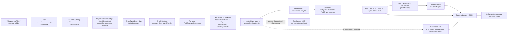

# Ghost — selektywny runtime decyzyjny dla Pump.fun na Solanie

> **Stan zweryfikowany względem bieżącego checkoutu: 2026-08-05.**  Ten dokument opisuje
> aktualną ścieżkę runtime oraz kontrolowany profil uruchomieniowy zapisany w repozytorium.
> Nie jest deklaracją gotowości do realnego handlu ani dowodem, że konkretny proces działa
> z taką samą konfiguracją. Dla uruchomienia źródłem prawdy są: wybrany plik `--config`,
> jego załadowany fingerprint, `ghost_brain_config_path`, zmienne środowiskowe i artefakty
> zapisane przez dany run.

Ghost jest rustowym, zdarzeniowym systemem selekcyjnego podejmowania decyzji dla
wczesnych pul Pump.fun. Nie jest HFT, systemem MEV ani ogólnym predyktorem rynku.
Jego zadaniem jest zebrać dowody dostępne w ograniczonym oknie obserwacji, odrzucić
kandydata, gdy dowody są niewystarczające lub ryzykowne, i pozostawić trwały ślad każdej
decyzji.

## Status bezpieczeństwa bieżącego profilu

W śledzonym rootowym profilu [`config.toml`](config.toml):

- Seer jest włączony z `source_mode = "grpc"`, commitment `processed` i profilem
  `single_global`.
- `[execution].execution_mode = "shadow"`, a `[trigger].entry_mode = "shadow_only"`.
- `[account_state_core].enable = true`.
- Gatekeeper V2.5 ma wyłączone `live_execution_enabled`; Gatekeeper V3 ma włączony
  shadow/replay evidence, ale `promotion.enabled = false`.

To oznacza, że **obecny profil rootowy jest shadow-only**. Przejście Gatekeepera na
`BUY` oznacza pozytywny werdykt decyzji, a nie potwierdzone kupno on-chain. W trybie
shadow runtime może przygotować i zasymulować ścieżkę wejścia oraz emitować artefakty
shadow, ale nie wolno interpretować ich jako `TransactionSent`, inclusion, fill ani PnL
z realnej pozycji.

`mode = "production"` w konfiguracji oznacza kontekst/profil launchera; nie nadpisuje
`execution_mode` i nie włącza live sendera. Kod live/dual istnieje, lecz nie jest aktywny
w tym profilu. Każda zmiana tej granicy wymaga osobnego przeglądu konfiguracji,
preflightu i dowodów rolloutowych.

## Mapa runtime


```mermaid
flowchart LR
    chain[Yellowstone gRPC / wybrane źródło] --> seer[Seer\nnormalizacja, parsery, provenance]
    seer --> ipc[Seer IPC / bridge\nrozdzielenie kanałów i provenance]
    ipc --> integrity[PumpObservationLedger + CandidateIntegrity\npermit kanonicznego runtime]
    integrity --> bus[GhostEvent Event Bus\ntokio broadcast]
    bus --> oracle[OracleRuntime\nrouting, rejestr puli, lifecycle]
    oracle --> session[Per-pool PoolObservationSession]
    session --> reducers[Admission + reduktory\nAccountStateCore, Tx Intelligence,\ncheckpoints, GatekeeperBuffer]
    reducers --> mfs[try_materialize_features\nMaterializedFeatureSet]
    mfs --> gk[Gatekeeper V2\nkanoniczna decyzja]
    mfs -. shadow checkpoints i diagnostyka .-> v25[Gatekeeper V2.5\nbez promotion authority]
    gk --> iwim[IWIM veto\nwyłącznie dla ścieżki PASS, gdy włączony]
    iwim --> terminal[BUY / REJECT / TIMEOUT\ntyp + reason code]
    mfs -. shadow/replay evidence .-> v3[Gatekeeper V3\npola evidence/replay, brak promotion authority]
    terminal --> shadow[Shadow dispatch / simulation\nprofil bieżący]
    shadow --> postbuy[PostBuyRuntime\nshadow lifecycle]
    terminal --> logger[DecisionLogger / JSONL]
    v3 --> logger
    postbuy --> logger
    logger --> audit[Replay, audyt, sidecary, WAL/snapshoty]
```

Najważniejsza zasada architektury brzmi:

```text
zdarzenia i stan sesji
→ materializacja jednego MaterializedFeatureSet
→ deterministyczna ocena Gatekeepera
→ typed terminal verdict + durable evidence
```

Polityka nie powinna ponownie wyliczać cech z konkurencyjnego, mutowalnego stanu.
Sidecary, eksperymenty i obserwacje po decyzji nie mogą przepisywać historycznego
werdyktu.

## Workspace i odpowiedzialności crate'ów

| Crate / binarium | Rola w aktualnym projekcie | Uwagi |
| --- | --- | --- |
| [`ghost-launcher`](ghost-launcher/) / `ghost-launcher` | Główny proces integracyjny: config, Seer, event bus, OracleRuntime, Gatekeeper handoff, Trigger, logging i shutdown. | To jest standardowy entry point runtime. |
| [`ghost-core`](ghost-core/) | Wspólne typy i reduktory: tożsamość/provenance zdarzeń, AccountStateCore, checkpointy, cechy, ShadowLedger, WAL. | Nie jest osobnym procesem. |
| [`ghost-brain`](ghost-brain/) | Konfiguracja Gatekeepera, policy/evidence types, DecisionLogger, moduły replayowe i analityczne. | Zawiera też narzędzia/binary offline, które nie są automatycznie częścią launchera. |
| [`off-chain/components/seer`](off-chain/components/seer/) / `seer` | Ingest Yellowstone/gRPC i inne adaptery, parsery, normalizacja, provenance oraz kanały do launchera. | Bieżący rootowy profil wybiera gRPC. |
| [`off-chain/components/trigger`](off-chain/components/trigger/) / `trigger` | Budowanie, preflight, transport i adaptery execution/shadow. | To, że crate obsługuje live transport, nie oznacza, że jest on aktywny. |
| [`off-chain/collector`](off-chain/collector/) | Biblioteka kolekcji datasetów. | Powierzchnia offline/datasetowa. |
| [`gui-backend`](gui-backend/) / `ghost-gui` | Opcjonalne REST/WebSocket GUI. | Launcher może wyłączyć wbudowany backend przez `GHOST_GUI_BACKEND_DISABLED`. |

Workspace zawiera również binaria narzędziowe, m.in. replay, audit metric-contract i
proby ACE. Są to kontrolowane powierzchnie analityczne/kwalifikacyjne, nie dodatkowe
ścieżki automatycznej decyzji w standardowym launcherze.

## Start i konfiguracja

### Interfejs launchera

```text
ghost-launcher [--config PATH] [--preflight | --generate-config]
ghost-launcher [config.toml]
```

- Bez argumentu launcher szuka `config.toml`; względna ścieżka jest rozwiązywana także
  względem przodków bieżącego katalogu i katalogu binarium.
- `--preflight` ładuje i waliduje profil, a następnie sprawdza wymagane powierzchnie
  runtime, w tym katalogi zapisu i — zależnie od profilu — skonfigurowane endpointy.
  Nie jest poleceniem submitu transakcji, ale nie jest też testem offline.
- `--generate-config` tworzy konfigurację domyślną tylko wtedy, gdy wskazany plik jeszcze
  nie istnieje. Nie używaj wygenerowanej konfiguracji jako autoryzacji do live execution.

Przykładowa bezpieczna kolejność dla lokalnego builda i sprawdzenia profilu, gdy operator
ma świadomie przygotowane lokalne credentials:

```bash
cargo build --release -p ghost-launcher --bin ghost-launcher
GHOST_ENV_FILE=/bezpieczna/lokalna/.env cargo run --release -p ghost-launcher --bin ghost-launcher -- \
  --config config.toml --preflight
```

Uruchomienie procesu wymaga już świadomie przygotowanej lokalnej konfiguracji i
credentials:

```bash
cargo run --release -p ghost-launcher --bin ghost-launcher -- \
  --config config.toml
```

Nie umieszczaj kluczy, tokenów, pełnych URL-i z credentialami ani prywatnego keypaira w
README, commicie lub artefaktach audytowych. Profil rootowy używa placeholderów zmiennych
środowiskowych dla powierzchni sieciowych. W zależności od wybranego profilu są to m.in.:

```text
GHOST_SEER_GRPC_ENDPOINT
GHOST_SEER_GRPC_X_TOKEN
GHOST_SEER_RPC_ENDPOINT
GHOST_TRIGGER_RPC_URL
GHOST_TRIGGER_SHADOW_RPC_URL
GHOST_TRIGGER_KEYPAIR_PATH
```

`GHOST_TRIGGER_KEYPAIR_PATH` jest potrzebny tylko wtedy, gdy wybrany profil i strategia
payera go wymagają. Katalogi trwałości można niezależnie nadpisać przez `GHOST_WAL_DIR`
i `GHOST_SNAPSHOT_DIR`.

`GHOST_ENV_FILE` może wskazać jawny lokalny plik z sekretami; bez niego launcher szuka
`.env` od katalogu konfiguracji ku przodkom. Taki plik pozostaje lokalnym wejściem
operatora, a nie artefaktem repozytorium ani dowodem uruchomienia.

### Który plik jest źródłem prawdy

| Powierzchnia | Plik / mechanizm | Zasada |
| --- | --- | --- |
| Profil launchera | [`config.toml`](config.toml) lub jawny `--config` | Określa ingest, execution mode, Trigger, logi, session, durability i komponenty opcjonalne. |
| Polityka Gatekeepera i post-buy | [`ghost-brain/ghost_brain_config.toml`](ghost-brain/ghost_brain_config.toml) | Ładowana przez `ghost_brain_config_path`; bieżące wartości progów są config-driven. |
| Profile eksperymentalne / rolloutowe | [`configs/rollout/`](configs/rollout/) | Osobne scope'y z własnymi ścieżkami i granicami; nie są domyślną konfiguracją. |
| Sekrety i lokalne override'y | środowisko / lokalny `.env` | Muszą pozostać poza VCS i poza raportami. |
| Fakty konkretnego runu | fingerprint configu, manifest, JSONL i logi runu | Mają pierwszeństwo przed tym README. |

Walidator konfiguracji wymaga jawnego profilu wykonawczego dla produkcyjnego launchera.
Nie opieraj rolloutów na legacy `dry_run` albo na niejawnych wartościach domyślnych.

## Pipeline runtime krok po kroku

### 1. Seer: ingest, normalizacja i provenance

Seer odbiera aktualizacje z wybranego źródła. W rootowym profilu jest to Yellowstone gRPC
z commitment `processed`; endpointy, programy, filtry, funding lane i polityki
backpressure należą do `[seer]` w wybranym pliku config.

Warstwa ingestu:

1. odbiera transakcje, aktualizacje kont, entry/slot/block metadata stosownie do
   subskrypcji;
2. parserami rozpoznaje semantykę puli, trade'ów i danych bonding curve;
3. niesie identyfikację źródła, pochodzenie czasowe oraz semantyczną lokalizację zdarzenia;
4. tworzy `DetectedPool`, `PoolTransaction`, `AccountUpdate` i eventy pomocnicze;
5. przepuszcza zdarzenia wymagające kanonicznej mutacji przez `CandidateIntegrity`.

Do kanonicznej admission kwalifikują się wyłącznie obserwacje pierwotnego raw Geyser
zgodne z kontraktem providera. Strumienie wtórne, parsowane obserwacje i witnesses mogą
uzupełniać dowód lub sygnalizować lukę pokrycia, lecz nie zyskują tą drogą autorytetu do
promowania kandydata do runtime.

`CanonicalRuntimePermitV1` jest nie-serializowalnym, procesowym dowodem, że bogaty payload
Seera dostał dopuszczenie do kanonicznego runtime. `NewPoolDetected` i `PoolTransaction`
bez takiego permitu nie są legalnym obejściem ścieżki decyzyjnej. CandidateIntegrity jest
warstwą technicznej integralności/provenance, a nie wynikiem strategii ani werdyktem
Gatekeepera.

Są też eventy **capture-only** (`FullUniverseTradeEvidence`,
`FullUniverseReserveEvidence`). Celowo nie mają runtime permitu i są kierowane do
opcjonalnego durable evidence; nie mogą mutować AccountStateCore, Gatekeepera, Triggera
ani execution state.

### 2. Event bus i routing OracleRuntime

[`ghost-launcher/src/events.rs`](ghost-launcher/src/events.rs) tworzy wspólny
`tokio::sync::broadcast` bus o pojemności `10_240`. OracleRuntime subskrybuje go przed
uruchomieniem Seera, co zamyka lukę startową między konsumentem a upstream ingestem.
Jest to kanał rozgłoszeniowy, nie trwały log ani gwarancja exactly-once; trwałe dowody
powstają dopiero na wyznaczonych ścieżkach writerów i loggerów.

Główna pętla OracleRuntime obsługuje m.in. barrier shutdownu Seer→Oracle, sygnały
CandidateIntegrity, pule, transakcje, funding evidence, execution-account evidence,
`GatekeeperCommitted` i aktualizacje kont. Poszczególne eventy są rozdzielane do
kanonicznej sesji puli albo do jawnie odseparowanej ścieżki evidence.

`broadcast::RecvError::Lagged` nie jest traktowany jako zwykłe pominięcie danych:
runtime oznacza stream gap, unieważnia oczekujące canonical-apply receipts i rejestruje
degradację/awarię odpowiedniego segmentu capture. Nie rekonstruuje potajemnie utraconych
zdarzeń jako pełnych dowodów decyzyjnych.

Na kontrolowanym shutdownzie `SeerOracleDrainBarrierV1` potwierdza, że Oracle zobaczył
wcześniejsze emisje Seera przed dalszym zamykaniem runtime. Nie zastępuje to końcowego
drainu tasków, loggerów i trwałych writerów.

### 3. Sesja obserwacji per pool

Każda dopuszczona pula ma własną `PoolObservationSession` i task obserwacyjny. Sesja
posiada własny lifecycle, deadline, bufor transakcji, checkpointy, stan accountowy oraz
konfigurację potrzebną do obliczeń.

Istotne granice:

- `PoolObservationSession::admit_transaction()` jest kanoniczną granicą admission przed
  reduktorami; duplicate nie ma tworzyć drugiego stanu cech.
- Po `Decided` lub `Closed` dalsze zdarzenia nie mogą przepisać historycznej decyzji.
- `Wait` i `PendingCurve` są stanami nieterminalnymi, a nie ukrytymi rejectami.
- Terminalna ścieżka korzysta z fallible
  `PoolObservationSession::try_materialize_features()`; błąd materializacji jest typed i
  propagowany, zamiast być pomijany.
- Wynik terminalny jest finalizowany razem z wymaganym evidence, a następnie sesja jest
  czyszczona albo jawnie przekazywana do kontrolowanego post-buy lifecycle.

### 4. `MaterializedFeatureSet`: pojedynczy snapshot decyzji

`MaterializedFeatureSet` w `ghost-core` jest kanonicznym snapshotem wejścia polityki.
Materializacja łączy dane, które należą do właściwych producerów, m.in.:

- cechy AccountStateCore i gotowość/finalność curve;
- Tx Intelligence i cechy transakcyjne;
- checkpointy, dynamikę/trajectory z GatekeeperBuffer oraz metadane sesji;
- cechy sybil/funding/alpha, stan jakości dowodu i projekcję metric-contract;
- jednoznaczny cutoff czasu/slotu dla materializacji i replayu.

AccountStateCore jest preferowanym źródłem kanonicznego stanu kont, gdy jest włączony.
ShadowLedger służy warstwie shadow/reconciliation oraz kontrolowanym fallbackom; nie może
niejawnie stać się konkurencyjnym źródłem cech polityki. Metoda
`materialize_features()` pozostaje fasadą kompatybilności, ale aktywna terminalna ścieżka
używa `try_materialize_features()`.

### 5. Gatekeeper: decyzja, reason code i sidecary

Kanoniczny terminalny Gatekeeper jest feature-driven: buduje assessment z
`MaterializedFeatureSet`, stosuje hard filters przed miękkimi elementami polityki, a wynik
zapisuje jako konkretny typ werdyktu oraz reason code. Rozróżnienie `BUY`, `REJECT` i
`TIMEOUT` jest istotne; nie należy zastępować go ogólnym `REJECT`.

Aktualne warstwy są rozdzielone następująco:

| Warstwa | Rola | Autorytet w bieżącym profilu |
| --- | --- | --- |
| Gatekeeper V2 | Kanoniczna ocena terminalna z materializowanych cech. | Tak — decyzja pre-buy. |
| V2.5 (DOW, TAS, PDD, APS) | Shadowowa warstwa checkpointów, assessmentu, diagnostyki i ablation fields zależna od configu. | Nie jest promowana do authority wykonania; bieżący config ma `live_execution_enabled = false`. |
| IWIM veto | Uruchamiany po ścieżce PASS tylko wtedy, gdy jest włączony; może zmienić PASS w typed reject. | Tak, gdy włączony w configu. |
| Gatekeeper V3 | Zapisuje wersjonowane pola shadow/replay evidence w rekordzie decyzji i danych replayowych. | Nie — `promotion.enabled = false`. |

Obecność `HyperPrediction`, `Chaos`, tuningów albo starszych typów w workspace nie jest
dowodem ich użycia w kanonicznej ścieżce V2. Aktualna decyzja pre-buy nie powinna wracać
do deprecated `score_pool()` ani odczytywać ukrytego live state poza kontraktem
materializacji.

### 6. Handoff execution i granica shadow/live

Profil wykonawczy jest walidowany jako para `execution_mode` + `trigger.entry_mode`.
Launcher konstruuje `LiveTxSender` wyłącznie dla zgodnych profili `live` lub `dual` i gdy
Trigger ma odpowiedni tryb wejścia. Obecny rootowy profil nie spełnia tych warunków,
ponieważ jest `shadow` + `shadow_only`.

W shadow path runtime może:

1. zweryfikować gotowość wymaganych kont i routingu;
2. przygotować payload wejścia;
3. wykonać przez `RpcShadowSimulator` RPC `simulateTransaction`/adaptację shadow oraz zapisać wynik i timestampy;
4. przekazać **symulowany** handoff do post-buy lifecycle, gdy spełnione są jego warunki.

To nie oznacza wysłania, lądowania ani potwierdzenia transakcji. Przy analizie eventów
zawsze czytaj `lane`, execution mode, `buy_landed_slot` i
`entry_simulation_rpc_slot`, zamiast wnioskować z samej nazwy eventu. `submit` i
`simulation` nie są `confirmation`, a nieznany status nie jest sukcesem.

### 7. Post-buy i lifecycle

Po skutecznym handoffie shadow `PostBuyRuntime` prowadzi osobny lifecycle pozycji i
zapisuje jego evidence. Rootowy Ghost Brain config utrzymuje shadow Position Manager Lite
V1 jako właściwy manager; HET-PM V2 oraz TimeStop V2 mają tryb `observe_only`, a AEM jest
wyłączony. Te obserwacyjne komponenty nie mają prawa samodzielnie zmieniać decyzji
pre-buy, wykonywać częściowych exitów ani uaktywniać realnego sell path.

## Artefakty, logging i replay

Wszystkie ścieżki mogą być nadpisane przez wybrany config/rollout. W rootowym profilu
warto znać następujące kategorie:

| Artefakt | Domyślna lokalizacja / routing | Znaczenie |
| --- | --- | --- |
| System log | `logs/system.log` | Start/stop komponentów i błędy operacyjne. |
| Oracle log | `logs/oracle_decision.log` | Formatowany log Oracle/decisions. |
| Gatekeeper JSONL | `logs/decisions/<rollout>/<gatekeeper>/<plane>/<config-hash>/gatekeeper_v2_decisions.jsonl` | Wszystkie terminalne decyzje; rekordy BUY są dodatkowo zapisywane do `gatekeeper_v2_buys.jsonl`. |
| Shadow entry | `logs/shadow_run/shadow_entries.jsonl` | Wyniki entry w aktualnym shadow profile. |
| Shadow lifecycle | ścieżka jawna albo wyprowadzona z `entry_log_path` | Lifecycle shadow/post-buy; nie jest dowodem live fillu. |
| Event/dataset output | `datasets/events/`, `datasets/decisions/` | Rotowane dane obserwacyjne i datasetowe. |
| Durability | `data/wal`, `data/snapshots` | WAL i snapshoty, o ile są włączone skuteczną konfiguracją. |

DecisionLogger zapisuje wersjonowane JSONL. W każdym Gatekeeper record ma pozostać typ
werdyktu; w razie wykrycia wadliwego legacy rekordu fallback jest oznaczony jawnie, zamiast
ukryć brak klasyfikacji. Writer sidecarów (np. selector shadow score,
metric-contract, coordination risk, V3 replay evidence) jest addytywny i nie ma prawa
zmieniać payloadu kanonicznego werdyktu ani jego replay hash.

Shutdown loggerów i terminal producerów jest ograniczony czasowo; błąd końcowego draina
unieważnia odpowiedni dowód zamiast ogłaszać niezweryfikowany sukces.

## Model współbieżności i granice czasu

- Launcher tworzy wielowątkowy Tokio runtime z jawnym rozmiarem stacku workerów.
- Event bus jest broadcast; per-pool taski mają osobne wejście, lifecycle i deadline.
- Canonical admission, deduplikacja, ordering/provenance oraz clean-up są częścią
  poprawności decyzji, nie optymalizacją poboczną.
- Runtime odróżnia event time, ingress/wall time, monotoniczną długość sesji,
  materialization time, decision time i execution/reconciliation time. Nie wolno
  odejmować mieszanych domen czasu jako podstawy cechy lub timeoutu.
- Provenance zachowuje rolę providera, slot, indeks transakcji, ordinal zdarzenia,
  signature i czas ingressu. Zachowanie kolejności rodzeństwa w pojedynczej transakcji
  nie ustanawia globalnego total order dla całego łańcucha; brakujący chain time musi być
  oznaczony fallbackiem do ingress time.
- Account-update worker ma oddzielną powierzchnię kolejki; nie należy z tego wyprowadzać
  twierdzenia, że wszystkie kolejki Ghosta są bezwarunkowo bounded.
- Na lag, brak gotowości curve, brak wymaganego dowodu lub materialization error system ma
  zachować jawny status/degradację, a nie dopowiadać brakujące dane.

## Obserwowalność

- `[metrics]` konfiguruje endpoint Prometheus; rootowy profil eksponuje `GET /metrics`
  oraz `GET /healthz` na `0.0.0.0:9091`. Operator powinien ograniczyć dostęp sieciowy
  odpowiednią polityką hosta.
- `[gui_backend]` jest opcjonalny. W bieżącym profilu binduje lokalny adres, a
  `GHOST_GUI_BACKEND_DISABLED=1` pozwala rozdzielić GUI od launchera.
- `CONFIG | ...` / config fingerprint oraz routing JSONL są elementami provenance runu.
  Zachowaj je wraz z hashami binarium i konfiguracji, jeżeli wynik ma być użyty do
  kwalifikacji lub porównania.

## Powierzchnie obserwacyjne, eksperymentalne i legacy

Repozytorium celowo zawiera więcej kodu niż aktywna ścieżka pre-buy. Należy klasyfikować
go po call graphu i konfiguracji, nie po nazwie modułu.

| Powierzchnia | Status / granica |
| --- | --- |
| Gatekeeper V3 | Włączony jako shadow/replay evidence w recordach decyzji i replayu, bez promotion do autorytetu wejścia. |
| HET-PM V2 i TimeStop V2 | `observe_only`; nie są właścicielem exit authority. |
| `rug_scalp_v2`, `rug_reality_capture`, ACE, P3.7 | Opcjonalne, izolowane profile capture/probe. Przy włączeniu walidator wymusza wzajemne wykluczenia i granice shadow/observe-only. |
| `PoolScored`, starsze dry-run/paper aliasy, legacy config fields | Zachowane dla kompatybilności/testów lub porównań; nie są automatyczną ścieżką kanonicznej decyzji. |
| `materialize_features()` | FASADA kompatybilności; terminalny runtime używa fallible `try_materialize_features()`. |

W szczególności nie wolno promować sidecarów, wyników offline, capture evidence,
HyperPrediction/Chaos ani post-buy telemetry do Gatekeepera tylko dlatego, że są dostępne
w workspace. Wymaga to osobnego kontraktu SSOT, planu, testów i decyzji rolloutowej.

## Weryfikacja zmian

Dobieraj wąskie testy do zmienianego kontraktu. Bazowy zestaw sprawdzeń dokumentacyjnych i
kompilacyjnych wygląda następująco:

```bash
cargo fmt --all -- --check
cargo test -p ghost-launcher --lib
cargo test -p seer
cargo test -p ghost-brain
```

Przed zmianą runtime policy lub execution profile dołóż testy dotyczące konkretnie:

- canonical admission oraz deduplikacji transakcji;
- terminalnego `BUY` / `REJECT` / `TIMEOUT` i reason code;
- typed materialization failure oraz czasu/deadline;
- routingów `AccountUpdate` / funding / CandidateIntegrity;
- granicy shadow/live, gdzie simulation nigdy nie jest potwierdzeniem;
- trwałości/replayu JSONL i shutdown drainu.

Nie zastępuj testu kontraktu długim runem obserwacyjnym. Z kolei sukces smoke'a lub
shadow runu nie jest dowodem dodatniego EV ani zgodą na live execution.

## Najważniejsze pliki do dalszego audytu

| Obszar | Weryfikuj przede wszystkim |
| --- | --- |
| Startup, profile i preflight | [`ghost-launcher/src/main.rs`](ghost-launcher/src/main.rs), [`ghost-launcher/src/config.rs`](ghost-launcher/src/config.rs), [`config.toml`](config.toml) |
| Eventy i canonical permits | [`ghost-launcher/src/events.rs`](ghost-launcher/src/events.rs), [`ghost-launcher/src/components/seer.rs`](ghost-launcher/src/components/seer.rs) |
| Geyser/Yellowstone ingest | [`off-chain/components/seer/src/grpc_connection.rs`](off-chain/components/seer/src/grpc_connection.rs) oraz parsery Seera |
| Sesja i materializacja | [`ghost-launcher/src/session/observation.rs`](ghost-launcher/src/session/observation.rs), [`ghost-core/src/checkpoint/types.rs`](ghost-core/src/checkpoint/types.rs) |
| Policy i reason codes | [`ghost-launcher/src/components/gatekeeper_policy.rs`](ghost-launcher/src/components/gatekeeper_policy.rs), [`ghost-launcher/src/components/gatekeeper.rs`](ghost-launcher/src/components/gatekeeper.rs) |
| Oracle lifecycle i shadow handoff | [`ghost-launcher/src/oracle_runtime.rs`](ghost-launcher/src/oracle_runtime.rs) |
| Decision JSONL i sidecary | [`ghost-brain/src/oracle/decision_logger.rs`](ghost-brain/src/oracle/decision_logger.rs) |
| Gatekeeper / post-buy config | [`ghost-brain/ghost_brain_config.toml`](ghost-brain/ghost_brain_config.toml) |

## Krótki słownik

| Termin | Znaczenie |
| --- | --- |
| **CandidateIntegrity** | Techniczna kontrola identity/provenance, która wydaje procesowy permit dla kanonicznej mutacji runtime. |
| **MFS / `MaterializedFeatureSet`** | Jednorazowo materializowany snapshot cech użyty przez politykę decyzji. |
| **Gatekeeper** | Kanoniczna polityka pre-buy zwracająca typed verdict oraz reason code. |
| **Shadow** | Przygotowanie/symulacja i evidence bez potwierdzonego realnego wejścia on-chain. |
| **Sidecar** | Addytywny artefakt diagnostyczny lub replayowy bez prawa do zmiany werdyktu. |
| **WAL** | Write-ahead log używany przez skonfigurowaną warstwę trwałości. |
| **Terminal verdict** | Jednorazowy rezultat sesji: `BUY`, `REJECT` lub `TIMEOUT`; nie może zostać zmieniony późnym eventem. |

---

Jeśli opis w tym README różni się od skutecznego configu, manifestu lub kodu bieżącego
refa, pierwszeństwo ma kod i dowód konkretnego runu. Zmiany w Gatekeeperze,
`MaterializedFeatureSet`, execution mode, AccountStateCore, DecisionLoggerze lub
provenance ingestu wymagają ponownego, code-backed przeglądu tej dokumentacji.
