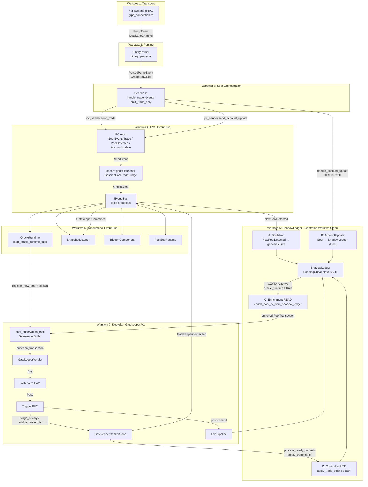

# ADR: Produkcyjny Pipeline Danych — Kompletny Flow od gRPC do Decyzji

**Data:** 2026-03-18
**Status:** Raport analityczny (code-grounded)
**Zakres:** Szczegółowy opis każdego elementu produkcyjnego pipeline, SSOT, kontraktów, wzajemnych relacji

---

## 1. Architektura wysokopoziomowa



> [!IMPORTANT]
> **ShadowLedger jest warstwą stanu POMIĘDZY Event Bus a Gatekeeperem.** Bez niego Gatekeeper Faza 6 (Bonding Curve Dynamics) nie ma danych rezerwowych. Jest jednocześnie CZYTELNIKIEM (enrichment przed Gatekeeperem) i CELEM ZAPISU (commit po BUY).

> [!NOTE]
> Po weryfikacji z kodem produkcyjnym ADR wymagał kilku doprecyzowań: transport subskrybuje nie tylko `Transaction`, ale też `Entry` i dynamiczne exact-account watches; `AccountUpdate` ma **dwie** ścieżki (direct write do `ShadowLedger` oraz osobny forwarding przez IPC/Event Bus do reconciliation); a commit po BUY wykonuje asynchroniczny `GatekeeperCommitLoop`, który dodatkowo emituje `GhostEvent::GatekeeperCommitted`.

---

## 2. Warstwa 1: gRPC Connection (Transport)

**Plik:** `off-chain/components/seer/src/grpc_connection.rs`

### Opis
Nawiązuje i utrzymuje połączenie z Yellowstone gRPC (Geyser plugin). W aktualnym kodzie transport działa jako `YellowstoneConnector` z obsługą **multi-provider fan-in**, watchdogiem ciszy, ping/pong, slot-gap tracking i dynamicznym resubscribe.

Subskrypcja obejmuje:
- `transactions`: `account_include=[Pump.fun, PumpSwap]`
- `entry`: `SubscribeRequestFilterEntry {}`
- `accounts`: **exact-account watch** dla dynamicznie śledzonych pooli/generic accounts

Ważne: exact-account filter nie subskrybuje „całej klasy” bonding curves przez memcmp; budżet exact-account jest w praktyce używany dla tracked pools / generic accounts.

### Kluczowe struktury
| Typ | Rola |
|-----|------|
| `PumpEvent` | Enum: `Transaction`, `AccountUpdate`, `EntryUpdate`, `BackfillTransaction` |
| `DualLaneChannel` | Bufor z dwoma ścieżkami: `fast` + `overflow`, obie bounded |
| `AccountRegistry` | Dynamiczna rejestracja kont do śledzenia z natychmiastowym `resub_notify()` |
| `DelayedAccountQueue` | Transportowy bufor AccountUpdate arriving-before-mapping |
| `SlotTracker` | Globalne wykrywanie gapów slotów ponad providerami |

### SSOT
- **Źródło prawdy:** Raw gRPC stream z Yellowstone (dane on-chain)
- **Kontrakt wejściowy:** `SubscribeRequest` z filtrem transakcyjnym na `Pump.fun + PumpSwap`, dynamicznymi exact-account watches i `Entry` feedem
- **Kontrakt wyjściowy:** `PumpEvent` na `DualLaneChannel`

### Mechanizm backpressure
```
fast (bounded) → jeśli pełny → overflow (bounded) → jeśli oba pełne → BLOCK / backpressure upstream
```

To ważna korekta względem uproszczonego opisu: aktualny kod nie preferuje końcowego dropu newest event, tylko blokuje overflow sender, aby wymusić naturalny backpressure.

### Reconciliation
- `AccountRegistry` rejestruje watched pools / curves / mints / generic accounts
- Resubscribe jest wyzwalany zarówno `Notify`, jak i tickerem health/registry
- `EntryUpdate` jest dodatkowym coverage / continuity anchor
- Manual backfill istnieje jako osobna ścieżka dla luk slotowych, ale dalej przechodzi parser-first (`BackfillTransaction`)

---

## 3. Warstwa 2: Binary Parser (Domain Parsing)

**Plik:** `off-chain/components/seer/src/binary_parser.rs`

### Opis
Dekoduje surowe bajty transakcji Solana do typizowanych eventów domenowych dla **Pump.fun oraz PumpSwap**. Rozpoznaje nie tylko `Create`, `Buy`, `Sell`, `Migrate`, ale także `Withdraw`, `SetParams`, `SwapTrade`, `SwapPoolCreated`, `MigrateReady`, `AccountChange` i `EntryAnchor`.

Parser obsługuje:
- top-level instructions,
- CPI / `inner_instructions`,
- Anchor CPI event logs,
- `EntryUpdate` scan pod embedded CPI eventy,
- RPC/backfill przez `parse_geyser_transaction()`.

### Kluczowe struktury
| Typ | Rola |
|-----|------|
| `ParsedPumpEvent` | Enum z wariantami tx/account/entry, obejmujący Pump.fun i PumpSwap |
| `CurveMintRegistry` | Mapa `curve_address → mint_address` — SSOT dla mapping bonding curve→token |
| `ResolveQueue` | Parser-level bufor unresolved AccountUpdate/raw account payloads |
| `CompleteTracker` | Edge detector `complete=false → true`, emituje `MigrateReady` tylko raz |

### Algorytm parsowania
1. Iteracja po `compiled_instructions` — szukanie instruction data z discriminatorem Pump.fun
2. Dekod Anchor (8-byte discriminator) → typ instrukcji
3. Dla `Buy`/`Sell`: wyciągnięcie `amount`, `max_sol_cost`/`min_sol_output` z instruction data
4. CPI: walking po `inner_instructions` → Anchor event logs (`EventTrade`, `EventCreate`, `EventComplete`)
5. Enrichment: `enrich_trade_optional_accounts_from_source_ix()` → wyciągnięcie `token_program`, `fee_recipient`, `bonding_curve` z account keys
6. Dedup: preferencja dla CPI/log-level truth nad mniej precyzyjnym ix-level duplicate (`dedup_trade_events()`)
7. Account path: `parse_account_raw()` → `CurveSnapshot` / `AccountChange` / jednorazowy `MigrateReady`
8. Entry path: `parse_entry_raw()` → `EntryAnchor { executed_transaction_count }` + best-effort CPI scan

### SSOT
- **Źródło prawdy:** Instruction data + inner_instructions + account data + entry payloads
- **Kontrakt wejściowy:** `PumpEvent::{Transaction, BackfillTransaction, AccountUpdate, EntryUpdate}`
- **Kontrakt wyjściowy:** `ParsedPumpEvent` (typed events)

### Dedup
- `recent_trade_sigs: HashSet<String>` — deduplikacja na poziomie signature (ring buffer ostatnich N)

---

## 4. Warstwa 3: Seer Orchestration

**Plik:** `off-chain/components/seer/src/lib.rs`

### Opis
Główna pętla Seera — konsumuje `PumpEvent` z gRPC, parsuje je przez `BinaryParser`, i emituje typizowane eventy przez IPC. Zarządza mappingiem `curve → mint`, buforowaniem trade'ów czekających na mapping, i coverage tracking.

Dodatkowo w aktualnym kodzie:
- `process_event()` rozróżnia źródła synthetic/raw (`PumpPortal` vs `Geyser`),
- `EntryAnchor` events są konsumowane dla coverage,
- `handle_account_update()` ma dwa skutki uboczne: direct write do `ShadowLedger` oraz IPC forwarding do reconciliation.

### Kluczowe funkcje
| Funkcja | Rola |
|---------|------|
| `handle_trade_event()` (L2304) | Hydracja trade, walidacja pool_id, buforowanie pending |
| `emit_trade_only()` (L2223) | Wysłanie TradeEvent przez IPC (ipc_sender.send_trade()) |
| `register_curve_mapping()` | Rejestracja nowego mappingu curve→mint, replay buforowanych trade'ów |
| `handle_account_update()` | Parsowanie AccountUpdate → ShadowLedger update + IPC emit |

### Flow przetwarzania trade'a
```
PumpEvent::Transaction
  → BinaryParser.parse_transaction()
  → ParsedPumpEvent::Trade(TradeEvent)
  → handle_trade_event():
      1. hydrate_trade_mapping() — wzbogacenie o mint/pool_amm_id z CurveMintRegistry
      2. Walidacja: is_invalid_trade_pool() → bufor pending lub drop
      3. Dedup check (pending trades buffer)
      4. Dedup check (forwarded signatures)
      5. emit_trade_only() → ipc_sender.send_trade(trade, EventPriority::Normal)
```

### Pending Trades Buffer
- `PendingTradeKey`: `ByCurve([u8;32])` / `ByMint([u8;32])` / `BySignature(String)`
- TTL: `PENDING_TRADE_TTL = 300s`
- Max per curve: `PENDING_TRADES_PER_CURVE_MAX = 1024`
- Replay: po `register_curve_mapping()` → natychmiastowy flush buforowanych trade'ów

### SSOT
- **Źródło prawdy:** `CurveMintRegistry` (parser-level) + `curve_to_mint` / `mint_to_curve` (Seer-level)
- **Kontrakt wyjściowy:** `SeerEvent::{Trade, PoolDetected, AccountUpdate}` na IPC channel

---

## 5. Warstwa 4: IPC → Event Bus Bridge

### 5a. IPC Channel (Seer → ghost-launcher)

**Plik:** `off-chain/components/seer/src/ipc.rs`

| Typ | Rola |
|-----|------|
| `SeerEvent` | Enum: `PoolDetected(DetectedPoolEvent)`, `Trade(DetectedTradeEvent)`, `AccountUpdate(DetectedAccountUpdateEvent)` |
| `IpcSender` | Wrapper tokio mpsc z backpressure (`BackpressurePolicy`: Block/DropNew/DropOldest/DropByPriority) |
| `IpcReceiver` | Consumer z metrycznym `handling_latency_ms` |

**Buffer size:** 10,000 (konfigurowane)
**Backpressure policy (Trade):** `Block` (nigdy nie gubi trade'ów)
**Backpressure policy (AccountUpdate):** `DropNew` (bezpieczne — następny update naprawi)

### 5b. SessionPoolTradeBridge (ghost-launcher)

**Plik:** `ghost-launcher/src/components/seer.rs`

### Opis
Buforuje trade'y które przychodzą PRZED `NewPoolDetected` (race condition — trade może przyjść szybciej niż create). Po `NewPoolDetected` → replay buforowanych.

W aktualnym kodzie bridge ma też osobną ścieżkę dla SeerEvent::AccountUpdate, która zamienia IPC payload na GhostEvent::AccountUpdate (gdy account_updates_enabled = true). Używa również wąskiego buforowania SESSION_POOL_TRADE_BUFFER_TTL = 10ms, przeznaczonego do obsługi bardzo krótkiego race condition typu trade-before-NewPoolDetected w obrębie tej samej sesji. To nie jest długotrwały bufor niezawodnościowy, lecz agresywnie krótki mechanizm minimalizujący opóźnienie i replayujący wyłącznie niemal natychmiastowe zakupy poprzedzające rejestrację poola.

### Kluczowe funkcje
| Funkcja | Rola |
|---------|------|
| `process_trade_event_for_session_gate()` (L450) | Ingestion: ForwardNow / Buffered / DuplicateSuppressed |
| `process_pool_detected_event_for_session_gate()` (L492) | Register pool → flush buforowanych → replay |
| `emit_pool_transaction_to_event_bus()` (L546) | TradeEvent → PoolTransaction → GhostEvent::pool_transaction() → broadcast |
| `detected_pool_from_candidate()` (L431) | CandidatePool → DetectedPool |

### Konwersja TradeEvent → PoolTransaction
```
trade_event_to_pool_transaction():
  - pool_amm_id: trade.pool_amm_id
  - token_mint: Some(trade.mint)
  - is_buy: trade.is_buy
  - volume_sol: lamports / 1_000_000_000.0
  - sol_amount_lamports: Some(lamports)
  - token_amount_units: Some(trade.amount)
  - signer: trade.user
  - signature: trade.signature
  - slot: trade.slot
  - timestamp_ms: trade.timestamp_ms
  - is_dev_buy: trade.is_dev_buy
```

### 5c. Event Bus

**Plik:** `ghost-launcher/src/events.rs`
**Typ:** `tokio::sync::broadcast` (fan-out do wielu konsumentów)
**Buffer:** 10,240 events

| Event | Payload |
|-------|---------|
| `GhostEvent::NewPoolDetected(Arc<DetectedPool>)` | pool_amm_id, base_mint, bonding_curve, creator, slot, signature |
| `GhostEvent::PoolTransaction(Arc<PoolTransaction>)` | pool_amm_id, token_mint, is_buy, volume_sol, signer, slot, reserves... |
| `GhostEvent::AccountUpdate { ... }` | base_mint + virtual reserves + complete + slot |
| `GhostEvent::GatekeeperCommitted { ... }` | sygnał zakończonego commitu launcherowego |

---

## 6. Warstwa 5: ShadowLedger — Centralna Warstwa Stanu

ShadowLedger **NIE jest zwykłym konsumentem Event Bus**. Jest centralną warstwą stanu, z 4 punktami interakcji z pipeline:

### Punkt A — Bootstrap (Event Bus → ShadowLedger)

**Plik:** `ghost-launcher/src/main.rs` (L381-398)

Na `NewPoolDetected` → `store_curve_with_snapshots()` z `genesis_curve()` i `slot=None`, `confirmed=false`. To jest **punkt zero** — bez tego Gatekeeper nie ma skąd wziąć rezerw dla nowego poola.

### Punkt B — AccountUpdate (Seer → ShadowLedger, BEZPOŚREDNIO)

**Plik:** `off-chain/components/seer/src/lib.rs` — `handle_account_update()`

AccountUpdate z gRPC trafia **bezpośrednio** do Shadow Ledger przez `handle_account_update()`. Seer ma `shadow_ledger: Option<Arc<ShadowLedger>>` i pisze do niego curve updates z on-chain. To jest korektywna ścieżka — jeśli lokalna krzywa rozjechała się z blockchainem, AccountUpdate ją naprawia.

**Ale to nie jest cała historia.** Ten sam `handle_account_update()` dodatkowo emituje `ipc_sender.send_account_update(...)`, a bridge w `ghost-launcher/src/components/seer.rs` przekłada to na `GhostEvent::AccountUpdate`, który `OracleRuntime` konsumuje do `process_account_update(...)`. Czyli:

```text
AccountUpdate → direct write do ShadowLedger
             → IPC AccountUpdate → Event Bus → OracleRuntime reconciliation
```

Zatem stwierdzenie „omija Event Bus” jest prawdziwe tylko dla ścieżki zapisu do `ShadowLedger`, ale nie opisuje pełnego losu eventu.

Dodatkowo: `ReconciliationRuntime` w `oracle_runtime.rs` (L5424+) co 400ms sprawdza on-chain stan via RPC i wywołuje `process_account_update()` → korekta Shadow Ledger.

### Punkt C — KRYTYCZNY: Enrichment PRZED Gatekeeperem (ShadowLedger → OracleRuntime)

**Plik:** `ghost-launcher/src/oracle_runtime.rs` (L4670)

```rust
let tx = enrich_pool_tx_from_shadow_ledger(tx, pool_id, ctx.oracle_runtime.get_shadow_ledger());
```

Każdy `PoolTransaction` **ZANIM trafi do `buffer.on_transaction(tx)`** jest wzbogacany o:
- `v_tokens_in_bonding_curve` — virtual token reserves
- `v_sol_in_bonding_curve` — virtual SOL reserves
- `price_quote` — cena (v_sol / v_tokens)
- `market_cap_sol` — market cap
- `reserve_base`, `reserve_quote` — rezerwy
- `curve_data_known` — czy dane pochodzą z potwierdzonego AccountUpdate

**Bez tego enrichmentu Faza 6 Gatekeepera (Bonding Curve Dynamics) nie ma danych i nie może podjąć decyzji.**

### Punkt D — Commit WRITE po decyzji BUY (OracleRuntime + GatekeeperCommitLoop → ShadowLedger)

**Plik:** `ghost-launcher/src/oracle_runtime.rs` (L1379+)

Po `GatekeeperVerdict::Buy`:
1. `commit_coordinator.add_approved_tx()` → `LauncherCommitBuffer` (`ghost-launcher/gatekeeper.rs`) → bufferuje tx
2. Asynchroniczny `GatekeeperCommitLoop` co `check_interval_ms` wywołuje `LauncherCommitCoordinator.process_ready_commits()`
3. `process_ready_commits()` → `build_trade_snapshots_observed(initial_state, txs)` (`history_types.rs`) → wewnętrznie wywołuje `state.apply_trade_strict(&tx)` na `ReconstructedState` → **ZAPIS do ShadowLedger** przez `ledger.commit_history()`
4. `GatekeeperCommitLoop` emituje `GhostEvent::GatekeeperCommitted`, inicjalizuje `LivePipeline` i forwarduje `pending_live`
5. `LivePipeline.process_event()` / `flush_ready()` → dalsze live tx po commit → **append do ShadowLedger** przez `append_live()`

> [!IMPORTANT]
> **`GatekeeperMintBuffer` z `ghost-core/shadow_ledger/gatekeeper.rs` NIE jest w tej ścieżce.**
> `apply_trade_strict()` jest wywoływany przez `build_trade_snapshots_observed()` z `history_types.rs`,
> operując na `ReconstructedState` — nie przez `GatekeeperMintBuffer`.

### SSOT

ShadowLedger jest **autorytatywnym cache'em krzywej bonding** w pamięci. Stan pochodzi z:
1. Genesis bootstrap (Punkt A)
2. On-chain AccountUpdate direct write (Punkt B)
3. `build_trade_snapshots_observed()` → `apply_trade_strict()` po commit BUY (Punkt D)
4. `append_live()` po inicjalizacji `LivePipeline` (post-commit continuation)

---

## 7. Warstwa 6: Konsumenci Event Bus

### 7a. OracleRuntime (Główny konsument decyzyjny)

**Plik:** `ghost-launcher/src/oracle_runtime.rs` (L5242+)

**Rola:** Zarządzanie per-pool stanem, decyzje Gatekeeper V2.

| Event | Akcja |
|-------|-------|
| `NewPoolDetected` | `build_enhanced_candidate_from_pool_data()` → `register_new_pool()` → spawn `pool_observation_task()` |
| `PoolTransaction` | Enrichment z ShadowLedger → routing: per-pool task channel LUB `forward_approved_tx_to_commit_or_live_pipeline()` |
| `AccountUpdate` | `process_account_update()` dla reconciliation (legacy / non-tx-only mode) |
| `GatekeeperCommitted` | `mark_pool_committed()` |

### 7b. SnapshotListener

**Plik:** `ghost-launcher/src/components/snapshot_listener.rs`

**Rola:** Jedyny kanoniczny writer do `SnapshotEngine`. Przetwarza `PoolTransaction` → `handle_tx_event()` → market snapshots. Dodatkowo konsumuje `GatekeeperCommitted`, żeby odblokować replay staged transactions dla committed pools.

### 7c. Trigger Component

**Plik:** `ghost-launcher/src/components/trigger/component.rs`

**Rola:** Budowanie i wysyłanie transakcji BUY na Solana. Konsumuje `NewPoolDetected` jako backup path (legacy).

### 7d. PostBuyRuntime

**Rola:** Nasłuchuje na eventy post-buy (monitorowanie pozycji po zakupie). Obsługuje paper + live lanes.

---

## 8. Warstwa 7: Decyzja (Gatekeeper V2)

### 8a. Per-Pool Observation Task

**Plik:** `ghost-launcher/src/oracle_runtime.rs` (L4522+)

Każdy pool otrzymuje dedykowany `pool_observation_task` z:
- `GatekeeperBuffer` — zbieranie transakcji, ocena faz
- `FingerprintAggregator` — early block-0 snipe detection
- `WindowState` — A/B window tracking
- Deadline: `max_wait_time_ms + 100ms grace`

### 8b. GatekeeperBuffer → GatekeeperVerdict

**Plik:** `ghost-launcher/src/components/gatekeeper.rs`

`buffer.on_transaction(tx)` → zwraca `GatekeeperVerdict`:

| Verdict | Znaczenie |
|---------|-----------|
| `Wait` | Jeszcze obserwujemy — czekaj na więcej tx |
| `PendingCurve` | Brak danych krzywej — czekaj |
| `ApprovedTx` | Pool już approved — forward do commit pipeline |
| `Buy { buffered_txs, assessment }` | Wszystkie 6 faz przeszło → BUY |
| `Reject { assessment, reason }` | Faza odpadła → REJECT |
| `Timeout { assessment }` | Deadline bez wyniku → TIMEOUT |

### 6 Faz Gatekeepera V2:
1. **Phase 1:** Min TX count (`min_tx_count`)
2. **Phase 2:** Unique signers (`min_unique_signers`)
3. **Phase 3:** Min buy count (`min_buy_count`)
4. **Phase 4:** SOL threshold (`min_sol_threshold`)
5. **Phase 5:** Min phases to pass
6. **Phase 6:** Bonding curve dynamics

### 8c. IWIM Veto Gate (post-Gatekeeper)

Po `GatekeeperVerdict::Buy`:
1. Lookup dev wallet (creator z DetectedPool)
2. `run_iwim_veto_gate()` → analiza IWIM (Intelligent Wallet Identity Matrix)
3. Jeśli Veto → konwersja BUY → REJECT (RejectIwimVeto / RejectIwimLowConf / RejectIwimUnknownStrict)

### 8d. Trigger BUY

Po przejściu IWIM:
1. `forward_approved_tx_to_commit_or_live_pipeline()`:
   - **Approved pool:** `commit_coordinator.add_approved_tx()` → buforowanie do atomicznego commitu
   - **Committed pool:** `live_pipeline.process_event()` → LiveTxEvent → snapshot update
2. Trigger Component → budowanie tx → wysłanie na Solana

Istotny detal: dla pooli niekanonicznych / tx-first / niezatwierdzonych `OracleRuntime` **nie** tworzy nowego taska obserwacyjnego z samych `PoolTransaction`; takie eventy są jawnie ignorowane jako non-canonical path.

### 8e. Commit Flow (ShadowLedger)

```
GatekeeperVerdict::Buy
  → buffered_txs → LauncherCommitCoordinator.stage_history()  ← ghost-launcher/gatekeeper.rs
    → GatekeeperCommitLoop.tick()
    → process_ready_commits()
      → build_trade_snapshots_observed(initial_state, txs)     ← history_types.rs
          → ReconstructedState.apply_trade_strict(&tx)         ← 1% fee, k-invariant
      → ShadowLedger.commit_history()                          ← ZAPIS
    → GhostEvent::GatekeeperCommitted                            ← Event Bus
  → ensure_live_pipeline_initialized_from_snapshot()
  → mark_pool_committed()
    → forward pending_live → LivePipeline.process_event()
    → LivePipeline.flush_ready() → ShadowLedger.append_live()    ← dalsze live tx
```

> [!WARNING]
> `GatekeeperMintBuffer` (`ghost-core/shadow_ledger/gatekeeper.rs`) to INNY byt — niskopoziomowy bufor historii w ShadowLedger, **nie jest wywoływany w ścieżce commit launchers**. Nie mylić z `LauncherCommitBuffer` / `LauncherCommitCoordinator` z `ghost-launcher/components/gatekeeper.rs`.

---

## 9. SSOT (Single Source of Truth) per warstwa

| Element | SSOT | Plik |
|---------|------|------|
| On-chain tx/entry data | Yellowstone gRPC stream | `grpc_connection.rs` |
| Curve→Mint mapping | `CurveMintRegistry` (parser) + `curve_to_mint` (Seer) | `binary_parser.rs`, `lib.rs` |
| IPC transport | `SeerEvent` enum (PoolDetected/Trade/AccountUpdate) | `ipc.rs` |
| Event Bus payload | `GhostEvent` enum | `events.rs` |
| Bonding curve state | `ShadowLedger` (BondingCurve per curve_key) | `ghost-core/shadow_ledger/` |
| Market snapshots | `SnapshotEngine` (via SnapshotListener — jedyny writer) | `snapshot_listener.rs` |
| Gatekeeper config | `ghost_brain_config.toml` → `[gatekeeper_v2]` sekcja | `main.rs` L764 |
| Pool runtime state | `OracleRuntime.runtime_pool_states` | `oracle_runtime.rs` |
| Fee handling | `apply_trade_strict()` — 1% fee (`*99/100`) | `history_types.rs` |
| Commit executor | `GatekeeperCommitLoop` | `gatekeeper_commit_loop.rs` |

---

## 10. Kontrakty i Invarianty

### apply_trade_strict() — CPMM k-invariant
```
fee = sol_amount * 99 / 100    (1% Pump.fun fee)
new_virtual_sol = old + fee     (buy) lub old - fee (sell)
new_virtual_token = k / new_virtual_sol   (k = x * y = const)
```

### GatekeeperBuffer contract
- Zbiera tx w oknie `max_wait_time_ms`
- Ewaluacja 6 faz przy każdym `on_transaction()`
- Monotoniczny event time per pool (`normalize_gatekeeper_event_time_ms`)

### IPC backpressure contract
- Trade events: Block policy (nigdy nie gubione)
- AccountUpdate events: DropNew policy (bezpieczne — następny update naprawi)
- Pool events: Block policy

### Transport backpressure contract
- `DualLaneChannel.fast` → `overflow`
- overflow jest bounded i przy pełnym stanie wymusza **blocking backpressure**, nie „best-effort drop”
- overflow depth i stall są telemetrycznie obserwowalne

### Event Bus contract
- `tokio::sync::broadcast` → late subscribers tracą wcześniejsze eventy
- Dlatego OracleRuntime subskrybuje PRZED Seerem (barrier synchronization via `oracle_ready_tx`)
- `GatekeeperCommitted` jest częścią kontraktu post-commit i odblokowuje downstream replay / commit-aware consumers

---

## 11. Oś czasu (Timeline) jednej transakcji

```
T+0ms    Solana block sfinalizowany
T+~50ms  Yellowstone gRPC dostarcza SubscribeUpdate
T+~51ms  grpc_connection.rs → PumpEvent::Transaction na DualLaneChannel
T+~52ms  BinaryParser.parse_transaction() → ParsedPumpEvent::Trade(TradeEvent)
T+~53ms  Seer.handle_trade_event() → walidacja, hydration, dedup
T+~54ms  Seer.emit_trade_only() → ipc_sender.send_trade() → IPC mpsc
T+~55ms  seer.rs: IPC recv → SessionPoolTradeBridge.ingest_trade()
T+~56ms  emit_pool_transaction_to_event_bus() → GhostEvent::PoolTransaction → broadcast
T+~57ms  OracleRuntime event_rx.recv() → pool_id routing
T+~58ms  PoolObservationMsg::Transaction → pool_observation_task channel
T+~59ms  ★ enrich_pool_tx_from_shadow_ledger() → CZYTA rezerwy z ShadowLedger ★
T+~60ms  GatekeeperBuffer.on_transaction(tx) → verdict evaluation (6 phases)
T+~60-2000ms  Zbieranie kolejnych tx w oknie max_wait_time_ms
T+max_wait_ms  GatekeeperVerdict::Buy/Reject/Timeout
T+max_wait_ms+1  IWIM Veto Gate (jeśli Buy)
T+max_wait_ms+2  commit_coordinator.stage/add_approved_tx
T+max_wait_ms+3  GatekeeperCommitLoop.process_ready_commits() → apply_trade_strict() → commit_history()
T+max_wait_ms+4  GhostEvent::GatekeeperCommitted + LivePipeline init
T+max_wait_ms+5  Trigger BUY → Solana tx
```

---

## 12. Znane problemy (z poprzedniej analizy)

1. **KRYTYCZNY:** `oracle_pipeline.rs` hardkoduje `dev_buy_sol: 0.0` i `has_dev_buy: false` w `convert_to_enhanced_candidate()` — Garekeeper v2 (ten z ghost-launcher) nie ma danych. 
2. **KRYTYCZNY / DODATKOWY ROZJAZD:** `oracle_runtime.rs` w `build_enhanced_candidate_from_pool_data()` robi to samo (`dev_buy_sol: 0.0`, `has_dev_buy: false`) — więc problem nie ogranicza się do `oracle_pipeline.rs`
3. **NISKI PRIORYTET:** `PROTOCOL_GENESIS_REAL_SOL_RESERVES` było ustawione na 30 SOL zamiast 0 (naprawione)


---

## 13. Kluczowe spostrzeżenia architektoniczne

1. **ShadowLedger jest centralną warstwą stanu pipeline** — nie jest passywnym konsumentem, lecz aktywnym elementem z 4 punktami interakcji: (A) bootstrap, (B) AccountUpdate direct, (C) enrichment read PRZED Gatekeeperem, (D) commit write PO decyzji BUY
2. **Gatekeeper V2 jest jedynym aktywnym silnikiem decyzyjnym** — 6 faz + IWIM veto gate
3. **HyperPredictionOracle jest zainicjalizowany ale martwy operacyjnie** — jego wynik nie warunkuje GatekeeperVerdict::Buy/Reject
4. **ShadowLedger enrichment jest krytyczny dla Fazy 6** — bez `enrich_pool_tx_from_shadow_ledger()` (L4670) Gatekeeper nie ma danych bonding curve
5. **Seer pisze do ShadowLedger bezpośrednio, ale równolegle forwarduje reconciliation przez Event Bus** — AccountUpdate ma ścieżkę direct write **i** osobny IPC/Event Bus path do `OracleRuntime::process_account_update()`
6. **SnapshotListener jest jedynym kanonicznym writerem do SnapshotEngine** — OracleRuntime nie pisze snapshots (EPIC 2 compliance)
7. **Barrier synchronization** — OracleRuntime subskrybuje Event Bus PRZED Seerem, gwarantując zero lost events
8. **Per-pool isolation** — każdy pool ma dedykowany async task z własnym GatekeeperBuffer, eliminując cross-pool blocking
9. **Gatekeeper commit jest asynchronicznym etapem pipeline** — `GatekeeperCommitLoop` jest jawnie odpowiedzialny za `process_ready_commits()`, emisję `GatekeeperCommitted` i bootstrap `LivePipeline`
10. **Tx-first non-canonical pools są odrzucane na poziomie OracleRuntime** — sam `PoolTransaction` bez kanonicznego `NewPoolDetected` nie tworzy nowego taska obserwacyjnego

---

## 14. Poprawiony pipeline (z jawnym ShadowLedger)

```
gRPC → BinaryParser → Seer → IPC → Event Bus
                    ↓                  ↓
            AccountUpdate DIRECT    NewPoolDetected / PoolTransaction / AccountUpdate / GatekeeperCommitted
                    ↓                  ↓
                ShadowLedger ←── Bootstrap (genesis curve)
                ↑       ↓
                │    CZYTA rezerwy (enrichment L4670)
                │       ↓
                │    OracleRuntime → pool_observation_task
                │       ↓
                │    GatekeeperBuffer (6 faz) → Verdict
                │       ↓
                │    IWIM Veto Gate
                │       ↓
                └── commit_coordinator → GatekeeperCommitLoop → apply_trade_strict() ← PISZE
                                        ↓
                                 GatekeeperCommitted
                                        ↓
                                    LivePipeline
                                        ↓
                              ShadowLedger.append_live()

AccountUpdate (IPC/Event Bus) → OracleRuntime.process_account_update() → reconciliation / repair
```

---

## 15. Weryfikacja sugerowanych poprawek i luk względem aktualnego kodu

Poniżej klasyfikuję każde z sugerowanych usprawnień jako:

- **ROZWIĄZANE** — mechanizm istnieje i jest realnie obecny na ścieżce produkcyjnej,
- **CZĘŚCIOWO** — są istotne elementy/fundamenty, ale brakuje pełnego domknięcia kontraktu,
- **NIE** — w aktualnym kodzie brak implementacji odpowiadającej sugestii.

### 15.1. Status kluczowych obszarów

| Obszar | Status | Co jest obecnie w kodzie | Wniosek code-grounded |
|---|---|---|---|
| **Zarządzanie reorg/forks / commitment level** | **CZĘŚCIOWO** | `off-chain/components/seer/src/config.rs` wspiera `Mempool/Confirmed/Finalized`; `ghost-launcher/src/components/seer.rs` ustawia obecnie **`CommitmentLevel::Confirmed`** dla runtime launchera; istnieje slot-gap/backfill (`grpc_manual_backfill_enabled`), event-driven + okresowy `ReconciliationRuntime` (`ghost-launcher/src/oracle_runtime.rs`, cykl RPC co 400 ms). | Jest mechanizm **naprawy driftu i coverage**, ale **nie ma** jawnego modelu `speculative → provisional → finalized`, rollbacku snapshotów/history, ani formalnego finalization window dla commitów do `ShadowLedger`. Obecny system **koryguje**, ale nie realizuje pełnego engine rollback/reorg. |
| **Trwałość buforów krytycznych (`PendingTrade`, `LauncherCommitBuffer`)** | **NIE** | `PENDING_TRADE_TTL = 300s` w Seer, session bridge TTL = `10ms` w launcherze, commit buffers i pending queues są pamięciowe; `ghost-core/src/shadow_ledger/storage.rs` opiera się o `DashMap`. W repo istnieje już bazowy prymityw `ghost-core/src/wal.rs`, ale nie jest jeszcze wpięty w produkcyjny ingest/decision path. | Bufory są bounded/TTL/capped, ale **nie mają jeszcze aktywnej WAL-integracji ani dyskowej trwałości na hot path**. Pad procesu nadal oznacza utratę pending trades / commit window. `ghost-core::wal` jest foundation, nie domkniętym durability layer. |
| **Atomicity i idempotencja commitów** | **CZĘŚCIOWO** | `ghost-core/src/shadow_ledger/history_types.rs`: `build_trade_snapshots_observed()` sortuje po `TxKey`, `apply_trade_strict()` używa fee-aware integer math; `ghost-core/src/shadow_ledger/ledger.rs`: `commit_history()` zwraca `NoOpExistingHistory`, `append_live()` odrzuca duplicate `tx_key`; testy: `test_commit_history_is_idempotent`, `commit_history_reports_noop_for_existing_history`, `shadow_run_equivalence_matches_legacy_gatekeeper`. | To jest **najlepiej pokryty** punkt z listy: deterministyczne porządkowanie, integer math i idempotentny commit już istnieją. Nadal brakuje jednak **silniejszej baterii property/permutation tests** dla pełnego launcherowego replay/commit path (np. permutacje kolejności buffered tx / replay po restart-like scenariuszach). |
| **ShadowLedger persistence + fast restart** | **NIE** | `ShadowLedger` jest w praktyce in-memory (`DashMapCurveStorage`, `DashMapSnapshotStorage`, `ShardedCurveStorage`); są eviction utilities i diagnostyka snapshotów, ale bez aktywnego zapisu snapshotów na dysk. | W aktualnym kodzie `persisted` w `CommitHistoryStatus::Persisted` oznacza **utrwalenie semantyczne do kanonicznego stanu w pamięci**, nie trwałość na dysku. Brakuje compact snapshot + changelog + recovery path pod restart `<1s`. |
| **Backpressure: blokowanie vs shed** | **CZĘŚCIOWO** | Transport ma bounded dual-lane (`crossbeam`), watchdog stall, multi-provider fan-in i backpressure zamiast końcowego dropu (`off-chain/components/seer/src/grpc_connection.rs`); IPC ma metryki `seer_ipc_queue_length`, `seer_ipc_handling_latency_ms`, drop counters (`off-chain/components/seer/src/ipc.rs`); watchdog launchera wykrywa stalle. | Mamy realne **bounded queues + observability + stall detection**, ale brak jawnego **provider circuit-breakera po N stallach** oraz brak osobnej, jasno nazwanej metryki typu `stall_rate`/`stall_budget`. To jest już operacyjnie sensowne, ale jeszcze nie „pełny kontrolowany shed/failover policy”. |
| **Skalowalność Event Bus (`tokio::sync::broadcast`)** | **CZĘŚCIOWO** | Event bus ma bufor `10_240`; konsumenci obsługują `RecvError::Lagged`; `SnapshotListener` i `Trigger` logują lag; `OracleRuntime` po wejściu z broadcastu rozbija dalej pracę na per-pool taski/channels. | Broadcast jest świadomie użyty i częściowo osłonięty dużym buforem + per-pool isolation dalej w runtime, ale hot path `PoolTransaction -> OracleRuntime` nadal przechodzi przez globalny broadcast. Nie ma jeszcze dedykowanego sharded fan-out zastępującego broadcast na najgorętszej ścieżce. |
| **Snapshot freshness / staleness window** | **CZĘŚCIOWO** | `ShadowLedger` ma slot-based stale checks (`get_quote()`), a launcherowy `enrich_pool_tx_from_shadow_ledger()` używa teraz wall-clock freshness gating z progiem `200ms`, opartym o `last_update_ts_ms` w `ShadowBondingCurve`; stale enrichment degraduje `curve_data_known=false`, co wpina się w istniejący flow `PendingCurve`. | To już jest pierwszy realny krok z modelu `known/unknown` do `fresh/stale`, ale nadal brakuje pełnego, konfigurowalnego SLA oraz szerzej rozlanej semantyki świeżości poza samym launcherowym enrich path. |
| **Mempool / frontrunning / execution engine** | **CZĘŚCIOWO** | `ghost-launcher/src/components/trigger/component.rs` ma Jito bundle path, safe tip guard, shadow-run z retry, dual-RPC fetch fallback, walidację payera/ATA/mintów; `trigger/jito_tip.rs` ogranicza bidding war. | Execution path jest już znacząco rozwinięty, ale wciąż nie widzę tu pełnego, jawnie domkniętego modelu: metryk `tx_send_latency`, queue-position telemetry, formalnej nonce strategii ani szerzej opisanej polityki raw relay / multi-endpoint send path. To bardziej „mocny execution skeleton” niż kompletnie domknięty MEV executor. |
| **Testy i chaos engineering** | **CZĘŚCIOWO** | Są testy bridge/replay/race (`ghost-launcher/src/components/seer.rs`, `seer_stress_tests.rs`), commit equivalence i recovery (`gatekeeper_commit_loop.rs`, `ledger.rs`), reconciliation integration (`oracle_runtime.rs`), property tests w `ghost-core/src/shadow_ledger/simulation.rs`. | Jakość testowa jest już spora, ale brakuje wyraźnie wydzielonych testów: **reorg simulation**, **provider failover e2e**, **full high-throughput soak**, **chaos suite dla całego pipeline**. Obecny stan to dobra bateria regresji lokalnych, nie pełny chaos engineering program. |
| **Operacyjne metryki must-have** | **CZĘŚCIOWO** | Są IPC queue gauges/histogramy, ShadowLedger health gauges, commit/live flush hist, reconciliation counters, listener lagged counters, watchdog/stall logika. | Telemetria istnieje i nie jest symboliczna, ale lista must-have z sugestii nie jest jeszcze pokryta 1:1. Najbardziej brakuje metryk typu: `shadow_ledger_age_ms`, `enrichment_latency_ms`, globalne `eventbus_drop/late_subscriber_count`, `tx_send_latency`, oraz oczywiście wszystkiego związanego z WAL/restart recovery. |

### 15.2. Pokrycie rekomendacji implementacyjnych (Rust-centric)

| Rekomendacja | Status | Stan obecny |
|---|---|---|
| **Hot path queues: crossbeam / bounded channels** | **CZĘŚCIOWO** | Transport już używa bounded `crossbeam` dual-lane; IPC nadal jest na `tokio::mpsc`, więc rekomendacja jest spełniona tylko częściowo. |
| **Concurrent map: `dashmap` / sharding** | **ROZWIĄZANE / FUNDAMENT JEST** | `ghost-core/src/shadow_ledger/storage.rs` ma `DashMapSnapshotStorage`, `DashMapCurveStorage`, `ShardedCurveStorage`. Tu repo jest już zgodne z kierunkiem rekomendacji. |
| **Snapshot engine: delta logs + compact snapshot files** | **NIE** | Nie ma aktywnej warstwy on-disk snapshot/changelog. |
| **Deterministic numeric math (integer-first)** | **CZĘŚCIOWO** | Krytyczny commit path (`apply_trade_strict`) jest integer-safe; ale wyższe warstwy nadal operują też na `f64` dla price/volume/derived fields. |
| **Allocate-less hot path / object reuse** | **NIE / MINIMALNIE** | Widać prealloc (`Vec::with_capacity`) i bounded struktury, ale nie ma tu świadomego systemu object pools / arenas / zero-copy discipline na całym hot path. |
| **Prometheus + histogram buckets dla tail latencies** | **CZĘŚCIOWO** | Prometheus/histogramy są już obecne w kilku miejscach (`ipc`, `pipeline_metrics`, `oracle_metrics`), ale coverage tail-latency dla całego pipeline nie jest jeszcze pełny. |

### 15.3. Pokrycie listy operacyjnych metryk z sugestii

| Metryka / obszar | Status | Uwagi |
|---|---|---|
| `ingestion_latency_ms (gRPC -> Parser output)` | **CZĘŚCIOWO** | Są logi/opóźnienia pośrednie i IPC handling latency, ale nie widzę jednej kanonicznej metryki Prometheus dokładnie dla `gRPC -> parser output`. |
| `parser_errors / malformed_tx_rate` | **CZĘŚCIOWO** | Są logi parse/decode failures i liczniki sukcesu w runtime, ale nie wygląda to na jedną spójną metrykę typu `malformed_tx_rate`. |
| `ipc_channel_lengths + backpressure_count` | **ROZWIĄZANE / BLISKO** | `seer_ipc_queue_length`, `seer_ipc_queue_length_max`, drop counters, warningi i utilization już istnieją. |
| `eventbus_drop_count / late_subscriber_count` | **CZĘŚCIOWO** | Lag jest wykrywany przez konsumentów (`RecvError::Lagged`), ale nie ma jednej globalnej metryki bus-level agregującej cały system. |
| `shadow_ledger_age_ms` | **CZĘŚCIOWO** | Nie ma jeszcze jednej kanonicznej metryki globalnej pod tą nazwą, ale launcher emituje już `shadow_ledger_enrichment_snapshot_age_ms` dla hot-path enrichmentu. |
| `enrichment_latency_ms` | **CZĘŚCIOWO** | Launcher emituje już `shadow_ledger_enrichment_latency_ms`, ale nadal nie jest to pełny zestaw telemetryczny dla wszystkich ścieżek korzystających z danych ShadowLedger. |
| `gatekeeper_buffer_size / verdict_latency_ms / buy_rate` | **CZĘŚCIOWO** | Są metryki bufora/commitów/finalize timing i dużo telemetryki decyzji, ale nie pełny zestaw wprost pod tymi nazwami. |
| `commit_loop_durations` | **CZĘŚCIOWO** | Jest `gatekeeper_snapshot_build_duration_us`, flush/append metrics i commit success counters, ale nie pełny rozbity profiling wszystkich podfaz loopa. |
| `WAL write latency / restart recovery time` | **NIE** | W repo istnieje już fundament `ghost-core::wal`, ale brak jego aktywnej integracji na ścieżce produkcyjnej i brak odpowiadającej telemetryki write/recovery. |
| `tx_send_latency / mempool queue position` | **NIE / CZĘŚCIOWO** | Execution ma retry i shadow telemetry, ale nie widzę kanonicznej metryki produkcyjnej `tx_send_latency` ani queue-position observability. |

### 15.4. Najważniejsze wnioski praktyczne

1. **Największa luka architektoniczna nadal dotyczy trwałości i restartów.** Bufory krytyczne oraz `ShadowLedger` są logicznie uporządkowane, ale wciąż pamięciowe; `ghost-core::wal` jest dopiero fundamentem, nie aktywną warstwą durability.
2. **Reorg/reconciliation jest częściowo rozwiązany jako repair loop, nie jako rollback model.** To ważne rozróżnienie: system naprawia drift, ale nie ma jeszcze pełnej semantyki `speculative/provisional/finalized`.
3. **Commit path jest już relatywnie mocny.** Deterministyczne sortowanie po `TxKey`, integer math, duplicate rejection i testy idempotencji dają solidny fundament.
4. **Event Bus i execution są produkcyjnie używalne, ale jeszcze nie „ostatnie słowo”.** Broadcast, Jito path, retry i telemetry już istnieją, ale nie domykają jeszcze wszystkich skalowalnościowych i MEV-operacyjnych postulatów z listy.

### 15.5. Priorytety dalszych prac, jeśli celem ma być pełne domknięcie tej listy

1. **WAL + fast restart dla `PendingTrade`, commit window i `ShadowLedger`**.
2. **Jawna semantyka finality/reorg**: `speculative/provisional/finalized` + rollback/replay contract.
3. **Domknięcie freshness SLA dla enrichmentu** (`shadow_ledger_age_ms`, fallback do `PendingCurve` przy starych danych, konfiguracja zamiast stałej runtime).
4. **Rozszerzenie metryk hot-path execution** (`tx_send_latency`, event-bus lag aggregations, stall-rate, enrichment latency).
5. **Silniejsze testy własnościowe i chaosowe** dla replay/ordering/reorg/provider-failover.

### 15.6. Synteza operatorska: gdzie jest edge, a gdzie ryzyko

#### 15.6.1. To jest dziś repair system, nie truth system

Obecny model operacyjny można streścić jako:

```text
event stream → state → drift → reconciliation → fix
```

To działa dobrze dla szybkiego systemu reaktywnego, ale jeszcze nie daje pełnej semantyki systemu fault-tolerant. W praktyce oznacza to, że pipeline potrafi naprawić rozjazd, lecz nie ma jeszcze natywnego modelu cofania i ponownego przeliczenia stanu dla krótkiego forka, reorderu albo chwilowej niespójności providerów.

Docelowy model dla warstwy tradingowej wysokiej niezawodności wygląda raczej tak:

```text
event stream → speculative state → commit tiers → rollback → canonical state
```

To rozróżnienie jest krytyczne, bo bez rollbacku decyzja BUY może zostać podjęta na stanie, który był lokalnie spójny, ale nigdy nie istniał w takiej postaci on-chain.

#### 15.6.2. ShadowLedger ma solidny core, ale brakuje mu wymiaru czasu

Dzisiejsze mocne strony `ShadowLedger` to:

- deterministyczny commit path,
- sortowanie po `TxKey`,
- integer-first math w krytycznym commit path,
- idempotentne `commit_history()` i ochrony w `append_live()`.

Brakuje jednak wersjonowania stanu po slocie / czasie. To można osiągnąć co najmniej na dwa sposoby:

- **wersjonowany stan per slot**, albo
- **append-only changelog + kompaktowe snapshoty co N slotów**.

Dopiero taka warstwa daje prawdziwy rollback/replay, porównania alternatywnych przebiegów i analizę „co by było gdyby dany tx nie istniał”.

#### 15.6.3. WAL to nie tylko durability — to edge operacyjny

Brak aktywnej integracji WAL oznacza dziś nie tylko gorszy recovery story. Odcina też:

- replay ostatnich sekund strumienia,
- debugging decyzji typu „czemu nie kupiliśmy”,
- testowanie alternatywnych polityk na realnym materiale,
- porównanie live-vs-replay dla Gatekeepera.

Minimalny sensowny projekt to append-only log segmentowany czasowo, zapisujący przynajmniej:

- `RawTxEvent`,
- `ParsedEvent`,
- decyzje pipeline.

W aktualnym repo istnieje już pod to bazowy prymityw `ghost-core::wal`, ale nie jest jeszcze wpięty w produkcyjny ingest/decision path.

#### 15.6.4. Event Bus jest realnym ukrytym bottleneckiem

Obecna architektura `tokio::sync::broadcast` jest poprawna i pragmatyczna, ale globalny bufor oraz semantyka `Lagged` oznaczają, że przy rosnącym throughputcie istnieje realne ryzyko implicytnej utraty widoczności części eventów przez wolniejszych konsumentów.

Najbardziej naturalny kierunek ewolucji hot path to:

```text
Parser → hash(pool_id) → shard channel → OracleRuntime worker
```

co zmniejsza contention, poprawia locality i eliminuje część ryzyk broadcastowych bez naruszania per-pool isolation.

#### 15.6.5. Snapshot freshness jest ukrytym killerem decyzji

Aktualny system dobrze odróżnia `known` od `unknown`, ale to nie wystarcza na szybko zmieniającym się flow. Snapshot może być logicznie poprawny, lecz jednocześnie za stary dla poprawnej decyzji BUY.

Dlatego docelowo potrzebny jest jawny kontrakt świeżości, np. meta `last_update_ts` i warunek typu:

```text
jeśli snapshot_age > SLA → PendingCurve
```

To jest szczególnie ważne dla Pump.fun, gdzie nawet kilkaset milisekund potrafi odpowiadać wielu zmianom ceny. Pierwsza wersja tego mechanizmu działa już na hot path enrichu launchera, ale wciąż wymaga uogólnienia i konfiguracji.

#### 15.6.6. Execution ma szkielet, ale nie pełny edge

Jito, retry i dual-RPC dają już sensowny produkcyjny szkielet, ale prawdziwy edge wykonawczy zwykle wymaga jeszcze:

- adaptacyjnego fee bidding,
- równoległego multi-send do kilku ścieżek dostarczenia,
- pre-signed / prebuilt template path ograniczającego build latency.

#### 15.6.7. Testy są dobre lokalnie, ale nie są jeszcze brutalne systemowo

Największa brakująca klasa testów to nie kolejne unit testy, ale testy równoważności i chaosowe, w szczególności pytanie:

> czy Gatekeeper podejmie tę samą decyzję dla live streamu i replay streamu podanego w innej kolejności / z opóźnieniami / z częściowymi stratami?

To właśnie taki test najczęściej ujawnia ukryte błędy porządku zdarzeń, zależności czasowych i założeń o świeżości stanu.

### 15.7. Dwa ruchy o najwyższym ROI teraz

Jeżeli celem jest szybkie zwiększenie niezawodności i jakości decyzji bez przebudowy całego systemu naraz, najwyższy zwrot dają obecnie dwa ruchy:

1. **Lekki append-only WAL** dla wejść i decyzji pipeline.
    - daje recovery,
    - daje replay,
    - daje debugging decyzji,
    - tworzy fundament pod późniejszy rollback/replay engine.

2. **Snapshot freshness SLA + TTL gating w decyzji**.
    - eliminuje decyzje oparte na za starym stanie,
    - pozwala przejść z modelu `known/unknown` do `fresh/stale`,
    - zmniejsza ryzyko błędnych BUY przy wysokiej dynamice zmian curve state.
