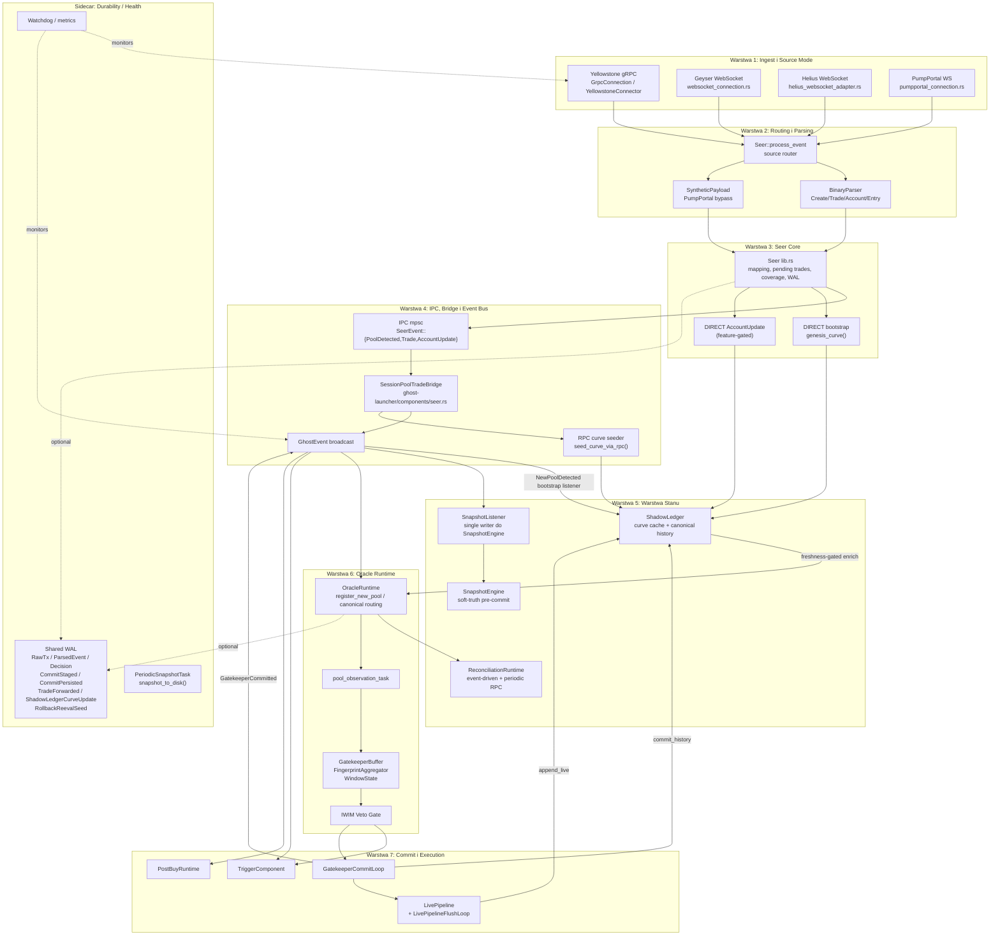

# ADR: Produkcyjny Pipeline Danych — Aktualny Flow od Multi-Source Ingest do Gatekeeper Commit

**Data:** 2026-03-20
**Status:** Raport analityczny (code-grounded)
**Zakres:** Aktualny stan pipeline produkcyjnego w `seer`, `ghost-launcher`, `ghost-core`, `ghost-brain`

---

## 1. Architektura wysokopoziomowa



> [!IMPORTANT]
> Aktualny pipeline nie jest już gRPC-only. `SeerConfig::effective_source_mode()` przełącza cały ingest między `GeyserGrpc`, `GeyserWebSocket`, `HeliusWebSocket` i `PumpPortalWs`.

> [!IMPORTANT]
> `ShadowLedger` jest dziś zasilany z większej liczby punktów niż w ADR z 2026-03-18: bezpośredni bootstrap w Seerze, bootstrap listener po `NewPoolDetected`, RPC curve seeder po IPC `PoolDetected`, opcjonalny direct `AccountUpdate`, enrichment read przed Gatekeeperem, commit canonical history oraz post-commit live append.

> [!NOTE]
> `SnapshotEngine` jest pre-commitowym soft-truth bufferem dla scoringu/sygnałów. Aktualny kod nie zapisuje jego snapshotów do `ShadowLedger` przed committem; kanoniczny zapis do `ShadowLedger` pozostaje po stronie `GatekeeperCommitLoop` i `LivePipelineFlushLoop`.

> [!NOTE]
> Warstwa durability jest w pełni aktywna od Fazy 4 (2026-03-22). `main.rs` wykonuje przy starcie: `restore_from_disk()` → odczyt watermark → `replay_shared_wal()` od watermark → rekonstrukcję pending state — i dopiero potem otwiera live ingest. Działa też `PeriodicSnapshotTask` zapisujący snapshoty co `GHOST_SNAPSHOT_INTERVAL_S` sekund. Szczegóły: ADR-0019.

> [!NOTE]
> Faza 5 (2026-03-22) zamknęła policy freshness/finality dla curve state. `OracleRuntime` rozwiązuje teraz jawny model jakości `unknown | stale | fresh | committed`, a `GatekeeperBuffer` podejmuje decyzję `PendingCurve / reject / normal path` na podstawie jakości oraz `CurveFinality` (`speculative | provisional | finalized`) zamiast ukrytych degradacji do pojedynczego boola.

---

## 2. Warstwa 1: Ingest i Transport

### 2.1. Yellowstone gRPC

**Plik:** `off-chain/components/seer/src/grpc_connection.rs`

### Opis
Aktualna ścieżka gRPC działa przez adapter `GrpcConnection`, który owija wewnętrzny `YellowstoneConnector`.

Najważniejsze cechy:
- `DualLaneChannel`: `fast` + `overflow`, oba bounded
- multi-provider fan-in
- `ProviderCircuitBreaker` z half-open probe
- `SlotTracker` współdzielony ponad providerami
- `AccountRegistry` z `resub_notify()`
- `DelayedAccountQueue` jako transportowy bufor AccountUpdate race
- manual backfill dla slot-gapów przez RPC
- dedup live + backfill po sygnaturze w `connect_geyser()`

### Kontrakt wejściowy
- `SubscribeRequest` z:
  - `transactions.account_include = [Pump.fun, PumpSwap]`
  - `entry = pump_entries`
  - `accounts = tracked_accounts` dla exact-watch pool/generic accounts

### Kontrakt wyjściowy
- `PumpEvent::{Transaction, AccountUpdate, EntryUpdate, BackfillTransaction}`
- następnie `GeyserEvent` z `source="grpc_global_stream"` albo `source="grpc_backfill"`

### Backpressure
Aktualny kod nie kończy się dropem newest eventu. Gdy `fast` i `overflow` są pełne, sender blokuje się na `overflow.send(ev)`, wymuszając naturalny backpressure upstream.

### Exact-account watch
- exact watch jest rezerwowany głównie dla `pool_accounts` i `generic_accounts`
- `curve_accounts` nie konkurują już o budżet exact-watch, bo curve truth ma przyjść z tx streamu / późniejszych write path

### Manual backfill
- `SlotTracker` wykrywa luki
- `run_manual_backfill_worker()` pobiera tx przez RPC dla obserwowanych adresów
- recovered tx wracają jako `PumpEvent::BackfillTransaction`
- downstream parser traktuje je parser-first, jak zwykły event

### 2.2. Pozostałe source modes

**Pliki:**
- `off-chain/components/seer/src/websocket_connection.rs`
- `off-chain/components/seer/src/helius_websocket_adapter.rs`
- `off-chain/components/seer/src/pumpportal_connection.rs`

### Geyser WebSocket
- legacy stream
- parser aktywny
- bez `YellowstoneConnector`, ale dalej produkuje `GeyserEvent`

### Helius WebSocket
- standard RPC WebSocket adapter
- parser aktywny
- `GeyserEvent::Transaction` budowany z RPC/WS payloadów

### PumpPortal WS
- parser binarny jest wyłączony
- adapter produkuje syntetyczne `GeyserEvent::Transaction { synthetic = true, source = "pumpportal" }`
- payload w `instructions[0].data` zawiera `SyntheticPayload::{InitializePool, Trade}`
- create event emituje również syntetyczny dev-buy trade
- `slot` pozostaje `None`

### SSOT dla Warstwy 1
| Source mode | SSOT ingestu | Typ wyjściowy |
|---|---|---|
| `GeyserGrpc` | Yellowstone stream + optional manual backfill | `GeyserEvent` |
| `GeyserWebSocket` | Geyser WS | `GeyserEvent` |
| `HeliusWebSocket` | Helius WS + RPC fetchy adaptera | `GeyserEvent` |
| `PumpPortalWs` | syntetyczne payloady PumpPortal | `GeyserEvent::Transaction(synthetic)` |

---

## 3. Warstwa 2: Routing i Parsing Domenowy

**Pliki:**
- `off-chain/components/seer/src/lib.rs`
- `off-chain/components/seer/src/binary_parser.rs`

### Source Router
`Seer::process_event()` najpierw rozstrzyga:
- czy event jest `synthetic`
- czy aktywny source mode wymaga parsera binarnego
- czy należy użyć `SyntheticPayload` bypass

To oznacza dwa realne tory:

```text
raw Geyser/WS/Helius event
  -> BinaryParser

synthetic PumpPortal event
  -> bincode SyntheticPayload
  -> bez BinaryParser
```

### BinaryParser
Parser dekoduje:
- `Create`
- `Buy` / `Sell`
- `Migrate`
- `Withdraw`
- `SwapTrade`
- `SwapPoolCreated`
- `AccountChange`
- `EntryAnchor`
- Anchor CPI event logs (`CpiTrade`, `CpiCreate`, `CpiComplete`, `CpiSwapBuy`, `CpiSwapSell`)

### Kluczowe struktury
| Typ | Rola |
|---|---|
| `CurveMintRegistry` | SSOT parsera dla `curve -> mint` |
| `ResolveQueue` | parserowy bufor AccountUpdate przed poznaniem mappingu |
| `CompleteTracker` | edge detector `complete=false -> true` |
| `ParsedPumpEvent` | zunifikowany wynik parsowania tx/account/entry |

### Entry path
`parse_entry_raw()` robi dwie rzeczy:
- emituje `ParsedEventKind::EntryAnchor { executed_transaction_count }`
- skanuje raw entry bytes pod embedded CPI eventy

### PumpPortal bypass
W `PumpPortalWs` parser nie jest wywoływany. Semantyka create/trade jest dostarczana już w `SyntheticPayload`.

### SSOT dla Warstwy 2
- dla raw source modes: instrukcje + inner instructions + account data + entry bytes
- dla PumpPortal: syntetyczny payload serialized przez adapter

---

## 4. Warstwa 3: Seer Core Orchestration

## 4A. Aktualizacja Fazy 5 — kontrakt jakości curve

### SSOT config policy

Top-level `[shadow_ledger]` w `ghost-launcher/src/config.rs` jest teraz SSOT dla policy curve-quality używanej przez runtime i Gatekeeper:

| Pole | Znaczenie |
|---|---|
| `enrichment_freshness_ms` | granica świeżości curve snapshotu dla hot-path enrichmentu |
| `stale_fallback` | policy dla stanu `stale` (`pending_curve`, `reject`, `use_stale_with_warning`) |
| `curve_wait_ms` | budżet oczekiwania dla `PendingCurve` |
| `curve_require_for_buy` | selector policy dla `unknown`: wait (`true`) albo immediate reject (`false`) |

`main.rs` synchronizuje te pola do `GatekeeperV2Config`, więc `[gatekeeper_v2]` pozostaje źródłem progów analitycznych, ale nie jest już SSOT dla freshness/pending policy.

### Runtime contract

`OracleRuntime::enrich_pool_tx_from_shadow_ledger()` nie degraduje już starego snapshotu przez ustawienie `curve_data_known=false`. Zamiast tego:

1. rozwiązuje `CurveFreshnessState` i `CurveFinality`,
2. propaguje raw truth (`curve_data_known`, `curve_finality`) do `PoolTransaction`,
3. przekazuje jawny quality state do `GatekeeperBuffer::record_curve_state(...)`.

Dzięki temu `curve_data_known` oznacza „mamy curve truth”, a nie „curve truth jest świeża”. Świeżość jest osobnym kontraktem policy.

### Gatekeeper policy matrix

Aktualna polityka runtime odpowiada Fazie 5:

| quality | finality | zachowanie |
|---|---|---|
| `unknown` | dowolna | `PendingCurve` do deadline albo immediate reject z configu |
| `stale` | `speculative` / `provisional` | `PendingCurve` albo reject wg `stale_fallback` |
| `stale` | `finalized` | allow tylko przy `use_stale_with_warning`, w przeciwnym razie pending/reject |
| `fresh` | `speculative` | normal path + istniejąca caution telemetry |
| `fresh` | `provisional` / `finalized` | normal path |
| `committed` | `finalized` | canonical confidence po commit/runtime relay |

### Terminalność `PendingCurve`

`PendingCurve` ma teraz jawne terminal states:

- `recovered`
- `rejected`
- `timed_out`

Są emitowane przez `GatekeeperBuffer` dokładnie raz per pool przez `gatekeeper_pending_curve_terminal_total{outcome=...}`.

**Plik:** `off-chain/components/seer/src/lib.rs`

### Opis
Seer jest dziś nie tylko parserowym glue code, ale rzeczywistym orchestratoriem:
- routuje source mode
- utrzymuje mapping `curve <-> mint`
- buforuje pending trade’y
- buforuje pending curve update’y
- uruchamia async RPC resolve dla curve->mint
- opcjonalnie zapisuje raw/parsed recordy do WAL
- wykonuje bezpośrednie write’y do `ShadowLedger`

### Kluczowe funkcje
| Funkcja | Rola |
|---|---|
| `process_event()` | source routing, parser/synthetic dispatch |
| `register_curve_mapping()` | zapis mappingu + replay pending state |
| `handle_trade_event()` | hydration, walidacja, buffer/replay/emit |
| `emit_trade_only()` | wysyłka `TradeEvent` przez IPC |
| `handle_account_update()` | feature-gated direct write + reconciliation forwarding |

### Trade path
```text
GeyserEvent::Transaction
  -> parse_trades() albo SyntheticPayload::Trade
  -> handle_trade_event()
      1. hydrate_trade_mapping()
      2. append ParsedEvent do WAL (opcjonalnie)
      3. walidacja pool/mint
      4. buffer pending mapping OR emit IPC trade
      5. po rejestracji curve mapping -> replay pending trades
```

### Pending state
- `pending_trades`: keyed by `PendingTradeKey::{ByCurve, ByMint, BySignature}`
- `pending_curve_updates`: ostatni AccountUpdate na curve do czasu poznania minta
- `pending_curve_resolves`: dedupe dla async RPC resolve

### Direct bootstrap w Seerze
Po wykryciu `Create`:
- Seer rejestruje `curve -> mint`
- przy obecnym `shadow_ledger: Some(...)` wywołuje `store_curve_with_snapshots(... genesis_curve(), slot=None, curve_data_known=false)`

To jest realny, bezpośredni bootstrap `ShadowLedger` z pominięciem Event Bus.

### AccountUpdate path
`handle_account_update()` jest dziś **feature-gated**:
- gdy `account_updates_enabled = false`
  - Seer zwraca `Ok(true)` dla AccountUpdate
  - nie zapisuje do `ShadowLedger`
  - nie emituje IPC `AccountUpdate`
- gdy `account_updates_enabled = true`
  - parsuje bonding curve
  - przy braku mappingu buforuje update i odpala async RPC resolve
  - po znalezieniu minta:
    - bezpośrednio zapisuje curve do `ShadowLedger`
    - wysyła `ipc.send_account_update(...)`

### WAL w Seerze
Aktywne recordy produkowane przez Seer:
- `WalRecord::RawTx`
- `WalRecord::ParsedEvent`

Nie widać w produkcyjnym hot path aktywnego zapisu:
- `TradeForwarded`
- `ShadowLedgerCurveUpdate`
- `CommitStaged`
- `CommitPersisted`

Te rekordy istnieją w modelu WAL i w testach recovery, ale nie są jeszcze emitowane przez runtime launchera.

---

## 5. Warstwa 4: IPC, Session Bridge i Event Bus

### 5.1. IPC channel

**Plik:** `off-chain/components/seer/src/ipc.rs`

`SeerEvent` ma aktualnie trzy payloady:
- `PoolDetected`
- `Trade`
- `AccountUpdate`

Kontrakty backpressure:
- `Trade`: blokujący path
- `PoolDetected`: blokujący path
- `AccountUpdate`: niskopriorytetowy path, bez gwarancji że zatrzyma pipeline

### 5.2. SessionPoolTradeBridge

**Plik:** `ghost-launcher/src/components/seer.rs`

Bridge wykonuje trzy osobne role:

1. Session gate dla race `trade before pool_detected`
- TTL bufora trade’ów: 10 ms
- per-pool i global caps
- replay po `PoolDetected`

2. Ostatnia walidacja `PoolDetected`
- odrzucenie patologii typu `base_mint == program_id`, `bonding_curve == global_state`, itp.

3. RPC curve seeder
- po `PoolDetected` spawn `seed_curve_via_rpc()`
- jeśli RPC zwróci prawidłowe konto bonding curve, bridge zapisuje confirmed curve bezpośrednio do `ShadowLedger`

To jest nowy, realny write path stanu:

```text
IPC PoolDetected
  -> SessionPoolTradeBridge
  -> seed_curve_via_rpc()
  -> store_curve_with_snapshots(slot=rpc_slot, curve_data_known=true)
```

### 5.3. Trade adapter do Event Bus

`trade_event_to_pool_transaction()` mapuje Seer `TradeEvent` na launcherowy `PoolTransaction`:
- `event_ordinal`
- `sol_amount_lamports`
- `token_amount_units`
- `token_program` / `global_config` / `fee_recipient`
- `curve_data_known`
- `curve_finality`

### 5.4. Event Bus

**Plik:** `ghost-launcher/src/events.rs`

`GhostEvent` na hot path używa dziś głównie:
- `NewPoolDetected`
- `PoolTransaction`
- `GatekeeperCommitted`
- `AccountUpdate`
- `TransactionSent`
- `PostBuySubmitted`
- `ShadowBuySimulated`

Legacy/auxiliary:
- `PoolScored`
- `GeyserTransaction`

### Uwaga o Triggerze
`TriggerComponent` nadal inicjalizuje `OraclePipeline`, ale w aktualnym runtime:
- `GhostEvent::PoolScored` jest traktowany jako legacy/observability path
- autorytatywny BUY wykonuje `OracleRuntime` przez `execute_gatekeeper_buy_path()`

### 5.5. Faza 6 — jawna klasyfikacja legacy side-effect paths

Od 2026-03-22 launcher utrzymuje jawne deskryptory legacy pathów dla execution boundary:

| Path | Klasyfikacja | Runtime plane | Czy może emitować autorytatywny BUY? |
|---|---|---|---|
| `trigger_pool_scored_observer` | `observability_only` | `legacy_observation` | nie |
| `trigger_embedded_oracle_pipeline` | `compatibility_only` | `legacy_observation` | nie |
| `trigger_no_event_bus_fallback` | `disabled_in_production` | `legacy_observation` | nie |

Kontrakt jest wymuszony przez kod, nie naming convention:
- `PoolScored(passed=true)` inkrementuje `legacy_path_side_effect_block_total{path="trigger_pool_scored_observer"}` zamiast wykonywać BUY,
- `Trigger` bez Event Busa wchodzi w jawny fallback `disabled_in_production`, który nie wykonuje side effectów,
- canonical BUY pozostaje wyłącznie w `OracleRuntime -> TriggerComponent::{prepare_buy_request,dispatch_prepared_buy_with_shadow}`.

---

## 6. Warstwa 5: ShadowLedger i SnapshotEngine

### 6.1. ShadowLedger — aktualne punkty interakcji

Aktualny kod ma co najmniej osiem odrębnych interakcji z `ShadowLedger`:

### Punkt A — direct bootstrap w Seerze
**Plik:** `off-chain/components/seer/src/lib.rs`

Po `Create`:
- `store_curve_with_snapshots(... genesis_curve(), slot=None, curve_data_known=false)`

### Punkt B — bootstrap listener po Event Bus
**Plik:** `ghost-launcher/src/main.rs`

Osobny task nasłuchuje `GhostEvent::NewPoolDetected` i wykonuje:
- `store_curve_with_snapshots(... genesis_curve(), slot=None, curve_data_known=false)`

To oznacza, że obecny system ma **dwa bootstrapy genesis seed** dla tego samego poola:
- jeden bezpośrednio w Seerze
- drugi po Event Bus w launcherze

### Punkt C — RPC curve seeder w bridge
**Plik:** `ghost-launcher/src/components/seer.rs`

Po `PoolDetected` bridge odpala:
- `seed_curve_via_rpc()`
- confirmed write do `ShadowLedger` z `curve_data_known=true`

### Punkt D — direct AccountUpdate
**Plik:** `off-chain/components/seer/src/lib.rs`

Tylko gdy `account_updates_enabled = true`:
- Seer zapisuje on-chain curve update bezpośrednio do `ShadowLedger`

### Punkt E — reconciliation loop
**Plik:** `ghost-launcher/src/oracle_runtime.rs`

Tylko gdy `account_updates_enabled = true`:
- `GhostEvent::AccountUpdate` wywołuje `OracleRuntime::process_account_update()`
- dodatkowo rusza okresowy RPC reconciliation cycle co 400 ms

To jest ścieżka korekcyjna, nie główny writer canonical history.

### 6.2. Semantic envelope cross-source

Canonical ingest events now carry a shared `EventSemanticEnvelope` with:
- `source_kind`
- `event_truth_kind`
- `slot_quality`
- `timestamp_quality`
- `completeness`

Normalizacja jest wykonywana raz, na wejściu Seera, a downstream konsumuje envelope zamiast zgadywać semantykę po `source`, `synthetic` albo brakach `slot`.

Mapowanie produkcyjne:
- `grpc_*` -> `source_kind=grpc`, `event_truth_kind=raw_chain`
- `websocket` -> `source_kind=geyser_ws`, `event_truth_kind=adapted_chain`
- `helius` -> `source_kind=helius_ws`, `event_truth_kind=adapted_chain`
- `pumpportal` -> `source_kind=pumpportal`, `event_truth_kind=synthetic`

Reguły kontraktu:
- `synthetic` nigdy nie podnosi eventu do `raw_chain`
- `synthetic` nie może zostać użyty jako `DataSource::HardTruth`
- `GhostEvent::AccountUpdate` nie jest już zawężonym inline payloadem; bus niesie `AccountUpdateEvent` z `bonding_curve`, `detected_at`, `sequence_number` i `semantic`
- fallback `DetectedPool.timestamp_ms = detected_ms` degraduje `timestamp_quality` do `wall_clock` i `completeness` do `partial`

### Punkt F — enrichment read przed Gatekeeperem
**Plik:** `ghost-launcher/src/oracle_runtime.rs`

Każdy `PoolTransaction` trafiający do `pool_observation_task` przechodzi przez:
- `enrich_pool_tx_from_shadow_ledger(...)`

Wzbogacane pola:
- `v_tokens_in_bonding_curve`
- `v_sol_in_bonding_curve`
- `reserve_base`
- `reserve_quote`
- `price_quote`
- `market_cap_sol`
- `curve_data_known`

### Freshness SLA
Enrichment ma dziś jawny próg świeżości:
- `shadow_ledger_enrichment_freshness_ms`
- domyślnie 200 ms

Jeżeli snapshot jest starszy niż próg:
- enrichment może nadal uzupełnić liczby
- ale `curve_data_known` jest degradowane do `false`
- Gatekeeper przechodzi naturalnie w `PendingCurve` / fail-closed po deadline

### Punkt G — canonical commit po BUY
**Pliki:**
- `ghost-launcher/src/components/gatekeeper.rs`
- `ghost-launcher/src/components/gatekeeper_commit_loop.rs`
- `ghost-core/src/shadow_ledger/history_types.rs`

Flow:
- `LauncherCommitCoordinator.stage_history()`
- `process_ready_commits()`
- `build_trade_snapshots_observed(...)`
- `ledger.commit_history(...)`

To jest główna ścieżka powstawania kanonicznej historii snapshotów.

### Punkt H — post-commit live append
**Pliki:**
- `ghost-launcher/src/components/gatekeeper_commit_loop.rs`
- `ghost-launcher/src/components/live_pipeline_flush_loop.rs`

Flow:
- `GatekeeperCommitLoop` inicjalizuje `LivePipeline`
- `pending_live` idzie do `LivePipeline.process_event()`
- `LivePipelineFlushLoop` cyklicznie robi `flush_ready(&shadow_ledger)`
- `ShadowLedger.append_live()` dopisuje dalsze live tx

### 6.2. SnapshotEngine

**Plik:** `ghost-brain/src/oracle/snapshot_engine.rs`

`SnapshotEngine`:
- buforuje pre-commit snapshoty i tx buffer per pool
- przyjmuje `InitPoolEvent` i `TxEvent` wyłącznie przez `SnapshotListener`
- ma bootstrap `g0/g1/g2`, ale tylko lokalnie

### Ważny kontrakt
Aktualny kod w `SnapshotEngine` **nie zapisuje pre-commit snapshotów do `ShadowLedger`**.

`set_shadow_ledger()` służy dziś do:
- obserwacji committed state
- przejścia w read-only semantics dla pooli committed

Nie ma aktywnego pre-commit write path do `ShadowLedger`.

### 6.3. SnapshotListener

**Plik:** `ghost-launcher/src/components/snapshot_listener.rs`

To jest jedyny kanoniczny writer do `SnapshotEngine`.

Tryby forwardowania:
- `None`
- `TrackedBuffered`
- `ApprovedOnly`
- `Provisional`

Potrafi:
- stage’ować tx dla nieznanych pooli / nierozwiązanej identity
- replayować staged tx po `NewPoolDetected`
- replayować staged tx po `GatekeeperCommitted`

---

## 7. Warstwa 6: OracleRuntime i konsumenci Event Bus

### 7.1. Startup ordering

**Plik:** `ghost-launcher/src/main.rs`

Launcher nadal pilnuje bariery:
- `OracleRuntime` subskrybuje Event Bus przed startem Seera
- `PostBuyRuntime` również subskrybuje przed producentami

To pozostaje ważnym kontraktem, bo `broadcast` nie buforuje historii dla późnych subscriberów.

### 7.2. OracleRuntime

**Plik:** `ghost-launcher/src/oracle_runtime.rs`

Reaguje na:
- `NewPoolDetected`
- `PoolTransaction`
- `GatekeeperCommitted`
- `AccountUpdate` (tylko jeśli enabled)

### `NewPoolDetected`
- `build_enhanced_candidate_from_pool_data()`
- `register_new_pool()`
- `remember_detected_pool()`
- spawn dedykowanego `pool_observation_task()`

### `PoolTransaction`
Runtime robi dziś dwie ważne rzeczy:

1. canonical-only routing
- jeśli pool nie ma taska i nie jest już `Approved/Committed`, tx jest ignorowany jako non-canonical tx-first path

2. relay dla pooli `Approved/Committed`
- `forward_approved_tx_to_commit_or_live_pipeline()`

### `AccountUpdate`
- gdy `account_updates_enabled = false`: no-op
- gdy `true`: event-driven reconciliation + osobny periodic RPC cycle

### 7.3. Inni konsumenci

### SnapshotListener
- jedyny writer do `SnapshotEngine`
- commit-aware replay staged tx

### TriggerComponent
- konsumuje Event Bus, ale autorytatywny BUY pochodzi z `OracleRuntime`
- legacy `PoolScored` path jest jawnie ignorowany jako nieautorytatywny

### PostBuyRuntime
- cienki adapter
- słucha `PostBuySubmitted`
- deleguje cały lifecycle do `ghost-brain`

### Watchdog
- nie jest częścią data plane
- obserwuje `RuntimeHealth`
- może wymusić exit na stallach gRPC albo writerów pipeline

---

## 8. Warstwa 7: Gatekeeper V2, IWIM i Commit

### 8.1. Per-pool task

Każdy pool dostaje osobny `pool_observation_task` z:
- `GatekeeperBuffer`
- `FingerprintAggregator`
- `WindowState`
- per-pool deadline

### 8.2. Ingestion do Gatekeepera

Dla każdej transakcji:
1. normalize monotonic event time
2. enrichment z `ShadowLedger`
3. identity promotion z tx, jeśli metadata poola była niepełna
4. feed do fingerprint aggregatora
5. update A/B window
6. `buffer.on_transaction(tx)`

### 8.3. Werdykty

Obsługiwane są realnie:
- `Wait`
- `PendingCurve`
- `ApprovedTx`
- `Reject`
- `Timeout`
- `Buy`

### `ApprovedTx`
To ścieżka dla pooli, które runtime już uznał za `Approved/Committed`:
- tx nie przechodzi ponownie pełnego 10s okna
- idzie do `register_pool_tx()`
- następnie do `forward_approved_tx_to_commit_or_live_pipeline()`

### 8.4. BUY path

Po `GatekeeperVerdict::Buy`:
1. opcjonalny `run_iwim_veto_gate()`
2. jeśli IWIM przepuści:
   - `stage_gatekeeper_history_for_commit()`
   - `mark_pool_approved()`
   - `approved_pools.insert(pool_id)`
   - opcjonalne `TriggerComponent` execution / shadow-run
3. decision logger + coverage audit zamykają okno

### IWIM Veto Gate

**Plik:** `ghost-launcher/src/components/iwim_veto.rs`

Polityka jest dziś deterministyczna:
- `dev_unknown + STRONG -> BUY`
- `dev_unknown + BORDERLINE -> REJECT`
- `timeout/error + STRONG -> BUY`
- `timeout/error + BORDERLINE -> REJECT`
- `LOW quality + STRONG -> BUY`
- `LOW quality + BORDERLINE -> REJECT`
- `HIGH quality + veto signal -> REJECT`

### 8.5. Commit path

```text
GatekeeperVerdict::Buy
  -> LauncherCommitCoordinator.stage_history()
  -> GatekeeperCommitLoop.tick()
  -> process_ready_commits()
  -> build_trade_snapshots_observed()
  -> ShadowLedger.commit_history()
  -> GhostEvent::GatekeeperCommitted
  -> LivePipeline.init_for_mint()
  -> pending_live -> LivePipeline.process_event()
  -> LivePipelineFlushLoop.flush_ready()
  -> ShadowLedger.append_live()
```

### Ważne rozróżnienie
Launcher używa:
- `LauncherCommitCoordinator`
- `GatekeeperCommitLoop`

To nie jest ten sam byt co:
- `ghost-core::shadow_ledger::GatekeeperMintBuffer`

---

## 9. Trwałość, WAL i recovery

### 9.1. Aktywna ścieżka durability (Faza 4 — domknięta 2026-03-22)

**Plik:** `ghost-launcher/src/main.rs`

**WAL (env `GHOST_WAL_DIR`):** launcher tworzy współdzielony `Wal` i przekazuje go do Seera i `OracleRuntime`.

Aktywnie zapisywane rekordy:
- Seer: `RawTx`, `ParsedEvent`
- OracleRuntime: `Decision`, `TradeForwarded`, `CommitStaged`, `CommitPersisted`, `ShadowLedgerCurveUpdate`, `RollbackReevalSeed`

**Deterministic startup restore sequence** (wykonywany przed otwarciem live ingest):

```
1. ShadowLedger::restore_from_disk(GHOST_SNAPSHOT_DIR)   ← disk snapshot
2. odczyt stats.written_at_ms jako snapshot_watermark_ms
3. replay_shared_wal(wal, oracle_runtime, Some(watermark)) ← delta WAL
4. restore_committed_history_from_wal()                   ← committed pools
5. restore_runtime_pool_state_from_wal()                  ← staged pools
6. replay_live_tx_from_wal() + flush_replayed_live_mint() ← pending live
7. restore_rollback_seed_from_wal()                       ← rollback seeds
8. dopiero potem: live ingest (Seer, event bus)
```

**PeriodicSnapshotTask** (spawned jeśli `GHOST_SNAPSHOT_DIR` ustawiony):
- tworzy snapshot co `GHOST_SNAPSHOT_INTERVAL_S` sekund (domyślnie z `config.durability.snapshot_interval_s`)
- rotuje pliki: przechowuje ostatnie 3
- metryka: `shadow_ledger_periodic_snapshot_total{result=ok|error}`

### 9.2. ReplayOrderKey i ordering

Każdy recovery-critical rekord WAL ma jawny `ReplayOrderKey` (zdefiniowany w `ghost-core/src/wal.rs`):

| Rekord | ReplayOrderKey | Uwaga |
|---|---|---|
| `TradeForwarded` | `TxBased(trade.tx.tx_key)` | deterministyczny porządek blockchain |
| `CommitStaged` | `TxBased(max tx_key z buffered_history)` | fallback: `SlotAndWallClock` |
| `CommitPersisted` | `TxBased(last_committed_tx_key)` | fallback: `SlotAndWallClock` |
| `ShadowLedgerCurveUpdate` | `SlotAndWallClock { slot, ts_ms }` | arbitraż write_strength gwarantuje idempotencję |
| `RollbackReevalSeed` | `SlotAndWallClock { slot, ts_ms }` | ostatni rekord per base_mint wygrywa |
| `RawTx`, `ParsedEvent`, `Decision` | `NotRecoveryCritical` | brak restore effect |

Replay odtwarza decision-order poprzez `sort_by(tx_key)` nad zebranymi `staged_history` i `post_commit` TX.

### 9.3. Recovery telemetry

| Metryka | Typ | Opis |
|---|---|---|
| `wal_replay_records_total` | counter | każdy przetworzony rekord WAL |
| `wal_replay_duration_ms` | histogram | czas pełnego replay |
| `shadow_ledger_restore_duration_ms` | histogram | czas restore z dysku |
| `runtime_recovery_watermark_ms` | gauge | `written_at_ms` snapshotu (wall-clock watermark) |
| `runtime_recovery_mode{mode=...}` | counter | tryb: `snapshot_plus_wal`, `wal_only`, `snapshot_only`, `cold_start` |

> [!NOTE]
> Plan Fazy 4 nazywał ostatnią metrykę `runtime_recovery_watermark_slot`. Snapshot header przechowuje `written_at_ms` (wall-clock ms), nie numer slotu Solana, dlatego metryka jest emitowana jako `runtime_recovery_watermark_ms`. Szczegóły: ADR-0019.

---

## 10. SSOT per warstwa

| Element | Aktualny SSOT | Plik / moduł |
|---|---|---|
| Wybrane źródło ingestu | `SeerConfig::effective_source_mode()` | `seer/src/config.rs` |
| gRPC transport truth | Yellowstone stream + manual backfill | `seer/src/grpc_connection.rs` |
| Parserowy `curve -> mint` | `CurveMintRegistry` | `seer/src/binary_parser.rs` |
| Runtime `curve <-> mint` | `curve_to_mint`, `mint_to_curve`, `tracked_curves` | `seer/src/lib.rs` |
| IPC kontrakt | `SeerEvent` | `seer/src/ipc.rs` |
| Event bus kontrakt | `GhostEvent` | `ghost-launcher/src/events.rs` |
| Pre-commit soft-truth snapshots | `SnapshotEngine` | `ghost-brain/src/oracle/snapshot_engine.rs` |
| Canonical curve cache | `ShadowLedger` curve storage | `ghost-core/shadow_ledger` |
| Canonical historia snapshotów | `ShadowLedger.commit_history()` + `append_live()` | `ghost-core/shadow_ledger/ledger.rs` |
| Runtime pool identity | `PoolIdentityRegistry` | `ghost-core/pool_identity.rs` |
| Runtime approval state | `ApprovedPools` + `PoolState` | `snapshot_engine.rs`, `gatekeeper.rs` |
| Silnik decyzyjny BUY/REJECT | `GatekeeperBuffer` + `IWIM` | `gatekeeper.rs`, `iwim_veto.rs` |
| Active durability (ingest) | `Wal` (`RawTx`, `ParsedEvent`, `Decision`, `TradeForwarded`, `CommitStaged`, `CommitPersisted`, `ShadowLedgerCurveUpdate`, `RollbackReevalSeed`) | `ghost-core/src/wal.rs` |
| Recovery startup sequence | `replay_shared_wal()` + `restore_from_disk()` | `ghost-launcher/src/wal_recovery.rs`, `main.rs` |
| Periodic snapshot | `PeriodicSnapshotTask` + `snapshot_to_disk()` | `ghost-launcher/src/main.rs`, `ghost-core/src/shadow_ledger/disk_snapshot.rs` |

---

## 11. Timeline jednej transakcji gRPC

```text
T+0ms      on-chain tx
T+~50ms    Yellowstone gRPC -> PumpEvent::Transaction
T+~51ms    GrpcConnection -> GeyserEvent::Transaction(source=grpc_global_stream)
T+~52ms    Seer.process_event() -> BinaryParser.parse_trades()
T+~53ms    Seer.handle_trade_event() -> hydrate / buffer / emit
T+~54ms    ipc_sender.send_trade()
T+~55ms    SessionPoolTradeBridge -> PoolTransaction -> GhostEvent::PoolTransaction
T+~56ms    SnapshotListener: stage albo forward do SnapshotEngine
T+~57ms    OracleRuntime: canonical routing do pool_observation_task
T+~58ms    enrich_pool_tx_from_shadow_ledger(freshness<=200ms)
T+~59ms    GatekeeperBuffer.on_transaction()
T+window   Wait / PendingCurve / Reject / Timeout / Buy
T+window+  IWIM veto gate (jeśli Buy)
T+window+  stage_history / add_approved_tx
T+window+  GatekeeperCommitLoop.process_ready_commits() -> commit_history()
T+window+  GhostEvent::GatekeeperCommitted
T+window+  LivePipeline.init + pending_live
T+window+  LivePipelineFlushLoop.flush_ready() -> append_live()
T+window+  Trigger -> TransactionSent / PostBuySubmitted
```

### PumpPortal różni się tym, że:
- wchodzi jako `synthetic=true`
- omija `BinaryParser`
- dostarcza create + dev-buy trade jako syntetyczne payloady
- `slot` jest zwykle `None`

---

## 12. Znane obserwacje i rozjazdy architektoniczne

1. Aktualny pipeline ma dwa bootstrapy `genesis_curve()` do `ShadowLedger`: direct w Seerze i osobny listener `NewPoolDetected` w `main.rs`.
2. `SessionPoolTradeBridge` nie jest już tylko session bufferem; ma także aktywny RPC curve seeder, który robi confirmed write do `ShadowLedger`.
3. `account_updates_enabled=false` to realny tx-only mode. W tym trybie direct `AccountUpdate` path i reconciliation event bus path są wyłączone, choć sam ingest gRPC nadal może subskrybować exact-account watches.
4. `SnapshotEngine` pozostaje pre-commitowym soft-truth bufferem. W aktualnym kodzie nie zapisuje snapshotów do `ShadowLedger` przed committem.
5. `TriggerComponent` nadal utrzymuje legacy `OraclePipeline`, ale autorytatywny BUY pochodzi z `OracleRuntime` i `execute_gatekeeper_buy_path()`.
6. `build_enhanced_candidate_from_pool_data()` nadal ustawia `dev_buy_sol = 0.0` oraz `has_dev_buy = false`, więc runtime candidate object sam z siebie nie niesie prawdy o dev-buy; faktyczna logika Gatekeepera korzysta z tx streamu.
7. WAL recovery i disk snapshoty są w pełni aktywne od Fazy 4: launcher odtwarza stan z dysku przy starcie (`restore_from_disk()` + `replay_shared_wal()`) i uruchamia `PeriodicSnapshotTask`. Szczegóły: ADR-0019.
8. Faza 6 domknęła execution-plane semantics: logi i metryki rozróżniają już `canonical_decision`, `legacy_observation`, `shadow_simulation` i `post_buy_monitoring`, a legacy `PoolScored` path jest liczony jako blockowany side-effect path, nie alternatywny runtime BUY.

---

## 13. Kluczowe wnioski

1. Produkcyjny pipeline Ghost jest dziś multi-source, ale autorytatywny flow decyzyjny pozostaje jeden: `PoolTransaction -> OracleRuntime -> per-pool Gatekeeper -> IWIM -> launcher commit/live path`.
2. `ShadowLedger` jest centralnym cachem i canonical state sinkiem, ale jego zasilanie jest wielopunktowe: bootstrap, RPC seeding, opcjonalne AccountUpdate, reconciliation, commit i live append.
3. Pre-commit stan rynku jest rozdzielony od kanonicznej historii: `SnapshotEngine` utrzymuje soft-truth lokalnie, natomiast `ShadowLedger` otrzymuje kanoniczne snapshoty dopiero po commit/live.
4. Durability jest domknięta (Faza 4): WAL działa na produkcyjnym hot path, a `main.rs` wykonuje deterministyczny boot-time restore ze snapshotu + replay delta WAL przed otwarciem live ingest. `PeriodicSnapshotTask` zapewnia ciągłe snapshotowanie.
